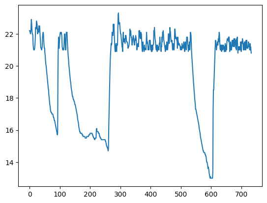

# netatmo-energy


<!-- WARNING: THIS FILE WAS AUTOGENERATED! DO NOT EDIT! -->

``` python
import json

import fastcore.all as fc, matplotlib.pyplot as plt, collections
from fasthtml.common import *
from fasthtml.jupyter import *
from fastcore.utils import *
from fastcore.xtras import dict2obj

from httpx import get as xget, post as xpost
from monsterui.core import *

from dotenv import load_dotenv

from base64 import b64decode
from ipykernel_helper import get_md
from IPython.display import Image, display
```

``` python
load_dotenv()
```

    True

Hi solveit! I am Pol, and I am working with you today! I’m an
experienced Python coder and I enjoy learning new things. When writing
code for me, please follow fast.ai coding style: avoid comments; place
single line if/loop/etc constructs on the same line; use concise
variable names where appropriate. Follow the style you will see in my
messages, as we work on this dialogue together. Are you ready?

##### 🤖Reply🤖<!-- SOLVEIT_SEPARATOR_7f3a9b2c -->

Hi Pol! Yes, I’m absolutely ready to work with you! I’m familiar with
the fast.ai coding style and will follow your preferences for concise,
clear code without unnecessary comments. I see you’ve already set up
some useful imports including fastcore, which I know is central to the
fast.ai approach.

The goal of this notebook is to set up communication with my home
thermostat from the Netatmo brand. I have already created an app on
their website to get API access.

The documentation is here:
https://dev.netatmo.com/apidocumentation/general

The documentation pages are rendered using JS so let’s first set up Zyte
so we can render those pages and access the proper docs.

## Zyte API

``` python
def fetch_page(
    url:str, # URL to fetch,
    browser_html:bool=True, # Use a browser to reunder js page?
    as_md:bool=False, # Convert HTML to markdown?
    screenshot:bool=False, # Also return a screenshot?
    timeout:int=15, # fetch timeout in seconds
):
    "Fetch a page"
    api_key=os.getenv('ZYTE_API_KEY')
    r = xpost("https://api.zyte.com/v1/extract", auth=(api_key, ""), json=dict(url=url, browserHtml=browser_html, screenshot=screenshot), timeout=timeout)
    r.raise_for_status()
    rj = r.json()
    if rj['statusCode'] != 200: raise Exception(f"Status {rj['statusCode']} for {url}")
    html = get_md(rj['browserHtml']) if as_md else rj['browserHtml']
    img = Image(data=b64decode(rj['screenshot'])) if screenshot and 'screenshot' in rj else None
    return (html, img) if screenshot else html
```

``` python
# html, img = fetch_page('https://dev.netatmo.com/apidocumentation/energy', screenshot=True)
```

``` python
# html[:500]
```

``` python
# img
```

## Thermostat Class

**Energy API endpoints** for Netatmo thermostat:

<table>
<thead>
<tr>
<th>Method</th>
<th>Endpoint</th>
<th>Description</th>
</tr>
</thead>
<tbody>
<tr>
<td>GET</td>
<td><code>/homesdata</code></td>
<td>Retrieve user’s homes and topology</td>
</tr>
<tr>
<td>GET</td>
<td><code>/homestatus</code></td>
<td>Get current status of home and devices</td>
</tr>
<tr>
<td>GET</td>
<td><code>/getroommeasure</code></td>
<td>Retrieve room data history (for graphs)</td>
</tr>
<tr>
<td>POST</td>
<td><code>/setroomthermpoint</code></td>
<td>Control heating of a room</td>
</tr>
<tr>
<td>POST</td>
<td><code>/setthermmode</code></td>
<td>Control home heating system</td>
</tr>
<tr>
<td>GET</td>
<td><code>/getmeasure</code></td>
<td>Retrieve boiler historical data</td>
</tr>
<tr>
<td>POST</td>
<td><code>/createnewhomeschedule</code></td>
<td>Create thermostat weekly schedule</td>
</tr>
<tr>
<td>POST</td>
<td><code>/synchomeschedule</code></td>
<td>Modify thermostat weekly schedule</td>
</tr>
<tr>
<td>POST</td>
<td><code>/switchhomeschedule</code></td>
<td>Apply a specific schedule</td>
</tr>
</tbody>
</table>

Base domain is `api.netatmo.com` (they’re retiring `api.netatmo.net` on
Sept 8, 2025).

------------------------------------------------------------------------

<a
href="https://github.com/kafkasl/netatmo-thermostat/blob/main/netatmo_thermostat/core.py#L20"
target="_blank" style="float:right; font-size:smaller">source</a>

### Thermostat

``` python

def Thermostat(
    client_id:NoneType=None, client_secret:NoneType=None, access_token:NoneType=None, refresh_token:NoneType=None
):

```

*Initialize self. See help(type(self)) for accurate signature.*

``` python
t = Thermostat()
t.client_id[:10]  # quick check
```

    '6952046932'

``` python
r = t._refresh()
list(r)
```

    ['access_token', 'refresh_token', 'expires_in', 'expire_in', 'scope']

``` python
from dialoghelper.core import *

# tool_info()
```

Tools available from dialoghelper:
&`[curr_dialog, msg_idx, add_html, find_msg_id, find_msgs, read_msg, del_msg, add_msg, update_msg, msg_insert_line, msg_str_replace, msg_strs_replace, msg_replace_lines]`

### Homes data

------------------------------------------------------------------------

<a
href="https://github.com/kafkasl/netatmo-thermostat/blob/main/netatmo_thermostat/core.py#L65"
target="_blank" style="float:right; font-size:smaller">source</a>

### Thermostat.homesdata

``` python

def homesdata(
    
):

```

``` python
r = t.homesdata()
home_id = r.homes[0].id
home_id
```

    '693572355b98bfc2a009b174'

``` python
r.homes[0].schedules
```

    [{'timetable': [{'zone_id': 1, 'm_offset': 0}, {'zone_id': 0, 'm_offset': 480}, {'zone_id': 1, 'm_offset': 1440}, {'zone_id': 0, 'm_offset': 1920}, {'zone_id': 1, 'm_offset': 2880}, {'zone_id': 0, 'm_offset': 3360}, {'zone_id': 1, 'm_offset': 4320}, {'zone_id': 0, 'm_offset': 4800}, {'zone_id': 1, 'm_offset': 5760}, {'zone_id': 0, 'm_offset': 6240}, {'zone_id': 1, 'm_offset': 7200}, {'zone_id': 0, 'm_offset': 7740}, {'zone_id': 1, 'm_offset': 8640}, {'zone_id': 0, 'm_offset': 9180}], 'zones': [{'name': 'Night', 'id': 1, 'type': 1, 'rooms_temp': [{'room_id': '3352988001', 'temp': 21}], 'modules': [], 'rooms': [{'id': '3352988001', 'therm_setpoint_temperature': 21}]}, {'name': 'Comfort', 'id': 0, 'type': 0, 'rooms_temp': [{'room_id': '3352988001', 'temp': 21}], 'modules': [], 'rooms': [{'id': '3352988001', 'therm_setpoint_temperature': 21}]}, {'name': 'Comfort +', 'id': 3, 'type': 8, 'rooms_temp': [{'room_id': '3352988001', 'temp': 22}], 'modules': [], 'rooms': [{'id': '3352988001', 'therm_setpoint_temperature': 22}]}, {'name': 'Eco', 'id': 4, 'type': 5, 'rooms_temp': [{'room_id': '3352988001', 'temp': 19}], 'modules': [], 'rooms': [{'id': '3352988001', 'therm_setpoint_temperature': 19}]}], 'name': 'Temperature schedule', 'default': False, 'away_temp': 17, 'hg_temp': 7, 'id': '693572355b98bfc2a009b175', 'type': 'therm', 'selected': True}]

We can see one schedule called “Temperature schedule” with:

**Zones** (temperature presets): - `Night` (id 1): 21°C - `Comfort` (id
0): 21°C  
- `Comfort +` (id 3): 22°C - `Eco` (id 4): 19°C

**Timetable** - `m_offset` is minutes from Monday 00:00: - `0` = Mon
00:00 → zone 1 (Night) - `480` = Mon 08:00 → zone 0 (Comfort) - `1440` =
Tue 00:00 → zone 1 (Night) - etc.

**Special temps:** - `away_temp`: 17°C - `hg_temp`: 7°C (frost guard)

So it switches between Night and Comfort zones each day at midnight and
8am

### Home status

------------------------------------------------------------------------

<a
href="https://github.com/kafkasl/netatmo-thermostat/blob/main/netatmo_thermostat/core.py#L70"
target="_blank" style="float:right; font-size:smaller">source</a>

### Thermostat.homestatus

``` python

def homestatus(
    home_id
):

```

``` python
st = t.homestatus(home_id=home_id)
room = st.home.rooms[0]
room
```

``` python
{ 'anticipating': False,
  'heating_power_request': 0,
  'id': '3352988001',
  'open_window': False,
  'reachable': True,
  'therm_measured_temperature': 21.5,
  'therm_setpoint_end_time': 1767809067,
  'therm_setpoint_mode': 'manual',
  'therm_setpoint_start_time': 1767805467,
  'therm_setpoint_temperature': 21.5}
```

let’s do them all in order, first only getroommeasuer

##### 🤖Reply🤖<!-- SOLVEIT_SEPARATOR_7f3a9b2c -->

🧠🧠🧠🧠🧠🧠🧠🧠🧠🧠

<details class="tool-usage-details">

``` json
{
  "id": "toolu_01HunczNpfbgMrcgkYhKt9EF",
  "call": {
    "function": "add_msg",
    "arguments": {
      "content": "### Getroommeasure"
    }
  },
  "result": "'_5dcdeea5'"
}
```

</details>

<details class="tool-usage-details">

``` json
{
  "id": "toolu_01Un5xyQRYNUejKCYZCTnrYc",
  "call": {
    "function": "add_msg",
    "arguments": {
      "msg_type": "code",
      "content": "@patch\ndef getroommeasure(self:Thermostat, home_id, room_id, scale='1hour', type='temperature', begin=None, end=None):\n    return self._request('getroommeasure', data=fc.dict_filter(\n        {'home_id': home_id, 'room_id': room_id, 'scale': scale, 'type': type, 'date_begin': begin, 'date_end': end}))"
    }
  },
  "result": "'_3eb95a1f'"
}
```

</details>

<details class="tool-usage-details">

``` json
{
  "id": "toolu_01VuX3fqR4a6YEAmdjv4oDWT",
  "call": {
    "function": "add_msg",
    "arguments": {
      "msg_type": "code",
      "content": "t.getroommeasure(home_id, room.id)"
    }
  },
  "result": "'_50cb2c7a'"
}
```

</details>

Done! I’ve added the `getroommeasure` method. Run those cells and let me
know what you get back — the `type` param can be `'temperature'` or
`'sp_temperature'` (setpoint), and `scale` can be `'30min'`, `'1hour'`,
`'3hours'`, `'1day'`, `'1week'`, `'1month'`.

### Get room measure

------------------------------------------------------------------------

<a
href="https://github.com/kafkasl/netatmo-thermostat/blob/main/netatmo_thermostat/core.py#L74"
target="_blank" style="float:right; font-size:smaller">source</a>

### Thermostat.getroommeasure

``` python

def getroommeasure(
    home_id:str, # Home ID
    room_id:str, # Room ID
    scale:str='1hour', # Time scale: 30min, 1hour, 3hours, 1day, 1week, 1month
    type:str='temperature', # Data type: temperature or sp_temperature
    begin:int=None, # Start timestamp
    end:int=None, # End timestamp
):

```

*Retrieve room temperature history*

``` python
r = t.getroommeasure(home_id, room.id)
list(r)
```

    [{'beg_time': 1765110600,
      'step_time': 3600,
      'value': (#749) [[22.2], [22.2], [22.1], [22], [22.1], [22.3], [22.9], [22.7], [22.3], [22], [22], [21.9], [21.3], [21.1], [21], [21], [21], [21.1], [21.3], [21.7], [22.4], [22.4], [22.3], [22.8], [22.7], [22.6], [22.3], [22], [22.3], [22.3], [22.1], [22.5], [22.3], [22.5], [22.3], [21.9], [21.6], [21.2], [21.1], [21.1], [21], [21.1], [21.2], [21.8], [22], [22.1], [22], [21.6], [21.3], [21.1], [21.1], [20.8], [20.6], [20.3], [20.1], [20], [19.8], [19.6], [19.4], [19.2], [19], [18.8], [18.6], [18.5], [18.2], [18], [17.8], [17.6], [17.5], [17.3], [17.2], [17.1], [17.1], [17.1], [17], [17], [17], [17], [16.9], [16.8], [16.8], [16.7], [16.6], [16.6], [16.5], [16.4], [16.3], [16.2], [16.1], [16], [15.9], [15.8], [15.7], [15.8], [19.5], [21.1], [21.8], [21.1], [21.1], [21.5], [21.8], [22], [22.1], [22], [22], [22.1], [22], [21.8], [21.2], [21.1], [21], [21.1], [21], [21], [21.2], [21.8], [22], [21.8], [21.4], [21], [21], [22], [22.1], [22], [22.1], [21.6], [21.2], [20.9], [20.6], [20.4], [20.1], [19.9], [19.7], [19.5], [19.3], [19.1], [19], [18.8], [18.6], [18.5], [18.4], [18.2], [18.1], [18.1], [18], [17.9], [17.9], [17.8], [17.8], [17.7], [17.6], [17.6], [17.5], [17.4], [17.3], [17.2], [17.1], [17], [16.9], [16.7], [16.6], [16.5], [16.4], [16.2], [16.1], [16], [15.9], [15.9], [15.8], [15.8], [15.8], [15.8], [15.8], [15.8], [15.7], [15.7], [15.7], [15.6], [15.6], [15.6], [15.6], [15.6], [15.6], [15.6], [15.5], [15.5], [15.5], [15.5], [15.5], [15.6], [15.6], [15.6], [15.6], [15.6], [15.6], [15.6], [15.7], [15.7], [15.7], [15.7], [15.8], [15.8], [15.8], [15.8], [15.8], [15.8], [15.8], [15.8], [15.7], [15.7], [15.6], [15.6], [15.5], [15.5], [15.5], [15.4], [15.4], [15.5], [15.5], [15.5], [15.5], [16], [16.1], [15.9], [15.9], [15.9], [15.9], [15.9], [15.8], [15.8], [15.8], [15.7], [15.6], [15.6], [15.5], [15.5], [15.5], [15.4], [15.4], [15.4], [15.4], [15.4], [15.4], [15.4], [15.4], [15.4], [15.4], [15.4], [15.4], [15.4]...]}]

let’s do a super minimal plot of the data

##### 🤖Reply🤖<!-- SOLVEIT_SEPARATOR_7f3a9b2c -->

🧠🧠🧠🧠🧠🧠

``` python
plt.plot(r[0]['value'])
```

``` python
plt.plot([v[0] for v in r[0]['value']])
```



amazing! let’s do the next endpoint

##### 🤖Reply🤖<!-- SOLVEIT_SEPARATOR_7f3a9b2c -->

🧠🧠🧠🧠🧠

<details class="tool-usage-details">

``` json
{
  "id": "toolu_01Rn74vzg44TKw4nVfbhD6hg",
  "call": {
    "function": "add_msg",
    "arguments": {
      "content": "### setroomthermpoint"
    }
  },
  "result": "'_f48d7b2e'"
}
```

</details>

<details class="tool-usage-details">

``` json
{
  "id": "toolu_01SSUKm8ojetBtSx4g3cJXcB",
  "call": {
    "function": "add_msg",
    "arguments": {
      "msg_type": "code",
      "content": "@patch\ndef setroomthermpoint(self:Thermostat,\n    home_id:str,   # Home ID\n    room_id:str,   # Room ID\n    mode:str,      # Mode: manual, home, or schedule\n    temp:float=None,      # Target temperature (for manual mode)\n    endtime:int=None,     # End timestamp (for manual mode)\n):\n    \"Set room temperature setpoint\"\n    d = {'home_id': home_id, 'room_id': room_id, 'mode': mode}\n    if temp: d['temp'] = temp\n    if endtime: d['endtime'] = endtime\n    return self._request('setroomthermpoint', data=d)"
    }
  },
  "result": "'_f2a8da99'"
}
```

</details>

<details class="tool-usage-details">

``` json
{
  "id": "toolu_014hxrqjtoCkPhe39bHg6yr8",
  "call": {
    "function": "add_msg",
    "arguments": {
      "msg_type": "code",
      "content": "# Example: set room to 20\u00b0C for 1 hour\n# t.setroomthermpoint(home_id, room.id, mode='manual', temp=20, endtime=int(time.time())+3600)"
    }
  },
  "result": "'_f1dd2356'"
}
```

</details>

Done! I commented out the example since it would actually change your
thermostat. Run the first cell to add the method, then you can test it
when ready. Next up is `setthermmode`?

maybe let’s first get the therm point so then we can actually set and
unset it to make sure this works

##### 🤖Reply🤖<!-- SOLVEIT_SEPARATOR_7f3a9b2c -->

🧠🧠🧠🧠🧠🧠🧠🧠🧠🧠🧠🧠🧠🧠🧠🧠🧠🧠🧠🧠🧠🧠🧠🧠🧠🧠🧠🧠🧠🧠🧠🧠🧠🧠🧠🧠

You already have the setpoint from `homestatus` — check `room`:

``` python
room.therm_setpoint_temperature, room.therm_setpoint_mode
```

That will show current temp and mode. Then you can set it, call
`homestatus` again, and verify it changed.

### Set room therm point

------------------------------------------------------------------------

<a
href="https://github.com/kafkasl/netatmo-thermostat/blob/main/netatmo_thermostat/core.py#L104"
target="_blank" style="float:right; font-size:smaller">source</a>

### Thermostat.room_temperatures

``` python

def room_temperatures(
    home_id:str
):

```

*Nicer way to get a list of the temperatures of all room in the home*

------------------------------------------------------------------------

<a
href="https://github.com/kafkasl/netatmo-thermostat/blob/main/netatmo_thermostat/core.py#L90"
target="_blank" style="float:right; font-size:smaller">source</a>

### Thermostat.setroomthermpoint

``` python

def setroomthermpoint(
    home_id:str, # Home ID
    room_id:str, # Room ID
    mode:str, # Mode: manual, home, or schedule
    temp:float=None, # Target temperature (for manual mode)
    endtime:int=None, # End timestamp (for manual mode)
):

```

*Set room temperature setpoint*

``` python
# let's check the thermp point before setting it

t.room_temperatures(home_id)
```

    [{'room_id': '3352988001',
      'temperature': 21.5,
      'setpoint': 21.5,
      'setpoint_mode': 'manual'}]

``` python
# Example: set room to 20°C for 1 hour
t.setroomthermpoint(home_id, room.id, mode='manual', temp=20, endtime=int(time())+3600)
```

``` python
{'status': 'ok', 'time_server': 1767805670}
```

``` python
t.room_temperatures(home_id)
```

    [{'room_id': '3352988001',
      'temperature': 21.5,
      'setpoint': 20,
      'setpoint_mode': 'manual'}]

We can see the thermostat was turned on, let’s turn it off again below

``` python
t.setroomthermpoint(home_id, room.id, mode='off')
```

``` python
{'status': 'ok', 'time_server': 1767805671}
```

``` python
t.room_temperatures(home_id)
```

    [{'room_id': '3352988001',
      'temperature': 21.5,
      'setpoint': 0,
      'setpoint_mode': 'off'}]

amazing! let’s do another method

##### 🤖Reply🤖<!-- SOLVEIT_SEPARATOR_7f3a9b2c -->

🧠🧠🧠🧠

<details class="tool-usage-details">

``` json
{
  "id": "toolu_01XDjLFWZHzxkWjqjH6jk2zx",
  "call": {
    "function": "add_msg",
    "arguments": {
      "content": "### setthermmode"
    }
  },
  "result": "'_be102f56'"
}
```

</details>

<details class="tool-usage-details">

``` json
{
  "id": "toolu_017ts9PKjZtrtTrBa548vWcr",
  "call": {
    "function": "add_msg",
    "arguments": {
      "msg_type": "code",
      "content": "@patch\ndef setthermmode(self:Thermostat,\n    home_id:str,   # Home ID\n    mode:str,      # Mode: schedule, away, hg (frost guard)\n    endtime:int=None,  # End timestamp (for away/hg modes)\n):\n    \"Set home thermostat mode\"\n    d = {'home_id': home_id, 'mode': mode}\n    if endtime: d['endtime'] = endtime\n    return self._request('setthermmode', data=d)"
    }
  },
  "result": "'_e51c0227'"
}
```

</details>

<details class="tool-usage-details">

``` json
{
  "id": "toolu_01GemP1TdjJUNwwGxTtBJ22q",
  "call": {
    "function": "add_msg",
    "arguments": {
      "msg_type": "code",
      "content": "# t.setthermmode(home_id, mode='schedule')"
    }
  },
  "result": "'_ce3bf4ca'"
}
```

</details>

Done! Modes are `schedule` (follow weekly schedule), `away` (away mode),
and `hg` (frost guard/minimum temp). Next is `getmeasure` for boiler
history?

### Set therm mode

------------------------------------------------------------------------

<a
href="https://github.com/kafkasl/netatmo-thermostat/blob/main/netatmo_thermostat/core.py#L111"
target="_blank" style="float:right; font-size:smaller">source</a>

### Thermostat.setthermmode

``` python

def setthermmode(
    home_id:str, # Home ID
    mode:str, # Mode: schedule (weekly program), away (reduced temp), hg (frost guard ~7°C)
    endtime:int=None, # End timestamp (for away/hg modes)
):

```

*Set home thermostat mode*

I think it would be good to document a bit more the schedule modes,
should we add the info after the markdown header? or in the method
docstring or docments? wdyt?

##### 🤖Reply🤖<!-- SOLVEIT_SEPARATOR_7f3a9b2c -->

🧠🧠🧠🧠🧠🧠🧠🧠🧠🧠🧠🧠🧠🧠🧠🧠🧠

I’d suggest in the docments (the parameter comments) since that’s where
you already have the pattern and it keeps info close to the code.
Something like:

``` python
mode:str,      # Mode: schedule (weekly), away (reduced temp), hg (frost guard ~7°C)
```

Or if you want more detail, a short note after the header works too.
What’s your preference?

docments sounds good! do it for me please!

##### 🤖Reply🤖<!-- SOLVEIT_SEPARATOR_7f3a9b2c -->

🧠🧠🧠🧠🧠

<details class="tool-usage-details">

``` json
{
  "id": "toolu_015oE9j2k2QJjddhRMibEcMv",
  "call": {
    "function": "msg_str_replace",
    "arguments": {
      "msgid": "_e51c0227",
      "old_str": "mode:str,      # Mode: schedule, away, hg (frost guard)",
      "new_str": "mode:str,      # Mode: schedule (weekly program), away (reduced temp), hg (frost guard ~7\u00b0C)"
    }
  },
  "result": "{'success': 'Replaced text in message _e51c0227'}"
}
```

</details>

Done! Updated the `mode` docment with more detail.

``` python
# t.setthermmode(home_id, mode='schedule')
```

``` python
t.room_temperatures(home_id)
```

    [{'room_id': '3352988001',
      'temperature': 21.5,
      'setpoint': 0,
      'setpoint_mode': 'off'}]

is this what we expect after setting the mode to schedule?

##### 🤖Reply🤖<!-- SOLVEIT_SEPARATOR_7f3a9b2c -->

🧠🧠🧠🧠🧠🧠🧠🧠🧠🧠🧠🧠🧠🧠🧠🧠🧠🧠🧠🧠🧠🧠🧠🧠🧠🧠🧠🧠🧠🧠🧠🧠🧠🧠🧠🧠🧠🧠🧠🧠🧠🧠🧠🧠🧠🧠🧠🧠🧠🧠🧠

Yes, this looks correct! `setthermmode` sets the *home’s* operating mode
to follow the schedule, but the schedule itself currently has your room
set to “off” at this time of day. So the room’s `setpoint_mode: 'off'`
is what the schedule dictates right now.

If you had heating periods defined in your weekly schedule, the room
would show `setpoint_mode: 'schedule'` with a target temperature during
those times.

can you explain this a bit in a note so users reading my notebook will
get it?

##### 🤖Reply🤖<!-- SOLVEIT_SEPARATOR_7f3a9b2c -->

🧠🧠🧠🧠🧠🧠🧠🧠🧠🧠🧠🧠

<details class="tool-usage-details">

``` json
{
  "id": "toolu_01KyVTw3dm44x9wNpWxtDya4",
  "call": {
    "function": "add_msg",
    "arguments": {
      "content": "**Note:** `setthermmode` controls the *home's* operating mode (schedule/away/hg), not individual room setpoints. When set to `schedule`, each room follows its weekly program\u2014so a room showing `setpoint_mode: 'off'` means the schedule has it off at that time. During scheduled heating periods, it would show `setpoint_mode: 'schedule'` with a target temperature."
    }
  },
  "result": "'_42759b01'"
}
```

</details>

Done! Want to continue with `getmeasure` next?

**Note:** `setthermmode` controls the *home’s* operating mode
(schedule/away/hg), not individual room setpoints. When set to
`schedule`, each room follows its weekly program—so a room showing
`setpoint_mode: 'off'` means the schedule has it off at that time.
During scheduled heating periods, it would show
`setpoint_mode: 'schedule'` with a target temperature.

### Get measure

------------------------------------------------------------------------

<a
href="https://github.com/kafkasl/netatmo-thermostat/blob/main/netatmo_thermostat/core.py#L123"
target="_blank" style="float:right; font-size:smaller">source</a>

### Thermostat.getmeasure

``` python

def getmeasure(
    device_id:str, # Device MAC address
    module_id:str=None, # Module MAC (if reading from a module)
    scale:str='1hour', # Time scale: 30min, 1hour, 3hours, 1day, 1week, 1month
    type:str='boileron', # Data type: boileron, boileroff, sum_boiler_on, sum_boiler_off
    begin:int=None, # Start timestamp
    end:int=None, # End timestamp
):

```

*Retrieve boiler historical data*

``` python
# Get device_id from homesdata
r = t.homesdata()
device_id = r.homes[0].modules[0].id
m = t.getmeasure(device_id)
list(m)
```

    [{'beg_time': 1765110600,
      'step_time': 3600,
      'value': (#749) [[{}], [{}], [{}], [{}], [{}], [{}], [{}], [{}], [{}], [{}], [{}], [{}], [{}], [{}], [{}], [{}], [{}], [{}], [{}], [{}], [{}], [{}], [{}], [{}], [{}], [{}], [{}], [{}], [{}], [{}], [{}], [{}], [{}], [{}], [{}], [{}], [{}], [{}], [{}], [{}], [{}], [{}], [{}], [{}], [{}], [{}], [{}], [{}], [{}], [{}], [{}], [{}], [{}], [{}], [{}], [{}], [{}], [{}], [{}], [{}], [{}], [{}], [{}], [{}], [{}], [{}], [{}], [{}], [{}], [{}], [{}], [{}], [{}], [{}], [{}], [{}], [{}], [{}], [{}], [{}], [{}], [{}], [{}], [{}], [{}], [{}], [{}], [{}], [{}], [{}], [{}], [{}], [{}], [{}], [{}], [{}], [{}], [{}], [{}], [{}], [{}], [{}], [{}], [{}], [{}], [{}], [{}], [{}], [{}], [{}], [{}], [{}], [{}], [{}], [{}], [{}], [{}], [{}], [{}], [{}], [{}], [{}], [{}], [{}], [{}], [{}], [{}], [{}], [{}], [{}], [{}], [{}], [{}], [{}], [{}], [{}], [{}], [{}], [{}], [{}], [{}], [{}], [{}], [{}], [{}], [{}], [{}], [{}], [{}], [{}], [{}], [{}], [{}], [{}], [{}], [{}], [{}], [{}], [{}], [{}], [{}], [{}], [{}], [{}], [{}], [{}], [{}], [{}], [{}], [{}], [{}], [{}], [{}], [{}], [{}], [{}], [{}], [{}], [{}], [{}], [{}], [{}], [{}], [{}], [{}], [{}], [{}], [{}], [{}], [{}], [{}], [{}], [{}], [{}], [{}], [{}], [{}], [{}], [{}], [{}], [{}], [{}], [{}], [{}], [{}], [{}], [{}], [{}], [{}], [{}], [{}], [{}], [{}], [{}], [{}], [{}], [{}], [{}], [{}], [{}], [{}], [{}], [{}], [{}], [{}], [{}], [{}], [{}], [{}], [{}], [{}], [{}], [{}], [{}], [{}], [{}], [{}], [{}], [{}], [{}], [{}], [{}], [{}], [{}], [{}], [{}], [{}], [{}], [{}], [{}]...]}]

I don’t have a boiler device so the data is None

I assumed it’s none because I have no boiler, but then I actually have a
device_id, what’s that?

##### 🤖Reply🤖<!-- SOLVEIT_SEPARATOR_7f3a9b2c -->

🧠🧠🧠🧠🧠🧠🧠🧠🧠🧠🧠🧠🧠🧠🧠🧠🧠🧠🧠🧠🧠

Good question! The `device_id` is likely your thermostat or relay
module, not a boiler. Try checking what modules you have:

``` python
[(m.id, m.type, m.get('name', '')) for m in r.homes[0].modules]
```

This will show you what devices are registered. The `getmeasure`
endpoint specifically tracks boiler on/off times, which requires a
compatible boiler controller module to report that data.

``` python
[(m.type, m.get('name', '')) for m in r.homes[0].modules]
```

    [('NAPlug', 'Termostato'), ('NATherm1', 'Thermostat')]

.

##### 🤖Reply🤖<!-- SOLVEIT_SEPARATOR_7f3a9b2c -->

🧠🧠🧠🧠🧠🧠🧠🧠🧠🧠🧠🧠🧠🧠🧠🧠🧠🧠🧠🧠🧠🧠🧠🧠🧠🧠🧠🧠🧠🧠🧠🧠🧠🧠🧠🧠🧠🧠

You have: - **NAPlug** - the relay that controls heating on/off -
**NATherm1** - the thermostat that measures temperature and sends
commands

The `getmeasure` boiler data likely returns `None` because your relay
isn’t logging boiler cycles, or your heating system doesn’t report that
info. This is normal for many setups.

Ready for the next endpoint? We have `createnewhomeschedule`,
`synchomeschedule`, and `switchhomeschedule` left.

### Create new home schedule

------------------------------------------------------------------------

<a
href="https://github.com/kafkasl/netatmo-thermostat/blob/main/netatmo_thermostat/core.py#L140"
target="_blank" style="float:right; font-size:smaller">source</a>

### Thermostat.createnewhomeschedule

``` python

def createnewhomeschedule(
    home_id:str, # Home ID
    name:str, # New schedule name
    zones:list, # List of zone dicts with id, name, type, rooms_temp
    timetable:list, # List of timetable entries with zone_id, m_offset
    hg_temp:float=7, # Frost guard temp
    away_temp:float=17, # Away mode temp
):

```

*Create a new weekly schedule*

### Switch home schedule

------------------------------------------------------------------------

<a
href="https://github.com/kafkasl/netatmo-thermostat/blob/main/netatmo_thermostat/core.py#L155"
target="_blank" style="float:right; font-size:smaller">source</a>

### Thermostat.switchhomeschedule

``` python

def switchhomeschedule(
    home_id:str, # Home ID
    schedule_id:str, # Schedule ID to activate
):

```

*Switch to a specific weekly schedule*

### Sync home schedule

------------------------------------------------------------------------

<a
href="https://github.com/kafkasl/netatmo-thermostat/blob/main/netatmo_thermostat/core.py#L164"
target="_blank" style="float:right; font-size:smaller">source</a>

### Thermostat.synchomeschedule

``` python

def synchomeschedule(
    home_id:str, # Home ID
    schedule_id:str, # Schedule ID to modify
    zones:list, # List of zone dicts with id, name, type, rooms_temp
    timetable:list, # List of timetable entries with zone_id, m_offset
    name:str=None, # Schedule name
    hg_temp:float=None, # Frost guard temp
    away_temp:float=None, # Away mode temp
):

```

*Modify an existing weekly schedule*

## Publishing the package to pypi

is our SDK only for thermostats? I’m planning to make it publicly
available and I’m wondering what the github repo name and description
should be to make it easily discoverable

##### 🤖Reply🤖<!-- SOLVEIT_SEPARATOR_7f3a9b2c -->

🧠🧠🧠🧠🧠🧠🧠🧠🧠🧠🧠🧠🧠🧠🧠🧠🧠🧠🧠🧠🧠🧠🧠🧠🧠🧠🧠🧠🧠🧠🧠🧠🧠🧠

Currently yes — we’ve only implemented the Energy API endpoints
(thermostats/heating). Netatmo also has APIs for: - **Weather** -
weather stations, rain gauges - **Security** - cameras, smoke
detectors - **Aircare** - air quality monitors

Naming options: 1. **Thermostat-specific**: `netatmo-thermostat`,
`netatmo-energy-py` — clear but limited scope 2. **Expandable**:
`netatmo-py`, `python-netatmo` — room to grow if you add other products
later

For discoverability, I’d suggest `netatmo-py` or `netatmo-api-python`
with a description like “Python SDK for Netatmo APIs
(Energy/Thermostat)” — accurate now but leaves room to expand.

What’s your preference?

yes create a basic README explaining how to use it. Consider that we
will export all the important class methods into a .py file to be used

##### 🤖Reply🤖<!-- SOLVEIT_SEPARATOR_7f3a9b2c -->

🧠🧠🧠🧠

<details class="tool-usage-details">

``` json
{
  "id": "toolu_01T5Z7MdaZ3af1ibUnAVreXH",
  "call": {
    "function": "add_msg",
    "arguments": {
      "content": "# netatmo-energy\n\nA simple Python SDK for the Netatmo Energy API (thermostats).\n\n## Setup\n\n1. Create an app at [dev.netatmo.com](https://dev.netatmo.com) to get your API credentials\n2. Create a `.env` file:\n```\nCLIENT_ID=your_client_id\nCLIENT_SECRET=your_client_secret\nACCESS_TOKEN=your_access_token\nREFRESH_TOKEN=your_refresh_token\n```\n\n## Usage\n\n```python\nfrom netatmo import Thermostat\n\nt = Thermostat()\nhomes = t.homesdata()\nhome_id = homes.homes[0].id\n\n# Get current status\nt.room_temperatures(home_id)\n\n# Set room to 20\u00b0C for 1 hour\nt.setroomthermpoint(home_id, room_id, mode='manual', temp=20,<TRUNCATED>"
    }
  },
  "result": "'_0bcdb02f'"
}
```

</details>

Done! Take a look and let me know if you want any changes — I can adjust
the tone, add more detail to any section, or link to Karpathy’s actual
tweet URL if you have it.

I just cloned the repo into our current working dir, I think the easiest
to publish it is to set it up as an nbdev project, could you help with
that?

##### 🤖Reply🤖<!-- SOLVEIT_SEPARATOR_7f3a9b2c -->

🧠🧠🧠🧠🧠🧠🧠🧠🧠🧠

Sure! Let’s see what’s in the repo first:

<details class="tool-usage-details">

``` json
{
  "id": "toolu_01Mvo1jSv5gsRE7Xr6fh1WKU",
  "call": {
    "function": "view",
    "arguments": {
      "path": "."
    }
  },
  "result": "'Directory contents of /app/data/netatmo-thermostat:\\n/app/data/netatmo-thermostat/thermostat-netatmo.ipynb\\n/app/data/netatmo-thermostat/netatmo-thermostat\\n/app/data/netatmo-thermostat/thermostat_netatmo.py\\n/app/data/netatmo-thermostat/LICENSE'"
}
```

</details>

Got it. To set up nbdev, you’ll need:

1.  `settings.ini` - project config
2.  `nbs/` folder for notebooks (or rename your existing one)
3.  Run `nbdev_new` or create the config manually

Want me to create a minimal `settings.ini` for you, or would you prefer
to run `nbdev_new` and configure interactively?

I already ran `nbdev_new` what next?

##### 🤖Reply🤖<!-- SOLVEIT_SEPARATOR_7f3a9b2c -->

🧠🧠🧠🧠🧠🧠🧠

<details class="tool-usage-details">

``` json
{
  "id": "toolu_01En4683Nf9ArbRVut5Dfzvc",
  "call": {
    "function": "view",
    "arguments": {
      "path": "."
    }
  },
  "result": "'Directory contents of /app/<TRUNCATED>"
}
```

</details>

Good, nbdev scaffolding is there. Next steps:

1.  Move your
    [`Thermostat`](https://kafkasl.github.io/netatmo-thermostat/core.html#thermostat)
    code into `nbs/00_core.ipynb` with `#| export` directives
2.  Update `nbs/index.ipynb` with your README content
3.  Run `nbdev_export` to generate `netatmo_thermostat/core.py`

Want me to show you what the `#| export` cells should look like, or do
you want to set that up yourself?

I marked the important cells for export already, can you now add at the
top the nbdev header & explanation that usually begins with \#
default_exp …

##### 🤖Reply🤖<!-- SOLVEIT_SEPARATOR_7f3a9b2c -->

🧠🧠🧠🧠🧠🧠🧠🧠🧠🧠🧠🧠

<details class="tool-usage-details">

``` json
{
  "id": "toolu_01L7yd9a4SYQvzkHV9qPNyA2",
  "call": {
    "function": "view",
    "arguments": {
      "path": "nbs/00_core.ipynb",
      "view_range": "[1, 30]"
    }
  },
  "result": "'Error: File not found: /app/data/netatmo-thermostat/nbs/nbs/00_core.ipynb'"
}
```

</details>

<details class="tool-usage-details">

``` json
{
  "id": "toolu_01XTLkEHUyCvsD7ydHk3D8KV",
  "call": {
    "function": "view",
    "arguments": {
      "path": "nbs"
    }
  },
  "result": "'Error: File not found: /app/data/netatmo-thermostat/nbs/nbs'"
}
```

</details>

<details class="tool-usage-details">

``` json
{
  "id": "toolu_01QmyU9icrqTChnZckbbRc9B",
  "call": {
    "function": "view",
    "arguments": {
      "path": "netatmo-thermostat"
    }
  },
  "result": "'Error: File not found: /app/data/netatmo-thermostat/nbs/netatmo-thermostat'"
}
```

</details>

<details class="tool-usage-details">

``` json
{
  "id": "toolu_013GpeNz2ahBHX8kRBdRx47f",
  "call": {
    "function": "view",
    "arguments": {
      "path": "/app/data/netatmo-thermostat"
    }
  },
  "result": "'Directory contents of /app/<TRUNCATED>"
}
```

</details>

<details class="tool-usage-details">

``` json
{
  "id": "toolu_01X1b3h9t6ALwFm44q8o5B3y",
  "call": {
    "function": "view",
    "arguments": {
      "path": "/app/data/netatmo-thermostat/nbs/00_core.ipynb",
      "view_range": "[1, 40]"
    }
  },
  "result": "'{\\n \"cells\": [\\n  {\\n   \"cell_type\": \"code\",\\n   \"execution_count\": null,\\n   \"id\": \"e8cba711\",\\n   \"metadata\": {\\n    \"time_run\": \"2025-12-30T05:25:29.557629+00:00\"\\n   },\\n   \"outputs\": [],\\n   \"source\": [\\n    \"from fastcore.utils import *\\\\n\",\\n    \"import fastcore.all as fc, re, math, itertools, functools, numpy as np, types, typing, dataclasses, matplotlib.pyplot as plt, collections, regex\\\\n\",\\n    \"from fastcore.xtras import dict2obj\\\\n\",\\n    \"from regex import search\\\\n\",\\n    \"from collections import Counter\\\\n\",\\n    \"from collections.abc import Iterable\\\\n\",\\n    \"from httpx impo<TRUNCATED>"
}
```

</details>

I see the notebook already has `#| export` directives. The standard
nbdev header goes at the very top. I’ll add a new first cell with
`#| default_exp core`:

<details class="tool-usage-details">

``` json
{
  "id": "toolu_01NWX5Y6WyQEJmoGzNF46T3o",
  "call": {
    "function": "insert",
    "arguments": {
      "path": "/app/data/netatmo-thermostat/nbs/00_core.ipynb",
      "insert_line": "2",
      "new_str": "{\n   \"cell_type\": \"code\",\n   \"execution_count\": null,\n   \"metadata\": {},\n   \"outputs\": [],\n   \"source\": [\"#| default_exp core\"]\n  },"
    }
  },
  "result": "'Inserted text at line 2 in /app/data/netatmo-thermostat/nbs/00_core.ipynb'"
}
```

</details>

Done! Added `#| default_exp core` as the first cell. Now `nbdev_export`
will know to export marked cells to `netatmo_thermostat/core.py`.

great! I created the reamde with the appropriate content, anything left
before pushing & publishing?

##### 🤖Reply🤖<!-- SOLVEIT_SEPARATOR_7f3a9b2c -->

🧠🧠🧠🧠🧠🧠🧠🧠🧠🧠

Quick checklist:

1.  **Run `nbdev_export`** to generate the `.py` files
2.  **Run `nbdev_clean`** to clean notebook metadata
3.  **Check `settings.ini`** has correct: `lib_name`, `version`,
    `description`, `author`, `keywords`
4.  **Test import**: `from netatmo_thermostat.core import Thermostat`

If those look good, you’re ready to push and `nbdev_pypi`!

can you check the .py file to see if the imports I exported are correct
and sufficient and whether settings.ini needs some package dependencies
added?

##### 🤖Reply🤖<!-- SOLVEIT_SEPARATOR_7f3a9b2c -->

🧠🧠🧠🧠🧠🧠🧠🧠🧠

<details class="tool-usage-details">

``` json
{
  "id": "toolu_018acryaUaLZZEofKtARKtuw",
  "call": {
    "function": "view",
    "arguments": {
      "path": "/app/data/netatmo-thermostat/netatmo_thermostat/core.py"
    }
  },
  "result": "'# AUTOGENERATED! DO NOT EDIT! File to edit: ../nbs/00_core.ipynb.\\n\\n# %% auto 0\\n__all__ = [\\'Thermostat\\']\\n\\n# %% ../nbs/00_core.ipynb 2\\nimport os\\nfrom time import time\\nfrom fastcore.utils import patch\\nfrom fastcore.xtras import dict2obj\\nfrom httpx import get as xget, post as xpost\\n\\n# %% ../nbs/00_core.ipynb 15\\nclass Thermostat:\\n    base = \\'https://api.netatmo.com\\'\\n    \\n    def __init__(self):\\n        self.client_id = os.getenv(\\'CLIENT_ID\\')\\n        self.client_secret = os.getenv(\\'CLIENT_SECRET\\')\\n        self.access_token = os.getenv(\\'ACCESS_TOKEN\\')\\n        self.refre<TRUNCATED>"
}
```

</details>

<details class="tool-usage-details">

``` json
{
  "id": "toolu_013h6SPMxkjmSa1Db4LY8Hjh",
  "call": {
    "function": "view",
    "arguments": {
      "path": "/app/data/netatmo-thermostat/settings.ini"
    }
  },
  "result": "'[DEFAULT]\\n# All sections below are required unless otherwise specified.\\n# See https://github.com/AnswerDotAI/nbdev/blob/main/settings.ini for examples.\\n\\n### Python library ###\\nrepo = netatmo-thermostat\\nlib_name = %(repo)s\\nversion = 0.0.1\\nmin_python = 3.9\\nlicense = apache2\\nblack_formatting = False\\n\\n### nbdev ###\\ndoc_path = _docs\\nlib_path = netatmo_thermostat\\nnbs_path = nbs\\nrecursive = True\\ntst_flags = notest\\nput_version_in_init = True\\nupdate_pyproject = True\\n\\n### Docs ###\\nbranch = main\\ncustom_sidebar = False\\ndoc_host = https://%(user)s.github.io\\ndoc_baseurl = /%(repo)s<TRUNCATED>"
}
```

</details>

Looks good! The imports use: - `fastcore` (for `patch`, `dict2obj`) -
`httpx` (for API calls)

Your `settings.ini` already has `requirements = fastcore httpx` ✅

One thing missing: `getroommeasure` — I don’t see it in the exported
file. Did you mark that cell for export?

what is the `_proc` folder?

##### 🤖Reply🤖<!-- SOLVEIT_SEPARATOR_7f3a9b2c -->

The `_proc` folder is created by nbdev to store processed versions of
your notebooks during builds. It’s used internally by nbdev for things
like:

- Running tests
- Building docs
- Checking for issues

You can safely add it to `.gitignore` — it’s generated automatically and
doesn’t need to be tracked in version control.

## UI

``` python
# Initialize App
app, rt = fast_app(hdrs=(
    Theme.blue.headers(apex_charts=True),
    # Script(src="https://cdn.jsdelivr.net/npm/apexcharts"),
    Script(src="https://cdn.tailwindcss.com"),
    Link(href="https://fonts.googleapis.com/css2?family=Inter:wght@300;400;500;600&family=Outfit:wght@300;400;600&display=swap", rel="stylesheet"),
    Script("""
        tailwind.config = {
            theme: {
                extend: {
                    fontFamily: {
                        sans: ['Inter', 'sans-serif'],
                        display: ['Outfit', 'sans-serif'],
                    },
                    colors: {
                        'temp-real': '#00b894',
                        'temp-set': '#e17055',
                        'solar-prod': '#fdcb6e',
                        'solar-cons': '#ff7675',
                        'card-bg': 'rgba(255, 255, 255, 0.85)',
                    },
                    boxShadow: {
                        'soft': '0 20px 40px rgba(0, 0, 0, 0.03)',
                    }
                }
            }
        }
    """)
))
```

``` python
srv = JupyUvi(app)
# srv.stop()
```

``` python
def get_preview(app): return partial(HTMX, app=app, host=None, port=None)
preview = get_preview(app)
```

can you compare the data `getroommeasure` returns vs the one we need to
chart it?

##### 🤖Reply🤖<!-- SOLVEIT_SEPARATOR_7f3a9b2c -->

🧠🧠🧠🧠🧠🧠🧠🧠🧠🧠🧠🧠🧠🧠🧠🧠🧠🧠🧠🧠🧠🧠🧠🧠🧠🧠🧠🧠🧠🧠🧠🧠🧠🧠🧠🧠🧠🧠🧠🧠🧠🧠🧠🧠🧠🧠🧠🧠🧠🧠🧠🧠🧠🧠🧠🧠🧠🧠🧠🧠🧠🧠🧠🧠🧠🧠🧠🧠🧠🧠🧠🧠🧠🧠🧠🧠🧠🧠🧠🧠

**`getroommeasure` returns:**

``` python
[{'beg_time': 1765110600,
  'step_time': 3600,
  'value': [[22.2], [22.1], [22.0], ...]}]
```

**ApexChart needs (datetime x-axis):**

``` python
[[1765110600000, 22.2], [1765114200000, 22.1], ...]  # [timestamp_ms, value]
```

**Transform needed:** 1. Unwrap `[[v]]` → `v` 2. Calculate
`ts = beg_time + i * step_time` 3. Convert to ms (`* 1000`) 4. Pair as
`[ts_ms, value]`

Should we add a helper method that does this transform, or keep it as a
separate utility function?

------------------------------------------------------------------------

<a
href="https://github.com/kafkasl/netatmo-thermostat/blob/main/netatmo_thermostat/core.py#L191"
target="_blank" style="float:right; font-size:smaller">source</a>

### SetpointDisplay

``` python

def SetpointDisplay(
    temp
):

```

------------------------------------------------------------------------

<a
href="https://github.com/kafkasl/netatmo-thermostat/blob/main/netatmo_thermostat/core.py#L181"
target="_blank" style="float:right; font-size:smaller">source</a>

### ControlBtn

``` python

def ControlBtn(
    text, change, current_temp, kwargs:VAR_KEYWORD
):

```

``` python
@rt("/setpoint")
def setpoint(change: float, current_setpoint: float):
    new_temp = round(current_setpoint + change, 1)
    t.setroomthermpoint(home_id, room.id, mode='manual', temp=new_temp, endtime=int(time())+3600)
    return (
        SetpointDisplay(new_temp),
        ControlBtn("−", -0.5, new_temp, id="btn-minus", hx_swap_oob="true"),
        ControlBtn("+", 0.5, new_temp, id="btn-plus", hx_swap_oob="true")
    )
```

``` python
preview(setpoint(-0.5, 22))
```

<iframe srcdoc=" &lt;!doctype html&gt;
 &lt;html&gt;
   &lt;head&gt;
     &lt;title&gt;FastHTML page&lt;/title&gt;
     &lt;link rel=&quot;canonical&quot; href=&quot;https://testserver/_1UMuiR3iTUGwFxqfPVMgdQ&quot;&gt;
     &lt;meta charset=&quot;utf-8&quot;&gt;
     &lt;meta name=&quot;viewport&quot; content=&quot;width=device-width, initial-scale=1, viewport-fit=cover&quot;&gt;
&lt;script src=&quot;https://cdn.jsdelivr.net/npm/htmx.org@2.0.7/dist/htmx.js&quot;&gt;&lt;/script&gt;&lt;script src=&quot;https://cdn.jsdelivr.net/gh/answerdotai/fasthtml-js@1.0.12/fasthtml.js&quot;&gt;&lt;/script&gt;&lt;script src=&quot;https://cdn.jsdelivr.net/gh/answerdotai/surreal@main/surreal.js&quot;&gt;&lt;/script&gt;&lt;script src=&quot;https://cdn.jsdelivr.net/gh/gnat/css-scope-inline@main/script.js&quot;&gt;&lt;/script&gt;     &lt;link rel=&quot;stylesheet&quot; href=&quot;https://cdn.jsdelivr.net/npm/franken-ui@2.0.0/dist/css/core.min.css&quot;&gt;
&lt;script type=&quot;module&quot; src=&quot;https://cdn.jsdelivr.net/npm/franken-ui@2.0.0/dist/js/core.iife.js&quot;&gt;&lt;/script&gt;&lt;script src=&quot;https://cdn.tailwindcss.com/3.4.17&quot;&gt;&lt;/script&gt;&lt;script&gt;
    tailwind.config = {
        darkMode: &#x27;selector&#x27;,
    }
    &lt;/script&gt;&lt;script&gt;
        const htmlElement = document.documentElement;
        &#10;          
          const __FRANKEN__ = JSON.parse(localStorage.getItem(&quot;__FRANKEN__&quot;) || &quot;{}&quot;);
    &#10;          if (
            __FRANKEN__.mode === &quot;dark&quot; ||
            (!__FRANKEN__.mode &amp;&amp;
              window.matchMedia(&quot;(prefers-color-scheme: dark)&quot;).matches)
          ) {
            htmlElement.classList.add(&quot;dark&quot;);
          } else {
            htmlElement.classList.remove(&quot;dark&quot;);
          }
        &#10;          htmlElement.classList.add(__FRANKEN__.theme || &quot;uk-theme-blue&quot;);
          htmlElement.classList.add(__FRANKEN__.radii || &quot;uk-radii-sm&quot;);
          htmlElement.classList.add(__FRANKEN__.shadows || &quot;uk-shadows-sm&quot;);
          htmlElement.classList.add(__FRANKEN__.font || &quot;uk-font-sm&quot;);
    &lt;/script&gt;     &lt;style&gt;
.monster-navbar.navbar-bold a {
    transition: all 0.3s cubic-bezier(0.4, 0, 0.2, 1);
}
.monster-navbar.navbar-bold a.uk-active {
    transform: scale(1.15) ;
    font-weight: bold;
    text-shadow: 0 0 12px rgba(var(--p-rgb), 0.4);
    letter-spacing: 0.02em;
    color: hsl(var(--p) / 1);
}
.monster-navbar.navbar-underline a.uk-active { position: relative; }
.monster-navbar.navbar-underline a.uk-active::after {
    content: &#x27;&#x27;;
    position: absolute;
    left: 0;
    bottom: -2px;
    width: 100%;
    height: 2px;
    background: currentColor;
    animation: slideIn 0.3s ease forwards;
}
@keyframes slideIn {
    from { transform: scaleX(0); }
    to { transform: scaleX(1); }
}
&lt;/style&gt;
&lt;script type=&quot;module&quot; src=&quot;https://cdn.jsdelivr.net/npm/franken-ui@2.0.0/dist/js/icon.iife.js&quot;&gt;&lt;/script&gt;     &lt;link rel=&quot;stylesheet&quot; href=&quot;https://cdn.jsdelivr.net/npm/daisyui@4.12.24/dist/full.min.css&quot;&gt;
     &lt;style&gt;
:root {
  --b1: from hsl(var(--background)) l c h;
  --bc: from hsl(var(--foreground)) l c h;
  --m: from hsl(var(--muted)) l c h;
  --mc: from hsl(var(--muted-foreground)) l c h;
  --po: from hsl(var(--popover)) l c h;
  --poc: from hsl(var(--popover-foreground)) l c h;
  --b2: from hsl(var(--card)) l c h;
  --b2c: from hsl(var(--card-foreground)) l c h;
  --br: from hsl(var(--border)) l c h;
  --in: from hsl(var(--input)) l c h;
  --p: from hsl(var(--primary)) l c h;
  --pc: from hsl(var(--primary-foreground)) l c h;
  --s: from hsl(var(--secondary)) l c h;
  --sc: from hsl(var(--secondary-foreground)) l c h;
  --a: from hsl(var(--accent)) l c h;
  --ac: from hsl(var(--accent-foreground)) l c h;
  --er: from hsl(var(--destructive)) l c h;
  --erc: from hsl(var(--destructive-foreground)) l c h;
  --b3: from hsl(var(--ring)) l c h;
  --ch1: from hsl(var(--chart-1)) l c h;
  --ch2: from hsl(var(--chart-2)) l c h;
  --ch3: from hsl(var(--chart-3)) l c h;
  --ch4: from hsl(var(--chart-4)) l c h;
  --ch5: from hsl(var(--chart-5)) l c h;
  --rd: var(--radius);
}
&lt;/style&gt;
&lt;script type=&quot;module&quot; src=&quot;https://cdn.jsdelivr.net/npm/franken-ui@2.0.0/dist/js/chart.iife.js&quot;&gt;&lt;/script&gt;&lt;script src=&quot;https://cdn.tailwindcss.com&quot;&gt;&lt;/script&gt;     &lt;link href=&quot;https://fonts.googleapis.com/css2?family=Inter:wght@300;400;500;600&amp;amp;family=Outfit:wght@300;400;600&amp;amp;display=swap&quot; rel=&quot;stylesheet&quot;&gt;
&lt;script&gt;
        tailwind.config = {
            theme: {
                extend: {
                    fontFamily: {
                        sans: [&#x27;Inter&#x27;, &#x27;sans-serif&#x27;],
                        display: [&#x27;Outfit&#x27;, &#x27;sans-serif&#x27;],
                    },
                    colors: {
                        &#x27;temp-real&#x27;: &#x27;#00b894&#x27;,
                        &#x27;temp-set&#x27;: &#x27;#e17055&#x27;,
                        &#x27;solar-prod&#x27;: &#x27;#fdcb6e&#x27;,
                        &#x27;solar-cons&#x27;: &#x27;#ff7675&#x27;,
                        &#x27;card-bg&#x27;: &#x27;rgba(255, 255, 255, 0.85)&#x27;,
                    },
                    boxShadow: {
                        &#x27;soft&#x27;: &#x27;0 20px 40px rgba(0, 0, 0, 0.03)&#x27;,
                    }
                }
            }
        }
    &lt;/script&gt;&lt;script&gt;
    function sendmsg() {
        window.parent.postMessage({height: document.documentElement.offsetHeight}, &#x27;*&#x27;);
    }
    window.onload = function() {
        sendmsg();
        document.body.addEventListener(&#x27;htmx:afterSettle&#x27;,    sendmsg);
        document.body.addEventListener(&#x27;htmx:wsAfterMessage&#x27;, sendmsg);
    };&lt;/script&gt;   &lt;/head&gt;
   &lt;body class=&quot; bg-background text-foreground&quot;&gt;
&lt;span id=&quot;setpoint-display&quot; class=&quot;text-slate-500 font-medium text-base&quot;&gt;Target &lt;span class=&quot;text-temp-set font-semibold&quot;&gt;21.5°&lt;/span&gt;&lt;/span&gt;&lt;button hx-post=&quot;/setpoint&quot; hx-swap=&quot;outerHTML&quot; hx-swap-oob=&quot;true&quot; type=&quot;submit&quot; hx-vals=&#x27;{&quot;change&quot;: -0.5, &quot;current_setpoint&quot;: 21.5}&#x27; hx-target=&quot;#setpoint-display&quot; id=&quot;btn-minus&quot; class=&quot;uk-btn w-10 h-10 rounded-full border border-black/5 bg-white/50 text-slate-700 text-lg flex items-center justify-center hover:bg-white hover:scale-105 transition-all shadow-sm cursor-pointer&quot; name=&quot;btn-minus&quot;&gt;−&lt;/button&gt;&lt;button hx-post=&quot;/setpoint&quot; hx-swap=&quot;outerHTML&quot; hx-swap-oob=&quot;true&quot; type=&quot;submit&quot; hx-vals=&#x27;{&quot;change&quot;: 0.5, &quot;current_setpoint&quot;: 21.5}&#x27; hx-target=&quot;#setpoint-display&quot; id=&quot;btn-plus&quot; class=&quot;uk-btn w-10 h-10 rounded-full border border-black/5 bg-white/50 text-slate-700 text-lg flex items-center justify-center hover:bg-white hover:scale-105 transition-all shadow-sm cursor-pointer&quot; name=&quot;btn-plus&quot;&gt;+&lt;/button&gt;   &lt;/body&gt;
 &lt;/html&gt;
" style="width: 100%; height: auto; border: none;" onload="{
        let frame = this;
        window.addEventListener('message', function(e) {
            if (e.source !== frame.contentWindow) return; // Only proceed if the message is from this iframe
            if (e.data.height) frame.style.height = (e.data.height+1) + 'px';
        }, false);
    }" allow="accelerometer; autoplay; camera; clipboard-read; clipboard-write; display-capture; encrypted-media; fullscreen; gamepad; geolocation; gyroscope; hid; identity-credentials-get; idle-detection; magnetometer; microphone; midi; payment; picture-in-picture; publickey-credentials-get; screen-wake-lock; serial; usb; web-share; xr-spatial-tracking"></iframe> 

------------------------------------------------------------------------

<a
href="https://github.com/kafkasl/netatmo-thermostat/blob/main/netatmo_thermostat/core.py#L199"
target="_blank" style="float:right; font-size:smaller">source</a>

### to_chart

``` python

def to_chart(
    raw
):

```

``` python
r = t.getroommeasure(home_id, room.id)
list(r[0]), r[0]['value'][:3]
```

    (['beg_time', 'step_time', 'value'], [[22.2], [22.2], [22.1]])

``` python
to_chart(r)[:3]  # [[timestamp_ms, temp], ...]
```

    [[1765110600000, 22.2], [1765114200000, 22.2], [1765117800000, 22.1]]

------------------------------------------------------------------------

<a
href="https://github.com/kafkasl/netatmo-thermostat/blob/main/netatmo_thermostat/core.py#L204"
target="_blank" style="float:right; font-size:smaller">source</a>

### TempChart

``` python

def TempChart(
    temps_raw, sp_raw
):

```

``` python
traw = t.getroommeasure(home_id, room.id, type='temperature')
spraw = t.getroommeasure(home_id, room.id, type='sp_temperature')

TempChart(traw, spraw)
```

``` html
<div class="">
<uk-chart><script type='application/json'>{"chart": {"type": "area", "height": 150, "sparkline": {"enabled": true}}, "series": [{"name": "Temp", "data": [[1765110600000, 22.2], [1765114200000, 22.2], [1765117800000, 22.1], [1765121400000, 22], [1765125000000, 22.1], [1765128600000, 22.3], [1765132200000, 22.9], [1765135800000, 22.7], [1765139400000, 22.3], [1765143000000, 22], [1765146600000, 22], [1765150200000, 21.9], [1765153800000, 21.3], [1765157400000, 21.1], [1765161000000, 21], [1765164600000, 21], [1765168200000, 21], [1765171800000, 21.1], [1765175400000, 21.3], [1765179000000, 21.7], [1765182600000, 22.4], [1765186200000, 22.4], [1765189800000, 22.3], [1765193400000, 22.8], [1765197000000, 22.7], [1765200600000, 22.6], [1765204200000, 22.3], [1765207800000, 22], [1765211400000, 22.3], [1765215000000, 22.3], [1765218600000, 22.1], [1765222200000, 22.5], [1765225800000, 22.3], [1765229400000, 22.5], [1765233000000, 22.3], [1765236600000, 21.9], [1765240200000, 21.6], [1765243800000, 21.2], [1765247400000, 21.1], [1765251000000, 21.1], [1765254600000, 21], [1765258200000, 21.1], [1765261800000, 21.2], [1765265400000, 21.8], [1765269000000, 22], [1765272600000, 22.1], [1765276200000, 22], [1765279800000, 21.6], [1765283400000, 21.3], [1765287000000, 21.1], [1765290600000, 21.1], [1765294200000, 20.8], [1765297800000, 20.6], [1765301400000, 20.3], [1765305000000, 20.1], [1765308600000, 20], [1765312200000, 19.8], [1765315800000, 19.6], [1765319400000, 19.4], [1765323000000, 19.2], [1765326600000, 19], [1765330200000, 18.8], [1765333800000, 18.6], [1765337400000, 18.5], [1765341000000, 18.2], [1765344600000, 18], [1765348200000, 17.8], [1765351800000, 17.6], [1765355400000, 17.5], [1765359000000, 17.3], [1765362600000, 17.2], [1765366200000, 17.1], [1765369800000, 17.1], [1765373400000, 17.1], [1765377000000, 17], [1765380600000, 17], [1765384200000, 17], [1765387800000, 17], [1765391400000, 16.9], [1765395000000, 16.8], [1765398600000, 16.8], [1765402200000, 16.7], [1765405800000, 16.6], [1765409400000, 16.6], [1765413000000, 16.5], [1765416600000, 16.4], [1765420200000, 16.3], [1765423800000, 16.2], [1765427400000, 16.1], [1765431000000, 16], [1765434600000, 15.9], [1765438200000, 15.8], [1765441800000, 15.7], [1765445400000, 15.8], [1765449000000, 19.5], [1765452600000, 21.1], [1765456200000, 21.8], [1765459800000, 21.1], [1765463400000, 21.1], [1765467000000, 21.5], [1765470600000, 21.8], [1765474200000, 22], [1765477800000, 22.1], [1765481400000, 22], [1765485000000, 22], [1765488600000, 22.1], [1765492200000, 22], [1765495800000, 21.8], [1765499400000, 21.2], [1765503000000, 21.1], [1765506600000, 21], [1765510200000, 21.1], [1765513800000, 21], [1765517400000, 21], [1765521000000, 21.2], [1765524600000, 21.8], [1765528200000, 22], [1765531800000, 21.8], [1765535400000, 21.4], [1765539000000, 21], [1765542600000, 21], [1765546200000, 22], [1765549800000, 22.1], [1765553400000, 22], [1765557000000, 22.1], [1765560600000, 21.6], [1765564200000, 21.2], [1765567800000, 20.9], [1765571400000, 20.6], [1765575000000, 20.4], [1765578600000, 20.1], [1765582200000, 19.9], [1765585800000, 19.7], [1765589400000, 19.5], [1765593000000, 19.3], [1765596600000, 19.1], [1765600200000, 19], [1765603800000, 18.8], [1765607400000, 18.6], [1765611000000, 18.5], [1765614600000, 18.4], [1765618200000, 18.2], [1765621800000, 18.1], [1765625400000, 18.1], [1765629000000, 18], [1765632600000, 17.9], [1765636200000, 17.9], [1765639800000, 17.8], [1765643400000, 17.8], [1765647000000, 17.7], [1765650600000, 17.6], [1765654200000, 17.6], [1765657800000, 17.5], [1765661400000, 17.4], [1765665000000, 17.3], [1765668600000, 17.2], [1765672200000, 17.1], [1765675800000, 17], [1765679400000, 16.9], [1765683000000, 16.7], [1765686600000, 16.6], [1765690200000, 16.5], [1765693800000, 16.4], [1765697400000, 16.2], [1765701000000, 16.1], [1765704600000, 16], [1765708200000, 15.9], [1765711800000, 15.9], [1765715400000, 15.8], [1765719000000, 15.8], [1765722600000, 15.8], [1765726200000, 15.8], [1765729800000, 15.8], [1765733400000, 15.8], [1765737000000, 15.7], [1765740600000, 15.7], [1765744200000, 15.7], [1765747800000, 15.6], [1765751400000, 15.6], [1765755000000, 15.6], [1765758600000, 15.6], [1765762200000, 15.6], [1765765800000, 15.6], [1765769400000, 15.6], [1765773000000, 15.5], [1765776600000, 15.5], [1765780200000, 15.5], [1765783800000, 15.5], [1765787400000, 15.5], [1765791000000, 15.6], [1765794600000, 15.6], [1765798200000, 15.6], [1765801800000, 15.6], [1765805400000, 15.6], [1765809000000, 15.6], [1765812600000, 15.6], [1765816200000, 15.7], [1765819800000, 15.7], [1765823400000, 15.7], [1765827000000, 15.7], [1765830600000, 15.8], [1765834200000, 15.8], [1765837800000, 15.8], [1765841400000, 15.8], [1765845000000, 15.8], [1765848600000, 15.8], [1765852200000, 15.8], [1765855800000, 15.8], [1765859400000, 15.7], [1765863000000, 15.7], [1765866600000, 15.6], [1765870200000, 15.6], [1765873800000, 15.5], [1765877400000, 15.5], [1765881000000, 15.5], [1765884600000, 15.4], [1765888200000, 15.4], [1765891800000, 15.5], [1765895400000, 15.5], [1765899000000, 15.5], [1765902600000, 15.5], [1765906200000, 16], [1765909800000, 16.1], [1765913400000, 15.9], [1765917000000, 15.9], [1765920600000, 15.9], [1765924200000, 15.9], [1765927800000, 15.9], [1765931400000, 15.8], [1765935000000, 15.8], [1765938600000, 15.8], [1765942200000, 15.7], [1765945800000, 15.6], [1765949400000, 15.6], [1765953000000, 15.5], [1765956600000, 15.5], [1765960200000, 15.5], [1765963800000, 15.4], [1765967400000, 15.4], [1765971000000, 15.4], [1765974600000, 15.4], [1765978200000, 15.4], [1765981800000, 15.4], [1765985400000, 15.4], [1765989000000, 15.4], [1765992600000, 15.4], [1765996200000, 15.4], [1765999800000, 15.4], [1766003400000, 15.4], [1766007000000, 15.4], [1766010600000, 15.4], [1766014200000, 15.3], [1766017800000, 15.3], [1766021400000, 15.2], [1766025000000, 15.1], [1766028600000, 15], [1766032200000, 15], [1766035800000, 14.9], [1766039400000, 14.9], [1766043000000, 14.8], [1766046600000, 14.7], [1766050200000, 14.9], [1766053800000, 16.2], [1766057400000, 17.1], [1766061000000, 17.9], [1766064600000, 18.8], [1766068200000, 19.7], [1766071800000, 20.4], [1766075400000, 20.8], [1766079000000, 21.1], [1766082600000, 21.4], [1766086200000, 21.3], [1766089800000, 21.4], [1766093400000, 22.1], [1766097000000, 22], [1766100600000, 21.9], [1766104200000, 21.9], [1766107800000, 22.6], [1766111400000, 22.4], [1766115000000, 22.6], [1766118600000, 22.1], [1766122200000, 21.6], [1766125800000, 21.2], [1766129400000, 20.9], [1766133000000, 21.3], [1766136600000, 20.9], [1766140200000, 21.4], [1766143800000, 21.4], [1766147400000, 20.9], [1766151000000, 21.3], [1766154600000, 21.3], [1766158200000, 21.3], [1766161800000, 22.4], [1766165400000, 23.2], [1766169000000, 23.3], [1766172600000, 22.8], [1766176200000, 22.6], [1766179800000, 22.6], [1766183400000, 22.7], [1766187000000, 22.4], [1766190600000, 22.2], [1766194200000, 22], [1766197800000, 22], [1766201400000, 21.8], [1766205000000, 21.6], [1766208600000, 21.4], [1766212200000, 21.2], [1766215800000, 21.1], [1766219400000, 20.9], [1766223000000, 21.8], [1766226600000, 22.1], [1766230200000, 21.6], [1766233800000, 21.5], [1766237400000, 21.7], [1766241000000, 21.6], [1766244600000, 21.5], [1766248200000, 21.4], [1766251800000, 21.9], [1766255400000, 21.9], [1766259000000, 21.9], [1766262600000, 21.7], [1766266200000, 21.5], [1766269800000, 21.5], [1766273400000, 21.5], [1766277000000, 21.4], [1766280600000, 21.2], [1766284200000, 21.1], [1766287800000, 21.2], [1766291400000, 21.2], [1766295000000, 21.3], [1766298600000, 21.5], [1766302200000, 21.8], [1766305800000, 22.3], [1766309400000, 21.9], [1766313000000, 22.2], [1766316600000, 22.1], [1766320200000, 21.8], [1766323800000, 21.8], [1766327400000, 21.6], [1766331000000, 21.3], [1766334600000, 21.4], [1766338200000, 21.6], [1766341800000, 21.8], [1766345400000, 21.9], [1766349000000, 21.8], [1766352600000, 21.6], [1766356200000, 21.4], [1766359800000, 21.3], [1766363400000, 21.5], [1766367000000, 21.7], [1766370600000, 21.6], [1766374200000, 21.9], [1766377800000, 21.8], [1766381400000, 21.6], [1766385000000, 21.3], [1766388600000, 21], [1766392200000, 21.1], [1766395800000, 21.3], [1766399400000, 21.4], [1766403000000, 21.3], [1766406600000, 21.2], [1766410200000, 21.5], [1766413800000, 22.2], [1766417400000, 21.9], [1766421000000, 22.2], [1766424600000, 21.8], [1766428200000, 21.7], [1766431800000, 21.7], [1766435400000, 22.1], [1766439000000, 22], [1766442600000, 22], [1766446200000, 21.5], [1766449800000, 21.1], [1766453400000, 20.9], [1766457000000, 20.9], [1766460600000, 21.5], [1766464200000, 21.2], [1766467800000, 21.1], [1766471400000, 21], [1766475000000, 20.9], [1766478600000, 21.3], [1766482200000, 21], [1766485800000, 21.1], [1766489400000, 21.1], [1766493000000, 21.1], [1766496600000, 21], [1766500200000, 21.6], [1766503800000, 22.1], [1766507400000, 21.7], [1766511000000, 21.4], [1766514600000, 21.5], [1766518200000, 21.3], [1766521800000, 21], [1766525400000, 21.2], [1766529000000, 21.1], [1766532600000, 21], [1766536200000, 21.6], [1766539800000, 21.6], [1766543400000, 21.6], [1766547000000, 21.6], [1766550600000, 21.2], [1766554200000, 21], [1766557800000, 21.3], [1766561400000, 20.9], [1766565000000, 21.2], [1766568600000, 20.9], [1766572200000, 21.3], [1766575800000, 21], [1766579400000, 21.3], [1766583000000, 21.3], [1766586600000, 21.4], [1766590200000, 22.2], [1766593800000, 21.9], [1766597400000, 22.4], [1766601000000, 22], [1766604600000, 21.7], [1766608200000, 21.6], [1766611800000, 21.4], [1766615400000, 21.1], [1766619000000, 21], [1766622600000, 21.1], [1766626200000, 21.3], [1766629800000, 20.9], [1766633400000, 21.3], [1766637000000, 21], [1766640600000, 21.2], [1766644200000, 21], [1766647800000, 21.2], [1766651400000, 21], [1766655000000, 21.4], [1766658600000, 21.4], [1766662200000, 21.8], [1766665800000, 21.5], [1766669400000, 21.3], [1766673000000, 21.1], [1766676600000, 20.9], [1766680200000, 21.2], [1766683800000, 21.2], [1766687400000, 21.8], [1766691000000, 21.5], [1766694600000, 22.1], [1766698200000, 22], [1766701800000, 22.2], [1766705400000, 21.9], [1766709000000, 21.6], [1766712600000, 21.5], [1766716200000, 21.3], [1766719800000, 21.2], [1766723400000, 21.1], [1766727000000, 20.9], [1766730600000, 21.2], [1766734200000, 21.3], [1766737800000, 21], [1766741400000, 21.2], [1766745000000, 21.5], [1766748600000, 21.3], [1766752200000, 21], [1766755800000, 21.1], [1766759400000, 21.3], [1766763000000, 22], [1766766600000, 22], [1766770200000, 21.9], [1766773800000, 21.4], [1766777400000, 21.7], [1766781000000, 22.4], [1766784600000, 22.2], [1766788200000, 22.1], [1766791800000, 21.8], [1766795400000, 21.6], [1766799000000, 21.5], [1766802600000, 21.6], [1766806200000, 21.6], [1766809800000, 21.3], [1766813400000, 21], [1766817000000, 21.2], [1766820600000, 21.4], [1766824200000, 21.1], [1766827800000, 21], [1766831400000, 21], [1766835000000, 21.4], [1766838600000, 22.3], [1766842200000, 22.3], [1766845800000, 22], [1766849400000, 21.7], [1766853000000, 21.7], [1766856600000, 21.8], [1766860200000, 21.7], [1766863800000, 21.6], [1766867400000, 21.5], [1766871000000, 21.1], [1766874600000, 21.8], [1766878200000, 21.6], [1766881800000, 21.5], [1766885400000, 21.3], [1766889000000, 21.4], [1766892600000, 21.4], [1766896200000, 21.3], [1766899800000, 21.3], [1766903400000, 21.2], [1766907000000, 21], [1766910600000, 21.2], [1766914200000, 21.1], [1766917800000, 21.1], [1766921400000, 21], [1766925000000, 21.4], [1766928600000, 21.3], [1766932200000, 21.2], [1766935800000, 21.1], [1766939400000, 21.1], [1766943000000, 21.3], [1766946600000, 21.5], [1766950200000, 21.4], [1766953800000, 21.1], [1766957400000, 20.9], [1766961000000, 21.3], [1766964600000, 21.5], [1766968200000, 21.3], [1766971800000, 21.2], [1766975400000, 21], [1766979000000, 21.5], [1766982600000, 21.8], [1766986200000, 21.5], [1766989800000, 21.8], [1766993400000, 21.4], [1766997000000, 21.2], [1767000600000, 20.9], [1767004200000, 21.3], [1767007800000, 21], [1767011400000, 21.2], [1767015000000, 21.5], [1767018600000, 21], [1767022200000, 21.5], [1767025800000, 22.1], [1767029400000, 22], [1767033000000, 21.9], [1767036600000, 21.3], [1767040200000, 20.8], [1767043800000, 20.5], [1767047400000, 20.2], [1767051000000, 19.9], [1767054600000, 19.6], [1767058200000, 19.3], [1767061800000, 19], [1767065400000, 18.8], [1767069000000, 18.5], [1767072600000, 18.3], [1767076200000, 18], [1767079800000, 17.8], [1767083400000, 17.6], [1767087000000, 17.3], [1767090600000, 17.3], [1767094200000, 17.2], [1767097800000, 17.1], [1767101400000, 17], [1767105000000, 16.9], [1767108600000, 16.8], [1767112200000, 16.7], [1767115800000, 16.6], [1767119400000, 16.5], [1767123000000, 16.4], [1767126600000, 16.3], [1767130200000, 16.1], [1767133800000, 16], [1767137400000, 15.9], [1767141000000, 15.8], [1767144600000, 15.6], [1767148200000, 15.5], [1767151800000, 15.4], [1767155400000, 15.3], [1767159000000, 15.2], [1767162600000, 15.1], [1767166200000, 15], [1767169800000, 14.9], [1767173400000, 14.8], [1767177000000, 14.7], [1767180600000, 14.7], [1767184200000, 14.6], [1767187800000, 14.6], [1767191400000, 14.6], [1767195000000, 14.6], [1767198600000, 14.5], [1767202200000, 14.5], [1767205800000, 14.4], [1767209400000, 14.4], [1767213000000, 14.3], [1767216600000, 14.1], [1767220200000, 14], [1767223800000, 14], [1767227400000, 13.9], [1767231000000, 13.8], [1767234600000, 13.6], [1767238200000, 13.7], [1767241800000, 13.6], [1767245400000, 13.5], [1767249000000, 13.3], [1767252600000, 13.2], [1767256200000, 13.1], [1767259800000, 13], [1767263400000, 13.1], [1767267000000, 13], [1767270600000, 13], [1767274200000, 13], [1767277800000, 13], [1767281400000, 13], [1767285000000, 13], [1767288600000, 13], [1767292200000, 13.4], [1767295800000, 17.2], [1767299400000, 18.5], [1767303000000, 18.5], [1767306600000, 19.1], [1767310200000, 19.6], [1767313800000, 20.2], [1767317400000, 20.7], [1767321000000, 21.3], [1767324600000, 21.6], [1767328200000, 21.5], [1767331800000, 21.3], [1767335400000, 21], [1767339000000, 21.2], [1767342600000, 21.3], [1767346200000, 21.5], [1767349800000, 21.4], [1767353400000, 21.3], [1767357000000, 21.7], [1767360600000, 21.5], [1767364200000, 21.8], [1767367800000, 22.1], [1767371400000, 22], [1767375000000, 21.5], [1767378600000, 21.1], [1767382200000, 21], [1767385800000, 21.3], [1767389400000, 21], [1767393000000, 21.3], [1767396600000, 20.9], [1767400200000, 21.3], [1767403800000, 21], [1767407400000, 21.3], [1767411000000, 21], [1767414600000, 21.1], [1767418200000, 21.3], [1767421800000, 21.1], [1767425400000, 21.2], [1767429000000, 20.9], [1767432600000, 21.2], [1767436200000, 20.9], [1767439800000, 21.4], [1767443400000, 21], [1767447000000, 20.9], [1767450600000, 21.3], [1767454200000, 21], [1767457800000, 21.3], [1767461400000, 21.6], [1767465000000, 21.7], [1767468600000, 21.6], [1767472200000, 21.6], [1767475800000, 21.6], [1767479400000, 21.8], [1767483000000, 21.5], [1767486600000, 21.8], [1767490200000, 21.4], [1767493800000, 20.9], [1767497400000, 21.4], [1767501000000, 21], [1767504600000, 21.5], [1767508200000, 21], [1767511800000, 21.2], [1767515400000, 21], [1767519000000, 21.3], [1767522600000, 21.6], [1767526200000, 21.6], [1767529800000, 21.3], [1767533400000, 21.2], [1767537000000, 21.6], [1767540600000, 21.5], [1767544200000, 21.7], [1767547800000, 21.2], [1767551400000, 21.3], [1767555000000, 21.7], [1767558600000, 21.6], [1767562200000, 21.6], [1767565800000, 21.1], [1767569400000, 21.2], [1767573000000, 21], [1767576600000, 21.7], [1767580200000, 21.5], [1767583800000, 21.8], [1767587400000, 21.3], [1767591000000, 20.8], [1767594600000, 21.2], [1767598200000, 21], [1767601800000, 21.1], [1767605400000, 21.2], [1767609000000, 21], [1767612600000, 21.2], [1767616200000, 21], [1767619800000, 21.2], [1767623400000, 21.5], [1767627000000, 21.4], [1767630600000, 20.9], [1767634200000, 21.5], [1767637800000, 21.4], [1767641400000, 21.5], [1767645000000, 21.7], [1767648600000, 21.6], [1767652200000, 21.3], [1767655800000, 21], [1767659400000, 21.4], [1767663000000, 21], [1767666600000, 21.4], [1767670200000, 21.5], [1767673800000, 21.5], [1767677400000, 21], [1767681000000, 21.3], [1767684600000, 21], [1767688200000, 21.6], [1767691800000, 21.3], [1767695400000, 21.6], [1767699000000, 21.1], [1767702600000, 21.2], [1767706200000, 21.1], [1767709800000, 21.1], [1767713400000, 21.4], [1767717000000, 21.5], [1767720600000, 21.2], [1767724200000, 21.2], [1767727800000, 21.2], [1767731400000, 21], [1767735000000, 21.4], [1767738600000, 21], [1767742200000, 21.2], [1767745800000, 21], [1767749400000, 20.9], [1767753000000, 21.7], [1767756600000, 21.3], [1767760200000, 21], [1767763800000, 21.4], [1767767400000, 21.4], [1767771000000, 21.5], [1767774600000, 21.2], [1767778200000, 21.2], [1767781800000, 21], [1767785400000, 21], [1767789000000, 21.3], [1767792600000, 21], [1767796200000, 21.3], [1767799800000, 21.6], [1767803400000, 21.7]]}, {"name": "Setpoint", "data": [[1765110600000, 21], [1765114200000, 18.8], [1765117800000, 22], [1765121400000, 22.1], [1765125000000, 22], [1765128600000, 22.5], [1765132200000, 22.1], [1765135800000, 22], [1765139400000, 22], [1765143000000, 22], [1765146600000, 22], [1765150200000, 21], [1765153800000, 21], [1765157400000, 21], [1765161000000, 21], [1765164600000, 21], [1765168200000, 21], [1765171800000, 21.4], [1765175400000, 22], [1765179000000, 22], [1765182600000, 22], [1765186200000, 22], [1765189800000, 22.1], [1765193400000, 22.5], [1765197000000, 22.3], [1765200600000, 22], [1765204200000, 22], [1765207800000, 21.9], [1765211400000, 21.5], [1765215000000, 21.5], [1765218600000, 21.8], [1765222200000, 22.5], [1765225800000, 22.5], [1765229400000, 22.4], [1765233000000, 22], [1765236600000, 21], [1765240200000, 21], [1765243800000, 21], [1765247400000, 21], [1765251000000, 21], [1765254600000, 21], [1765258200000, 21], [1765261800000, 21.5], [1765265400000, 22], [1765269000000, 22], [1765272600000, 22], [1765276200000, 21.1], [1765279800000, 20.5], [1765283400000, 20.5], [1765287000000, 21.3], [1765290600000, 21.5], [1765294200000, 21.5], [1765297800000, 21.7], [1765301400000, 22], [1765305000000, 22], [1765308600000, 22], [1765312200000, 22], [1765315800000, 22], [1765319400000, 22], [1765323000000, 21], [1765326600000, 21], [1765330200000, 21], [1765333800000, 21], [1765337400000, 21], [1765341000000, 21], [1765344600000, 21], [1765348200000, 21.4], [1765351800000, 22], [1765355400000, 22], [1765359000000, 22], [1765362600000, 22], [1765366200000, 22], [1765369800000, 22], [1765373400000, 22], [1765377000000, 22], [1765380600000, 22], [1765384200000, 22], [1765387800000, 22], [1765391400000, 22], [1765395000000, 22], [1765398600000, 22], [1765402200000, 22], [1765405800000, 22], [1765409400000, 21], [1765413000000, 21], [1765416600000, 21], [1765420200000, 21], [1765423800000, 21], [1765427400000, 21], [1765431000000, 21], [1765434600000, 21.5], [1765438200000, 22], [1765441800000, 22], [1765445400000, 22], [1765449000000, 22], [1765452600000, 22], [1765456200000, 22], [1765459800000, 22], [1765463400000, 22], [1765467000000, 22], [1765470600000, 22], [1765474200000, 22], [1765477800000, 22], [1765481400000, 22], [1765485000000, 22], [1765488600000, 22], [1765492200000, 22], [1765495800000, 21], [1765499400000, 21], [1765503000000, 21], [1765506600000, 21], [1765510200000, 21], [1765513800000, 21], [1765517400000, 21], [1765521000000, 21.4], [1765524600000, 22], [1765528200000, 22], [1765531800000, 20.9], [1765535400000, 20.5], [1765539000000, 20.5], [1765542600000, 21.6], [1765546200000, 22], [1765549800000, 22], [1765553400000, 22], [1765557000000, 22], [1765560600000, 22], [1765564200000, 22], [1765567800000, 22], [1765571400000, 22], [1765575000000, 22], [1765578600000, 22], [1765582200000, 21], [1765585800000, 21], [1765589400000, 21], [1765593000000, 21], [1765596600000, 21], [1765600200000, 21], [1765603800000, 21], [1765607400000, 21], [1765611000000, 21.5], [1765614600000, 22], [1765618200000, 22], [1765621800000, 22], [1765625400000, 22], [1765629000000, 22], [1765632600000, 22], [1765636200000, 22], [1765639800000, 22], [1765643400000, 22], [1765647000000, 22], [1765650600000, 22], [1765654200000, 22], [1765657800000, 22], [1765661400000, 22], [1765665000000, 22], [1765668600000, 21], [1765672200000, 21], [1765675800000, 21], [1765679400000, 21], [1765683000000, 21], [1765686600000, 21], [1765690200000, 21.9], [1765693800000, 22], [1765697400000, 22], [1765701000000, 22], [1765704600000, 22], [1765708200000, 22], [1765711800000, 22], [1765715400000, 22], [1765719000000, 22], [1765722600000, 22], [1765726200000, 22], [1765729800000, 22], [1765733400000, 22], [1765737000000, 22], [1765740600000, 22], [1765744200000, 22], [1765747800000, 22], [1765751400000, 22], [1765755000000, 21.1], [1765758600000, 21], [1765762200000, 21], [1765765800000, 21], [1765769400000, 21], [1765773000000, 21.9], [1765776600000, 22], [1765780200000, 22], [1765783800000, 22], [1765787400000, 22], [1765791000000, 22], [1765794600000, 22], [1765798200000, 22], [1765801800000, 22], [1765805400000, 22], [1765809000000, 22], [1765812600000, 22], [1765816200000, 22], [1765819800000, 22], [1765823400000, 22], [1765827000000, 22], [1765830600000, 22], [1765834200000, 22], [1765837800000, 22], [1765841400000, 21], [1765845000000, 21], [1765848600000, 21], [1765852200000, 21], [1765855800000, 21], [1765859400000, 21.9], [1765863000000, 22], [1765866600000, 22], [1765870200000, 22], [1765873800000, 22], [1765877400000, 22], [1765881000000, 22], [1765884600000, 22], [1765888200000, 22], [1765891800000, 22], [1765895400000, 22], [1765899000000, 22], [1765902600000, 22], [1765906200000, 4.9], [1765909800000, 0], [1765913400000, 0], [1765917000000, 0], [1765920600000, 0], [1765924200000, 0], [1765927800000, 0], [1765931400000, 0], [1765935000000, 0], [1765938600000, 0], [1765942200000, 0], [1765945800000, 0], [1765949400000, 0], [1765953000000, 0], [1765956600000, 0], [1765960200000, 0], [1765963800000, 0], [1765967400000, 0], [1765971000000, 0], [1765974600000, 0], [1765978200000, 0], [1765981800000, 0], [1765985400000, 0], [1765989000000, 0], [1765992600000, 0], [1765996200000, 0], [1765999800000, 0], [1766003400000, 0], [1766007000000, 0], [1766010600000, 0], [1766014200000, 0], [1766017800000, 0], [1766021400000, 0], [1766025000000, 0], [1766028600000, 0], [1766032200000, 0], [1766035800000, 0], [1766039400000, 0], [1766043000000, 0], [1766046600000, 0], [1766050200000, 18], [1766053800000, 21], [1766057400000, 21], [1766061000000, 21], [1766064600000, 21], [1766068200000, 21], [1766071800000, 21], [1766075400000, 21], [1766079000000, 21.7], [1766082600000, 21.5], [1766086200000, 21.1], [1766089800000, 22], [1766093400000, 22], [1766097000000, 21.9], [1766100600000, 21], [1766104200000, 21.8], [1766107800000, 22.5], [1766111400000, 22.5], [1766115000000, 21.9], [1766118600000, 21], [1766122200000, 21], [1766125800000, 21], [1766129400000, 21], [1766133000000, 21], [1766136600000, 21.2], [1766140200000, 21.3], [1766143800000, 21], [1766147400000, 21], [1766151000000, 21], [1766154600000, 21], [1766158200000, 22.6], [1766161800000, 23.5], [1766165400000, 23.5], [1766169000000, 21.2], [1766172600000, 21], [1766176200000, 21], [1766179800000, 21], [1766183400000, 21], [1766187000000, 21], [1766190600000, 21], [1766194200000, 21], [1766197800000, 21], [1766201400000, 21], [1766205000000, 21], [1766208600000, 21], [1766212200000, 21], [1766215800000, 21], [1766219400000, 21.7], [1766223000000, 22], [1766226600000, 21.3], [1766230200000, 21], [1766233800000, 21], [1766237400000, 21], [1766241000000, 21], [1766244600000, 21], [1766248200000, 21.2], [1766251800000, 21.5], [1766255400000, 21.5], [1766259000000, 21.3], [1766262600000, 21], [1766266200000, 21], [1766269800000, 21], [1766273400000, 21], [1766277000000, 21], [1766280600000, 21], [1766284200000, 21], [1766287800000, 21], [1766291400000, 21], [1766295000000, 21], [1766298600000, 21], [1766302200000, 21.9], [1766305800000, 22], [1766309400000, 22], [1766313000000, 21.2], [1766316600000, 21], [1766320200000, 21], [1766323800000, 21], [1766327400000, 21], [1766331000000, 21], [1766334600000, 21], [1766338200000, 21], [1766341800000, 21], [1766345400000, 21], [1766349000000, 21], [1766352600000, 21], [1766356200000, 21], [1766359800000, 21], [1766363400000, 21.5], [1766367000000, 21.5], [1766370600000, 21.5], [1766374200000, 21.1], [1766377800000, 21], [1766381400000, 21], [1766385000000, 21], [1766388600000, 21], [1766392200000, 21], [1766395800000, 21], [1766399400000, 21], [1766403000000, 21], [1766406600000, 21], [1766410200000, 22], [1766413800000, 22], [1766417400000, 22], [1766421000000, 21.1], [1766424600000, 21], [1766428200000, 21], [1766431800000, 21.5], [1766435400000, 22], [1766439000000, 22], [1766442600000, 21.6], [1766446200000, 21], [1766449800000, 21], [1766453400000, 21], [1766457000000, 21], [1766460600000, 21], [1766464200000, 21], [1766467800000, 21], [1766471400000, 21], [1766475000000, 21], [1766478600000, 21], [1766482200000, 21], [1766485800000, 21], [1766489400000, 21], [1766493000000, 21], [1766496600000, 21.3], [1766500200000, 22], [1766503800000, 21.3], [1766507400000, 21], [1766511000000, 21], [1766514600000, 21], [1766518200000, 21], [1766521800000, 21], [1766525400000, 21], [1766529000000, 21], [1766532600000, 21], [1766536200000, 21.5], [1766539800000, 21.5], [1766543400000, 21.5], [1766547000000, 21.1], [1766550600000, 21], [1766554200000, 21], [1766557800000, 21], [1766561400000, 21], [1766565000000, 21], [1766568600000, 21], [1766572200000, 21], [1766575800000, 21], [1766579400000, 21], [1766583000000, 21], [1766586600000, 21.8], [1766590200000, 22], [1766593800000, 22], [1766597400000, 21.3], [1766601000000, 21], [1766604600000, 21], [1766608200000, 21], [1766611800000, 21], [1766615400000, 21], [1766619000000, 21], [1766622600000, 21], [1766626200000, 21], [1766629800000, 21], [1766633400000, 21], [1766637000000, 21], [1766640600000, 21], [1766644200000, 21], [1766647800000, 21], [1766651400000, 21], [1766655000000, 21.4], [1766658600000, 21.5], [1766662200000, 21.5], [1766665800000, 21.1], [1766669400000, 21], [1766673000000, 21], [1766676600000, 21], [1766680200000, 21], [1766683800000, 21.2], [1766687400000, 21.5], [1766691000000, 21.7], [1766694600000, 22], [1766698200000, 22], [1766701800000, 21.7], [1766705400000, 21], [1766709000000, 21], [1766712600000, 21], [1766716200000, 21], [1766719800000, 21], [1766723400000, 21], [1766727000000, 21], [1766730600000, 21], [1766734200000, 21], [1766737800000, 21], [1766741400000, 21], [1766745000000, 21], [1766748600000, 21], [1766752200000, 21], [1766755800000, 21], [1766759400000, 21.5], [1766763000000, 22], [1766766600000, 22], [1766770200000, 21.6], [1766773800000, 21], [1766777400000, 21], [1766781000000, 21], [1766784600000, 21], [1766788200000, 21], [1766791800000, 21], [1766795400000, 21], [1766799000000, 21], [1766802600000, 21], [1766806200000, 21], [1766809800000, 21], [1766813400000, 21], [1766817000000, 21], [1766820600000, 21], [1766824200000, 21], [1766827800000, 21], [1766831400000, 21.1], [1766835000000, 22], [1766838600000, 22], [1766842200000, 22], [1766845800000, 21.1], [1766849400000, 21], [1766853000000, 21], [1766856600000, 21], [1766860200000, 21], [1766863800000, 21], [1766867400000, 21], [1766871000000, 21.2], [1766874600000, 21.5], [1766878200000, 21.5], [1766881800000, 21.3], [1766885400000, 21], [1766889000000, 21], [1766892600000, 21], [1766896200000, 21], [1766899800000, 21], [1766903400000, 21], [1766907000000, 21], [1766910600000, 21], [1766914200000, 21], [1766917800000, 21], [1766921400000, 21], [1766925000000, 21], [1766928600000, 21], [1766932200000, 21], [1766935800000, 21], [1766939400000, 21], [1766943000000, 21], [1766946600000, 21], [1766950200000, 21], [1766953800000, 21], [1766957400000, 21], [1766961000000, 21], [1766964600000, 21], [1766968200000, 21], [1766971800000, 21], [1766975400000, 21.1], [1766979000000, 21.5], [1766982600000, 21.5], [1766986200000, 21.5], [1766989800000, 21.1], [1766993400000, 21], [1766997000000, 21], [1767000600000, 21], [1767004200000, 21], [1767007800000, 21], [1767011400000, 21], [1767015000000, 21], [1767018600000, 21.1], [1767022200000, 22], [1767025800000, 22], [1767029400000, 14.7], [1767033000000, 0], [1767036600000, 0], [1767040200000, 0], [1767043800000, 0], [1767047400000, 0], [1767051000000, 0], [1767054600000, 0], [1767058200000, 0], [1767061800000, 0], [1767065400000, 4.6], [1767069000000, 0], [1767072600000, 0], [1767076200000, 0], [1767079800000, 0], [1767083400000, 0], [1767087000000, 0], [1767090600000, 0], [1767094200000, 0], [1767097800000, 0], [1767101400000, 0], [1767105000000, 0], [1767108600000, 0], [1767112200000, 0], [1767115800000, 0], [1767119400000, 0], [1767123000000, 0], [1767126600000, 0], [1767130200000, 0], [1767133800000, 0], [1767137400000, 0], [1767141000000, 0], [1767144600000, 0], [1767148200000, 0], [1767151800000, 0], [1767155400000, 0], [1767159000000, 0], [1767162600000, 0], [1767166200000, 0], [1767169800000, 0], [1767173400000, 0], [1767177000000, 0], [1767180600000, 0], [1767184200000, 0], [1767187800000, 0], [1767191400000, 0], [1767195000000, 0], [1767198600000, 0], [1767202200000, 0], [1767205800000, 0], [1767209400000, 0], [1767213000000, 0], [1767216600000, 0], [1767220200000, 0], [1767223800000, 0], [1767227400000, 0], [1767231000000, 0], [1767234600000, 0], [1767238200000, 0], [1767241800000, 0], [1767245400000, 0], [1767249000000, 0], [1767252600000, 0], [1767256200000, 0], [1767259800000, 0], [1767263400000, 0], [1767267000000, 0], [1767270600000, 0], [1767274200000, 0], [1767277800000, 0], [1767281400000, 0], [1767285000000, 0], [1767288600000, 0], [1767292200000, 18.9], [1767295800000, 22], [1767299400000, 22], [1767303000000, 22], [1767306600000, 22], [1767310200000, 22], [1767313800000, 22], [1767317400000, 22], [1767321000000, 21.7], [1767324600000, 21.5], [1767328200000, 21.5], [1767331800000, 21.2], [1767335400000, 21], [1767339000000, 21.4], [1767342600000, 21.5], [1767346200000, 21.5], [1767349800000, 21.1], [1767353400000, 21.4], [1767357000000, 21], [1767360600000, 21.4], [1767364200000, 21.8], [1767367800000, 22], [1767371400000, 21.5], [1767375000000, 21], [1767378600000, 21], [1767382200000, 21], [1767385800000, 21], [1767389400000, 21], [1767393000000, 21], [1767396600000, 21], [1767400200000, 21], [1767403800000, 21], [1767407400000, 21], [1767411000000, 21], [1767414600000, 21], [1767418200000, 21], [1767421800000, 21], [1767425400000, 21], [1767429000000, 21], [1767432600000, 21], [1767436200000, 21], [1767439800000, 21], [1767443400000, 21], [1767447000000, 21], [1767450600000, 21], [1767454200000, 21], [1767457800000, 21], [1767461400000, 21.4], [1767465000000, 21.5], [1767468600000, 21.5], [1767472200000, 21.1], [1767475800000, 21.1], [1767479400000, 21.5], [1767483000000, 21.5], [1767486600000, 21.4], [1767490200000, 21], [1767493800000, 21], [1767497400000, 21], [1767501000000, 21], [1767504600000, 21], [1767508200000, 21], [1767511800000, 21], [1767515400000, 21], [1767519000000, 21.5], [1767522600000, 21.5], [1767526200000, 21.5], [1767529800000, 21.1], [1767533400000, 21.3], [1767537000000, 21.5], [1767540600000, 21.5], [1767544200000, 21.3], [1767547800000, 21], [1767551400000, 21.7], [1767555000000, 21.5], [1767558600000, 21.3], [1767562200000, 21], [1767565800000, 21], [1767569400000, 21], [1767573000000, 21.3], [1767576600000, 21.5], [1767580200000, 21.5], [1767583800000, 21.3], [1767587400000, 21], [1767591000000, 21], [1767594600000, 21], [1767598200000, 21], [1767601800000, 21], [1767605400000, 21], [1767609000000, 21], [1767612600000, 21], [1767616200000, 21], [1767619800000, 21], [1767623400000, 21], [1767627000000, 21], [1767630600000, 21], [1767634200000, 21], [1767637800000, 21], [1767641400000, 21], [1767645000000, 21], [1767648600000, 21], [1767652200000, 21], [1767655800000, 21], [1767659400000, 21], [1767663000000, 21], [1767666600000, 21.2], [1767670200000, 15.4], [1767673800000, 16.1], [1767677400000, 21], [1767681000000, 21], [1767684600000, 21.4], [1767688200000, 21.5], [1767691800000, 21.5], [1767695400000, 21.1], [1767699000000, 21], [1767702600000, 21], [1767706200000, 21], [1767709800000, 21], [1767713400000, 21.3], [1767717000000, 21], [1767720600000, 21], [1767724200000, 21], [1767727800000, 21], [1767731400000, 21], [1767735000000, 21], [1767738600000, 21], [1767742200000, 18.1], [1767745800000, 0], [1767749400000, 18.9], [1767753000000, 18.8], [1767756600000, 21.1], [1767760200000, 21], [1767763800000, 21.4], [1767767400000, 21.5], [1767771000000, 21.5], [1767774600000, 21.1], [1767778200000, 21], [1767781800000, 21], [1767785400000, 21], [1767789000000, 21], [1767792600000, 21.1], [1767796200000, 21.4], [1767799800000, 21.3], [1767803400000, 21.3]]}], "xaxis": {"type": "datetime"}, "stroke": {"curve": ["smooth", "stepline"], "width": [3, 2], "dashArray": [0, 5]}, "colors": ["#00b894", "#e17055"], "fill": {"type": "gradient", "gradient": {"opacityFrom": 0.15, "opacityTo": 0}}}</script></uk-chart></div>
```

------------------------------------------------------------------------

<a
href="https://github.com/kafkasl/netatmo-thermostat/blob/main/netatmo_thermostat/core.py#L218"
target="_blank" style="float:right; font-size:smaller">source</a>

### ThermostatWidget

``` python

def ThermostatWidget(
    t, home_id, room_id, xtra_classes:str='w-[320px]'
):

```

``` python
preview(ThermostatWidget(t, home_id, room.id))
```

<iframe srcdoc=" &lt;!doctype html&gt;
 &lt;html&gt;
   &lt;head&gt;
     &lt;title&gt;FastHTML page&lt;/title&gt;
     &lt;link rel=&quot;canonical&quot; href=&quot;https://testserver/_UFJLVnEzRG6PJt6wH7iM6w&quot;&gt;
     &lt;meta charset=&quot;utf-8&quot;&gt;
     &lt;meta name=&quot;viewport&quot; content=&quot;width=device-width, initial-scale=1, viewport-fit=cover&quot;&gt;
&lt;script src=&quot;https://cdn.jsdelivr.net/npm/htmx.org@2.0.7/dist/htmx.js&quot;&gt;&lt;/script&gt;&lt;script src=&quot;https://cdn.jsdelivr.net/gh/answerdotai/fasthtml-js@1.0.12/fasthtml.js&quot;&gt;&lt;/script&gt;&lt;script src=&quot;https://cdn.jsdelivr.net/gh/answerdotai/surreal@main/surreal.js&quot;&gt;&lt;/script&gt;&lt;script src=&quot;https://cdn.jsdelivr.net/gh/gnat/css-scope-inline@main/script.js&quot;&gt;&lt;/script&gt;     &lt;link rel=&quot;stylesheet&quot; href=&quot;https://cdn.jsdelivr.net/npm/franken-ui@2.0.0/dist/css/core.min.css&quot;&gt;
&lt;script type=&quot;module&quot; src=&quot;https://cdn.jsdelivr.net/npm/franken-ui@2.0.0/dist/js/core.iife.js&quot;&gt;&lt;/script&gt;&lt;script src=&quot;https://cdn.tailwindcss.com/3.4.17&quot;&gt;&lt;/script&gt;&lt;script&gt;
    tailwind.config = {
        darkMode: &#x27;selector&#x27;,
    }
    &lt;/script&gt;&lt;script&gt;
        const htmlElement = document.documentElement;
        &#10;          
          const __FRANKEN__ = JSON.parse(localStorage.getItem(&quot;__FRANKEN__&quot;) || &quot;{}&quot;);
    &#10;          if (
            __FRANKEN__.mode === &quot;dark&quot; ||
            (!__FRANKEN__.mode &amp;&amp;
              window.matchMedia(&quot;(prefers-color-scheme: dark)&quot;).matches)
          ) {
            htmlElement.classList.add(&quot;dark&quot;);
          } else {
            htmlElement.classList.remove(&quot;dark&quot;);
          }
        &#10;          htmlElement.classList.add(__FRANKEN__.theme || &quot;uk-theme-blue&quot;);
          htmlElement.classList.add(__FRANKEN__.radii || &quot;uk-radii-sm&quot;);
          htmlElement.classList.add(__FRANKEN__.shadows || &quot;uk-shadows-sm&quot;);
          htmlElement.classList.add(__FRANKEN__.font || &quot;uk-font-sm&quot;);
    &lt;/script&gt;     &lt;style&gt;
.monster-navbar.navbar-bold a {
    transition: all 0.3s cubic-bezier(0.4, 0, 0.2, 1);
}
.monster-navbar.navbar-bold a.uk-active {
    transform: scale(1.15) ;
    font-weight: bold;
    text-shadow: 0 0 12px rgba(var(--p-rgb), 0.4);
    letter-spacing: 0.02em;
    color: hsl(var(--p) / 1);
}
.monster-navbar.navbar-underline a.uk-active { position: relative; }
.monster-navbar.navbar-underline a.uk-active::after {
    content: &#x27;&#x27;;
    position: absolute;
    left: 0;
    bottom: -2px;
    width: 100%;
    height: 2px;
    background: currentColor;
    animation: slideIn 0.3s ease forwards;
}
@keyframes slideIn {
    from { transform: scaleX(0); }
    to { transform: scaleX(1); }
}
&lt;/style&gt;
&lt;script type=&quot;module&quot; src=&quot;https://cdn.jsdelivr.net/npm/franken-ui@2.0.0/dist/js/icon.iife.js&quot;&gt;&lt;/script&gt;     &lt;link rel=&quot;stylesheet&quot; href=&quot;https://cdn.jsdelivr.net/npm/daisyui@4.12.24/dist/full.min.css&quot;&gt;
     &lt;style&gt;
:root {
  --b1: from hsl(var(--background)) l c h;
  --bc: from hsl(var(--foreground)) l c h;
  --m: from hsl(var(--muted)) l c h;
  --mc: from hsl(var(--muted-foreground)) l c h;
  --po: from hsl(var(--popover)) l c h;
  --poc: from hsl(var(--popover-foreground)) l c h;
  --b2: from hsl(var(--card)) l c h;
  --b2c: from hsl(var(--card-foreground)) l c h;
  --br: from hsl(var(--border)) l c h;
  --in: from hsl(var(--input)) l c h;
  --p: from hsl(var(--primary)) l c h;
  --pc: from hsl(var(--primary-foreground)) l c h;
  --s: from hsl(var(--secondary)) l c h;
  --sc: from hsl(var(--secondary-foreground)) l c h;
  --a: from hsl(var(--accent)) l c h;
  --ac: from hsl(var(--accent-foreground)) l c h;
  --er: from hsl(var(--destructive)) l c h;
  --erc: from hsl(var(--destructive-foreground)) l c h;
  --b3: from hsl(var(--ring)) l c h;
  --ch1: from hsl(var(--chart-1)) l c h;
  --ch2: from hsl(var(--chart-2)) l c h;
  --ch3: from hsl(var(--chart-3)) l c h;
  --ch4: from hsl(var(--chart-4)) l c h;
  --ch5: from hsl(var(--chart-5)) l c h;
  --rd: var(--radius);
}
&lt;/style&gt;
&lt;script type=&quot;module&quot; src=&quot;https://cdn.jsdelivr.net/npm/franken-ui@2.0.0/dist/js/chart.iife.js&quot;&gt;&lt;/script&gt;&lt;script src=&quot;https://cdn.tailwindcss.com&quot;&gt;&lt;/script&gt;     &lt;link href=&quot;https://fonts.googleapis.com/css2?family=Inter:wght@300;400;500;600&amp;amp;family=Outfit:wght@300;400;600&amp;amp;display=swap&quot; rel=&quot;stylesheet&quot;&gt;
&lt;script&gt;
        tailwind.config = {
            theme: {
                extend: {
                    fontFamily: {
                        sans: [&#x27;Inter&#x27;, &#x27;sans-serif&#x27;],
                        display: [&#x27;Outfit&#x27;, &#x27;sans-serif&#x27;],
                    },
                    colors: {
                        &#x27;temp-real&#x27;: &#x27;#00b894&#x27;,
                        &#x27;temp-set&#x27;: &#x27;#e17055&#x27;,
                        &#x27;solar-prod&#x27;: &#x27;#fdcb6e&#x27;,
                        &#x27;solar-cons&#x27;: &#x27;#ff7675&#x27;,
                        &#x27;card-bg&#x27;: &#x27;rgba(255, 255, 255, 0.85)&#x27;,
                    },
                    boxShadow: {
                        &#x27;soft&#x27;: &#x27;0 20px 40px rgba(0, 0, 0, 0.03)&#x27;,
                    }
                }
            }
        }
    &lt;/script&gt;&lt;script&gt;
    function sendmsg() {
        window.parent.postMessage({height: document.documentElement.offsetHeight}, &#x27;*&#x27;);
    }
    window.onload = function() {
        sendmsg();
        document.body.addEventListener(&#x27;htmx:afterSettle&#x27;,    sendmsg);
        document.body.addEventListener(&#x27;htmx:wsAfterMessage&#x27;, sendmsg);
    };&lt;/script&gt;   &lt;/head&gt;
   &lt;body class=&quot; bg-background text-foreground&quot;&gt;
     &lt;div class=&quot;bg-white/85 backdrop-blur-xl border border-white/60 rounded-[32px] p-8 shadow-soft flex flex-col h-full transition-transform hover:-translate-y-1 duration-300 aspect-square w-[320px]&quot;&gt;
       &lt;div class=&quot;flex justify-between items-center mb-6&quot;&gt;
&lt;span class=&quot;font-display text-xs font-bold text-slate-400 uppercase tracking-widest&quot;&gt;CLIMATE&lt;/span&gt;         &lt;div class=&quot;flex gap-2&quot;&gt;
&lt;button hx-post=&quot;/setpoint&quot; hx-swap=&quot;outerHTML&quot; type=&quot;submit&quot; hx-vals=&#x27;{&quot;change&quot;: -0.5, &quot;current_setpoint&quot;: 21.5}&#x27; hx-target=&quot;#setpoint-display&quot; id=&quot;btn-minus&quot; class=&quot;uk-btn w-10 h-10 rounded-full border border-black/5 bg-white/50 text-slate-700 text-lg flex items-center justify-center hover:bg-white hover:scale-105 transition-all shadow-sm cursor-pointer&quot; name=&quot;btn-minus&quot;&gt;−&lt;/button&gt;&lt;button hx-post=&quot;/setpoint&quot; hx-swap=&quot;outerHTML&quot; type=&quot;submit&quot; hx-vals=&#x27;{&quot;change&quot;: 0.5, &quot;current_setpoint&quot;: 21.5}&#x27; hx-target=&quot;#setpoint-display&quot; id=&quot;btn-plus&quot; class=&quot;uk-btn w-10 h-10 rounded-full border border-black/5 bg-white/50 text-slate-700 text-lg flex items-center justify-center hover:bg-white hover:scale-105 transition-all shadow-sm cursor-pointer&quot; name=&quot;btn-plus&quot;&gt;+&lt;/button&gt;         &lt;/div&gt;
       &lt;/div&gt;
       &lt;div class=&quot;flex items-baseline gap-3 flex-wrap&quot;&gt;
&lt;span class=&quot;font-display text-6xl text-temp-real leading-none&quot;&gt;21.5°&lt;/span&gt;&lt;span id=&quot;setpoint-display&quot; class=&quot;text-slate-500 font-medium text-base&quot;&gt;Target &lt;span class=&quot;text-temp-set font-semibold&quot;&gt;21.5°&lt;/span&gt;&lt;/span&gt;       &lt;/div&gt;
       &lt;div class=&quot;mt-auto -mx-3 h-[150px]&quot;&gt;
         &lt;div class=&quot;&quot;&gt;
&lt;uk-chart&gt;&lt;script type=&#x27;application/json&#x27;&gt;{&quot;chart&quot;: {&quot;type&quot;: &quot;area&quot;, &quot;height&quot;: 150, &quot;sparkline&quot;: {&quot;enabled&quot;: true}}, &quot;series&quot;: [{&quot;name&quot;: &quot;Temp&quot;, &quot;data&quot;: [[1765110600000, 22.2], [1765114200000, 22.2], [1765117800000, 22.1], [1765121400000, 22], [1765125000000, 22.1], [1765128600000, 22.3], [1765132200000, 22.9], [1765135800000, 22.7], [1765139400000, 22.3], [1765143000000, 22], [1765146600000, 22], [1765150200000, 21.9], [1765153800000, 21.3], [1765157400000, 21.1], [1765161000000, 21], [1765164600000, 21], [1765168200000, 21], [1765171800000, 21.1], [1765175400000, 21.3], [1765179000000, 21.7], [1765182600000, 22.4], [1765186200000, 22.4], [1765189800000, 22.3], [1765193400000, 22.8], [1765197000000, 22.7], [1765200600000, 22.6], [1765204200000, 22.3], [1765207800000, 22], [1765211400000, 22.3], [1765215000000, 22.3], [1765218600000, 22.1], [1765222200000, 22.5], [1765225800000, 22.3], [1765229400000, 22.5], [1765233000000, 22.3], [1765236600000, 21.9], [1765240200000, 21.6], [1765243800000, 21.2], [1765247400000, 21.1], [1765251000000, 21.1], [1765254600000, 21], [1765258200000, 21.1], [1765261800000, 21.2], [1765265400000, 21.8], [1765269000000, 22], [1765272600000, 22.1], [1765276200000, 22], [1765279800000, 21.6], [1765283400000, 21.3], [1765287000000, 21.1], [1765290600000, 21.1], [1765294200000, 20.8], [1765297800000, 20.6], [1765301400000, 20.3], [1765305000000, 20.1], [1765308600000, 20], [1765312200000, 19.8], [1765315800000, 19.6], [1765319400000, 19.4], [1765323000000, 19.2], [1765326600000, 19], [1765330200000, 18.8], [1765333800000, 18.6], [1765337400000, 18.5], [1765341000000, 18.2], [1765344600000, 18], [1765348200000, 17.8], [1765351800000, 17.6], [1765355400000, 17.5], [1765359000000, 17.3], [1765362600000, 17.2], [1765366200000, 17.1], [1765369800000, 17.1], [1765373400000, 17.1], [1765377000000, 17], [1765380600000, 17], [1765384200000, 17], [1765387800000, 17], [1765391400000, 16.9], [1765395000000, 16.8], [1765398600000, 16.8], [1765402200000, 16.7], [1765405800000, 16.6], [1765409400000, 16.6], [1765413000000, 16.5], [1765416600000, 16.4], [1765420200000, 16.3], [1765423800000, 16.2], [1765427400000, 16.1], [1765431000000, 16], [1765434600000, 15.9], [1765438200000, 15.8], [1765441800000, 15.7], [1765445400000, 15.8], [1765449000000, 19.5], [1765452600000, 21.1], [1765456200000, 21.8], [1765459800000, 21.1], [1765463400000, 21.1], [1765467000000, 21.5], [1765470600000, 21.8], [1765474200000, 22], [1765477800000, 22.1], [1765481400000, 22], [1765485000000, 22], [1765488600000, 22.1], [1765492200000, 22], [1765495800000, 21.8], [1765499400000, 21.2], [1765503000000, 21.1], [1765506600000, 21], [1765510200000, 21.1], [1765513800000, 21], [1765517400000, 21], [1765521000000, 21.2], [1765524600000, 21.8], [1765528200000, 22], [1765531800000, 21.8], [1765535400000, 21.4], [1765539000000, 21], [1765542600000, 21], [1765546200000, 22], [1765549800000, 22.1], [1765553400000, 22], [1765557000000, 22.1], [1765560600000, 21.6], [1765564200000, 21.2], [1765567800000, 20.9], [1765571400000, 20.6], [1765575000000, 20.4], [1765578600000, 20.1], [1765582200000, 19.9], [1765585800000, 19.7], [1765589400000, 19.5], [1765593000000, 19.3], [1765596600000, 19.1], [1765600200000, 19], [1765603800000, 18.8], [1765607400000, 18.6], [1765611000000, 18.5], [1765614600000, 18.4], [1765618200000, 18.2], [1765621800000, 18.1], [1765625400000, 18.1], [1765629000000, 18], [1765632600000, 17.9], [1765636200000, 17.9], [1765639800000, 17.8], [1765643400000, 17.8], [1765647000000, 17.7], [1765650600000, 17.6], [1765654200000, 17.6], [1765657800000, 17.5], [1765661400000, 17.4], [1765665000000, 17.3], [1765668600000, 17.2], [1765672200000, 17.1], [1765675800000, 17], [1765679400000, 16.9], [1765683000000, 16.7], [1765686600000, 16.6], [1765690200000, 16.5], [1765693800000, 16.4], [1765697400000, 16.2], [1765701000000, 16.1], [1765704600000, 16], [1765708200000, 15.9], [1765711800000, 15.9], [1765715400000, 15.8], [1765719000000, 15.8], [1765722600000, 15.8], [1765726200000, 15.8], [1765729800000, 15.8], [1765733400000, 15.8], [1765737000000, 15.7], [1765740600000, 15.7], [1765744200000, 15.7], [1765747800000, 15.6], [1765751400000, 15.6], [1765755000000, 15.6], [1765758600000, 15.6], [1765762200000, 15.6], [1765765800000, 15.6], [1765769400000, 15.6], [1765773000000, 15.5], [1765776600000, 15.5], [1765780200000, 15.5], [1765783800000, 15.5], [1765787400000, 15.5], [1765791000000, 15.6], [1765794600000, 15.6], [1765798200000, 15.6], [1765801800000, 15.6], [1765805400000, 15.6], [1765809000000, 15.6], [1765812600000, 15.6], [1765816200000, 15.7], [1765819800000, 15.7], [1765823400000, 15.7], [1765827000000, 15.7], [1765830600000, 15.8], [1765834200000, 15.8], [1765837800000, 15.8], [1765841400000, 15.8], [1765845000000, 15.8], [1765848600000, 15.8], [1765852200000, 15.8], [1765855800000, 15.8], [1765859400000, 15.7], [1765863000000, 15.7], [1765866600000, 15.6], [1765870200000, 15.6], [1765873800000, 15.5], [1765877400000, 15.5], [1765881000000, 15.5], [1765884600000, 15.4], [1765888200000, 15.4], [1765891800000, 15.5], [1765895400000, 15.5], [1765899000000, 15.5], [1765902600000, 15.5], [1765906200000, 16], [1765909800000, 16.1], [1765913400000, 15.9], [1765917000000, 15.9], [1765920600000, 15.9], [1765924200000, 15.9], [1765927800000, 15.9], [1765931400000, 15.8], [1765935000000, 15.8], [1765938600000, 15.8], [1765942200000, 15.7], [1765945800000, 15.6], [1765949400000, 15.6], [1765953000000, 15.5], [1765956600000, 15.5], [1765960200000, 15.5], [1765963800000, 15.4], [1765967400000, 15.4], [1765971000000, 15.4], [1765974600000, 15.4], [1765978200000, 15.4], [1765981800000, 15.4], [1765985400000, 15.4], [1765989000000, 15.4], [1765992600000, 15.4], [1765996200000, 15.4], [1765999800000, 15.4], [1766003400000, 15.4], [1766007000000, 15.4], [1766010600000, 15.4], [1766014200000, 15.3], [1766017800000, 15.3], [1766021400000, 15.2], [1766025000000, 15.1], [1766028600000, 15], [1766032200000, 15], [1766035800000, 14.9], [1766039400000, 14.9], [1766043000000, 14.8], [1766046600000, 14.7], [1766050200000, 14.9], [1766053800000, 16.2], [1766057400000, 17.1], [1766061000000, 17.9], [1766064600000, 18.8], [1766068200000, 19.7], [1766071800000, 20.4], [1766075400000, 20.8], [1766079000000, 21.1], [1766082600000, 21.4], [1766086200000, 21.3], [1766089800000, 21.4], [1766093400000, 22.1], [1766097000000, 22], [1766100600000, 21.9], [1766104200000, 21.9], [1766107800000, 22.6], [1766111400000, 22.4], [1766115000000, 22.6], [1766118600000, 22.1], [1766122200000, 21.6], [1766125800000, 21.2], [1766129400000, 20.9], [1766133000000, 21.3], [1766136600000, 20.9], [1766140200000, 21.4], [1766143800000, 21.4], [1766147400000, 20.9], [1766151000000, 21.3], [1766154600000, 21.3], [1766158200000, 21.3], [1766161800000, 22.4], [1766165400000, 23.2], [1766169000000, 23.3], [1766172600000, 22.8], [1766176200000, 22.6], [1766179800000, 22.6], [1766183400000, 22.7], [1766187000000, 22.4], [1766190600000, 22.2], [1766194200000, 22], [1766197800000, 22], [1766201400000, 21.8], [1766205000000, 21.6], [1766208600000, 21.4], [1766212200000, 21.2], [1766215800000, 21.1], [1766219400000, 20.9], [1766223000000, 21.8], [1766226600000, 22.1], [1766230200000, 21.6], [1766233800000, 21.5], [1766237400000, 21.7], [1766241000000, 21.6], [1766244600000, 21.5], [1766248200000, 21.4], [1766251800000, 21.9], [1766255400000, 21.9], [1766259000000, 21.9], [1766262600000, 21.7], [1766266200000, 21.5], [1766269800000, 21.5], [1766273400000, 21.5], [1766277000000, 21.4], [1766280600000, 21.2], [1766284200000, 21.1], [1766287800000, 21.2], [1766291400000, 21.2], [1766295000000, 21.3], [1766298600000, 21.5], [1766302200000, 21.8], [1766305800000, 22.3], [1766309400000, 21.9], [1766313000000, 22.2], [1766316600000, 22.1], [1766320200000, 21.8], [1766323800000, 21.8], [1766327400000, 21.6], [1766331000000, 21.3], [1766334600000, 21.4], [1766338200000, 21.6], [1766341800000, 21.8], [1766345400000, 21.9], [1766349000000, 21.8], [1766352600000, 21.6], [1766356200000, 21.4], [1766359800000, 21.3], [1766363400000, 21.5], [1766367000000, 21.7], [1766370600000, 21.6], [1766374200000, 21.9], [1766377800000, 21.8], [1766381400000, 21.6], [1766385000000, 21.3], [1766388600000, 21], [1766392200000, 21.1], [1766395800000, 21.3], [1766399400000, 21.4], [1766403000000, 21.3], [1766406600000, 21.2], [1766410200000, 21.5], [1766413800000, 22.2], [1766417400000, 21.9], [1766421000000, 22.2], [1766424600000, 21.8], [1766428200000, 21.7], [1766431800000, 21.7], [1766435400000, 22.1], [1766439000000, 22], [1766442600000, 22], [1766446200000, 21.5], [1766449800000, 21.1], [1766453400000, 20.9], [1766457000000, 20.9], [1766460600000, 21.5], [1766464200000, 21.2], [1766467800000, 21.1], [1766471400000, 21], [1766475000000, 20.9], [1766478600000, 21.3], [1766482200000, 21], [1766485800000, 21.1], [1766489400000, 21.1], [1766493000000, 21.1], [1766496600000, 21], [1766500200000, 21.6], [1766503800000, 22.1], [1766507400000, 21.7], [1766511000000, 21.4], [1766514600000, 21.5], [1766518200000, 21.3], [1766521800000, 21], [1766525400000, 21.2], [1766529000000, 21.1], [1766532600000, 21], [1766536200000, 21.6], [1766539800000, 21.6], [1766543400000, 21.6], [1766547000000, 21.6], [1766550600000, 21.2], [1766554200000, 21], [1766557800000, 21.3], [1766561400000, 20.9], [1766565000000, 21.2], [1766568600000, 20.9], [1766572200000, 21.3], [1766575800000, 21], [1766579400000, 21.3], [1766583000000, 21.3], [1766586600000, 21.4], [1766590200000, 22.2], [1766593800000, 21.9], [1766597400000, 22.4], [1766601000000, 22], [1766604600000, 21.7], [1766608200000, 21.6], [1766611800000, 21.4], [1766615400000, 21.1], [1766619000000, 21], [1766622600000, 21.1], [1766626200000, 21.3], [1766629800000, 20.9], [1766633400000, 21.3], [1766637000000, 21], [1766640600000, 21.2], [1766644200000, 21], [1766647800000, 21.2], [1766651400000, 21], [1766655000000, 21.4], [1766658600000, 21.4], [1766662200000, 21.8], [1766665800000, 21.5], [1766669400000, 21.3], [1766673000000, 21.1], [1766676600000, 20.9], [1766680200000, 21.2], [1766683800000, 21.2], [1766687400000, 21.8], [1766691000000, 21.5], [1766694600000, 22.1], [1766698200000, 22], [1766701800000, 22.2], [1766705400000, 21.9], [1766709000000, 21.6], [1766712600000, 21.5], [1766716200000, 21.3], [1766719800000, 21.2], [1766723400000, 21.1], [1766727000000, 20.9], [1766730600000, 21.2], [1766734200000, 21.3], [1766737800000, 21], [1766741400000, 21.2], [1766745000000, 21.5], [1766748600000, 21.3], [1766752200000, 21], [1766755800000, 21.1], [1766759400000, 21.3], [1766763000000, 22], [1766766600000, 22], [1766770200000, 21.9], [1766773800000, 21.4], [1766777400000, 21.7], [1766781000000, 22.4], [1766784600000, 22.2], [1766788200000, 22.1], [1766791800000, 21.8], [1766795400000, 21.6], [1766799000000, 21.5], [1766802600000, 21.6], [1766806200000, 21.6], [1766809800000, 21.3], [1766813400000, 21], [1766817000000, 21.2], [1766820600000, 21.4], [1766824200000, 21.1], [1766827800000, 21], [1766831400000, 21], [1766835000000, 21.4], [1766838600000, 22.3], [1766842200000, 22.3], [1766845800000, 22], [1766849400000, 21.7], [1766853000000, 21.7], [1766856600000, 21.8], [1766860200000, 21.7], [1766863800000, 21.6], [1766867400000, 21.5], [1766871000000, 21.1], [1766874600000, 21.8], [1766878200000, 21.6], [1766881800000, 21.5], [1766885400000, 21.3], [1766889000000, 21.4], [1766892600000, 21.4], [1766896200000, 21.3], [1766899800000, 21.3], [1766903400000, 21.2], [1766907000000, 21], [1766910600000, 21.2], [1766914200000, 21.1], [1766917800000, 21.1], [1766921400000, 21], [1766925000000, 21.4], [1766928600000, 21.3], [1766932200000, 21.2], [1766935800000, 21.1], [1766939400000, 21.1], [1766943000000, 21.3], [1766946600000, 21.5], [1766950200000, 21.4], [1766953800000, 21.1], [1766957400000, 20.9], [1766961000000, 21.3], [1766964600000, 21.5], [1766968200000, 21.3], [1766971800000, 21.2], [1766975400000, 21], [1766979000000, 21.5], [1766982600000, 21.8], [1766986200000, 21.5], [1766989800000, 21.8], [1766993400000, 21.4], [1766997000000, 21.2], [1767000600000, 20.9], [1767004200000, 21.3], [1767007800000, 21], [1767011400000, 21.2], [1767015000000, 21.5], [1767018600000, 21], [1767022200000, 21.5], [1767025800000, 22.1], [1767029400000, 22], [1767033000000, 21.9], [1767036600000, 21.3], [1767040200000, 20.8], [1767043800000, 20.5], [1767047400000, 20.2], [1767051000000, 19.9], [1767054600000, 19.6], [1767058200000, 19.3], [1767061800000, 19], [1767065400000, 18.8], [1767069000000, 18.5], [1767072600000, 18.3], [1767076200000, 18], [1767079800000, 17.8], [1767083400000, 17.6], [1767087000000, 17.3], [1767090600000, 17.3], [1767094200000, 17.2], [1767097800000, 17.1], [1767101400000, 17], [1767105000000, 16.9], [1767108600000, 16.8], [1767112200000, 16.7], [1767115800000, 16.6], [1767119400000, 16.5], [1767123000000, 16.4], [1767126600000, 16.3], [1767130200000, 16.1], [1767133800000, 16], [1767137400000, 15.9], [1767141000000, 15.8], [1767144600000, 15.6], [1767148200000, 15.5], [1767151800000, 15.4], [1767155400000, 15.3], [1767159000000, 15.2], [1767162600000, 15.1], [1767166200000, 15], [1767169800000, 14.9], [1767173400000, 14.8], [1767177000000, 14.7], [1767180600000, 14.7], [1767184200000, 14.6], [1767187800000, 14.6], [1767191400000, 14.6], [1767195000000, 14.6], [1767198600000, 14.5], [1767202200000, 14.5], [1767205800000, 14.4], [1767209400000, 14.4], [1767213000000, 14.3], [1767216600000, 14.1], [1767220200000, 14], [1767223800000, 14], [1767227400000, 13.9], [1767231000000, 13.8], [1767234600000, 13.6], [1767238200000, 13.7], [1767241800000, 13.6], [1767245400000, 13.5], [1767249000000, 13.3], [1767252600000, 13.2], [1767256200000, 13.1], [1767259800000, 13], [1767263400000, 13.1], [1767267000000, 13], [1767270600000, 13], [1767274200000, 13], [1767277800000, 13], [1767281400000, 13], [1767285000000, 13], [1767288600000, 13], [1767292200000, 13.4], [1767295800000, 17.2], [1767299400000, 18.5], [1767303000000, 18.5], [1767306600000, 19.1], [1767310200000, 19.6], [1767313800000, 20.2], [1767317400000, 20.7], [1767321000000, 21.3], [1767324600000, 21.6], [1767328200000, 21.5], [1767331800000, 21.3], [1767335400000, 21], [1767339000000, 21.2], [1767342600000, 21.3], [1767346200000, 21.5], [1767349800000, 21.4], [1767353400000, 21.3], [1767357000000, 21.7], [1767360600000, 21.5], [1767364200000, 21.8], [1767367800000, 22.1], [1767371400000, 22], [1767375000000, 21.5], [1767378600000, 21.1], [1767382200000, 21], [1767385800000, 21.3], [1767389400000, 21], [1767393000000, 21.3], [1767396600000, 20.9], [1767400200000, 21.3], [1767403800000, 21], [1767407400000, 21.3], [1767411000000, 21], [1767414600000, 21.1], [1767418200000, 21.3], [1767421800000, 21.1], [1767425400000, 21.2], [1767429000000, 20.9], [1767432600000, 21.2], [1767436200000, 20.9], [1767439800000, 21.4], [1767443400000, 21], [1767447000000, 20.9], [1767450600000, 21.3], [1767454200000, 21], [1767457800000, 21.3], [1767461400000, 21.6], [1767465000000, 21.7], [1767468600000, 21.6], [1767472200000, 21.6], [1767475800000, 21.6], [1767479400000, 21.8], [1767483000000, 21.5], [1767486600000, 21.8], [1767490200000, 21.4], [1767493800000, 20.9], [1767497400000, 21.4], [1767501000000, 21], [1767504600000, 21.5], [1767508200000, 21], [1767511800000, 21.2], [1767515400000, 21], [1767519000000, 21.3], [1767522600000, 21.6], [1767526200000, 21.6], [1767529800000, 21.3], [1767533400000, 21.2], [1767537000000, 21.6], [1767540600000, 21.5], [1767544200000, 21.7], [1767547800000, 21.2], [1767551400000, 21.3], [1767555000000, 21.7], [1767558600000, 21.6], [1767562200000, 21.6], [1767565800000, 21.1], [1767569400000, 21.2], [1767573000000, 21], [1767576600000, 21.7], [1767580200000, 21.5], [1767583800000, 21.8], [1767587400000, 21.3], [1767591000000, 20.8], [1767594600000, 21.2], [1767598200000, 21], [1767601800000, 21.1], [1767605400000, 21.2], [1767609000000, 21], [1767612600000, 21.2], [1767616200000, 21], [1767619800000, 21.2], [1767623400000, 21.5], [1767627000000, 21.4], [1767630600000, 20.9], [1767634200000, 21.5], [1767637800000, 21.4], [1767641400000, 21.5], [1767645000000, 21.7], [1767648600000, 21.6], [1767652200000, 21.3], [1767655800000, 21], [1767659400000, 21.4], [1767663000000, 21], [1767666600000, 21.4], [1767670200000, 21.5], [1767673800000, 21.5], [1767677400000, 21], [1767681000000, 21.3], [1767684600000, 21], [1767688200000, 21.6], [1767691800000, 21.3], [1767695400000, 21.6], [1767699000000, 21.1], [1767702600000, 21.2], [1767706200000, 21.1], [1767709800000, 21.1], [1767713400000, 21.4], [1767717000000, 21.5], [1767720600000, 21.2], [1767724200000, 21.2], [1767727800000, 21.2], [1767731400000, 21], [1767735000000, 21.4], [1767738600000, 21], [1767742200000, 21.2], [1767745800000, 21], [1767749400000, 20.9], [1767753000000, 21.7], [1767756600000, 21.3], [1767760200000, 21], [1767763800000, 21.4], [1767767400000, 21.4], [1767771000000, 21.5], [1767774600000, 21.2], [1767778200000, 21.2], [1767781800000, 21], [1767785400000, 21], [1767789000000, 21.3], [1767792600000, 21], [1767796200000, 21.3], [1767799800000, 21.6], [1767803400000, 21.7]]}, {&quot;name&quot;: &quot;Setpoint&quot;, &quot;data&quot;: [[1765110600000, 21], [1765114200000, 18.8], [1765117800000, 22], [1765121400000, 22.1], [1765125000000, 22], [1765128600000, 22.5], [1765132200000, 22.1], [1765135800000, 22], [1765139400000, 22], [1765143000000, 22], [1765146600000, 22], [1765150200000, 21], [1765153800000, 21], [1765157400000, 21], [1765161000000, 21], [1765164600000, 21], [1765168200000, 21], [1765171800000, 21.4], [1765175400000, 22], [1765179000000, 22], [1765182600000, 22], [1765186200000, 22], [1765189800000, 22.1], [1765193400000, 22.5], [1765197000000, 22.3], [1765200600000, 22], [1765204200000, 22], [1765207800000, 21.9], [1765211400000, 21.5], [1765215000000, 21.5], [1765218600000, 21.8], [1765222200000, 22.5], [1765225800000, 22.5], [1765229400000, 22.4], [1765233000000, 22], [1765236600000, 21], [1765240200000, 21], [1765243800000, 21], [1765247400000, 21], [1765251000000, 21], [1765254600000, 21], [1765258200000, 21], [1765261800000, 21.5], [1765265400000, 22], [1765269000000, 22], [1765272600000, 22], [1765276200000, 21.1], [1765279800000, 20.5], [1765283400000, 20.5], [1765287000000, 21.3], [1765290600000, 21.5], [1765294200000, 21.5], [1765297800000, 21.7], [1765301400000, 22], [1765305000000, 22], [1765308600000, 22], [1765312200000, 22], [1765315800000, 22], [1765319400000, 22], [1765323000000, 21], [1765326600000, 21], [1765330200000, 21], [1765333800000, 21], [1765337400000, 21], [1765341000000, 21], [1765344600000, 21], [1765348200000, 21.4], [1765351800000, 22], [1765355400000, 22], [1765359000000, 22], [1765362600000, 22], [1765366200000, 22], [1765369800000, 22], [1765373400000, 22], [1765377000000, 22], [1765380600000, 22], [1765384200000, 22], [1765387800000, 22], [1765391400000, 22], [1765395000000, 22], [1765398600000, 22], [1765402200000, 22], [1765405800000, 22], [1765409400000, 21], [1765413000000, 21], [1765416600000, 21], [1765420200000, 21], [1765423800000, 21], [1765427400000, 21], [1765431000000, 21], [1765434600000, 21.5], [1765438200000, 22], [1765441800000, 22], [1765445400000, 22], [1765449000000, 22], [1765452600000, 22], [1765456200000, 22], [1765459800000, 22], [1765463400000, 22], [1765467000000, 22], [1765470600000, 22], [1765474200000, 22], [1765477800000, 22], [1765481400000, 22], [1765485000000, 22], [1765488600000, 22], [1765492200000, 22], [1765495800000, 21], [1765499400000, 21], [1765503000000, 21], [1765506600000, 21], [1765510200000, 21], [1765513800000, 21], [1765517400000, 21], [1765521000000, 21.4], [1765524600000, 22], [1765528200000, 22], [1765531800000, 20.9], [1765535400000, 20.5], [1765539000000, 20.5], [1765542600000, 21.6], [1765546200000, 22], [1765549800000, 22], [1765553400000, 22], [1765557000000, 22], [1765560600000, 22], [1765564200000, 22], [1765567800000, 22], [1765571400000, 22], [1765575000000, 22], [1765578600000, 22], [1765582200000, 21], [1765585800000, 21], [1765589400000, 21], [1765593000000, 21], [1765596600000, 21], [1765600200000, 21], [1765603800000, 21], [1765607400000, 21], [1765611000000, 21.5], [1765614600000, 22], [1765618200000, 22], [1765621800000, 22], [1765625400000, 22], [1765629000000, 22], [1765632600000, 22], [1765636200000, 22], [1765639800000, 22], [1765643400000, 22], [1765647000000, 22], [1765650600000, 22], [1765654200000, 22], [1765657800000, 22], [1765661400000, 22], [1765665000000, 22], [1765668600000, 21], [1765672200000, 21], [1765675800000, 21], [1765679400000, 21], [1765683000000, 21], [1765686600000, 21], [1765690200000, 21.9], [1765693800000, 22], [1765697400000, 22], [1765701000000, 22], [1765704600000, 22], [1765708200000, 22], [1765711800000, 22], [1765715400000, 22], [1765719000000, 22], [1765722600000, 22], [1765726200000, 22], [1765729800000, 22], [1765733400000, 22], [1765737000000, 22], [1765740600000, 22], [1765744200000, 22], [1765747800000, 22], [1765751400000, 22], [1765755000000, 21.1], [1765758600000, 21], [1765762200000, 21], [1765765800000, 21], [1765769400000, 21], [1765773000000, 21.9], [1765776600000, 22], [1765780200000, 22], [1765783800000, 22], [1765787400000, 22], [1765791000000, 22], [1765794600000, 22], [1765798200000, 22], [1765801800000, 22], [1765805400000, 22], [1765809000000, 22], [1765812600000, 22], [1765816200000, 22], [1765819800000, 22], [1765823400000, 22], [1765827000000, 22], [1765830600000, 22], [1765834200000, 22], [1765837800000, 22], [1765841400000, 21], [1765845000000, 21], [1765848600000, 21], [1765852200000, 21], [1765855800000, 21], [1765859400000, 21.9], [1765863000000, 22], [1765866600000, 22], [1765870200000, 22], [1765873800000, 22], [1765877400000, 22], [1765881000000, 22], [1765884600000, 22], [1765888200000, 22], [1765891800000, 22], [1765895400000, 22], [1765899000000, 22], [1765902600000, 22], [1765906200000, 4.9], [1765909800000, 0], [1765913400000, 0], [1765917000000, 0], [1765920600000, 0], [1765924200000, 0], [1765927800000, 0], [1765931400000, 0], [1765935000000, 0], [1765938600000, 0], [1765942200000, 0], [1765945800000, 0], [1765949400000, 0], [1765953000000, 0], [1765956600000, 0], [1765960200000, 0], [1765963800000, 0], [1765967400000, 0], [1765971000000, 0], [1765974600000, 0], [1765978200000, 0], [1765981800000, 0], [1765985400000, 0], [1765989000000, 0], [1765992600000, 0], [1765996200000, 0], [1765999800000, 0], [1766003400000, 0], [1766007000000, 0], [1766010600000, 0], [1766014200000, 0], [1766017800000, 0], [1766021400000, 0], [1766025000000, 0], [1766028600000, 0], [1766032200000, 0], [1766035800000, 0], [1766039400000, 0], [1766043000000, 0], [1766046600000, 0], [1766050200000, 18], [1766053800000, 21], [1766057400000, 21], [1766061000000, 21], [1766064600000, 21], [1766068200000, 21], [1766071800000, 21], [1766075400000, 21], [1766079000000, 21.7], [1766082600000, 21.5], [1766086200000, 21.1], [1766089800000, 22], [1766093400000, 22], [1766097000000, 21.9], [1766100600000, 21], [1766104200000, 21.8], [1766107800000, 22.5], [1766111400000, 22.5], [1766115000000, 21.9], [1766118600000, 21], [1766122200000, 21], [1766125800000, 21], [1766129400000, 21], [1766133000000, 21], [1766136600000, 21.2], [1766140200000, 21.3], [1766143800000, 21], [1766147400000, 21], [1766151000000, 21], [1766154600000, 21], [1766158200000, 22.6], [1766161800000, 23.5], [1766165400000, 23.5], [1766169000000, 21.2], [1766172600000, 21], [1766176200000, 21], [1766179800000, 21], [1766183400000, 21], [1766187000000, 21], [1766190600000, 21], [1766194200000, 21], [1766197800000, 21], [1766201400000, 21], [1766205000000, 21], [1766208600000, 21], [1766212200000, 21], [1766215800000, 21], [1766219400000, 21.7], [1766223000000, 22], [1766226600000, 21.3], [1766230200000, 21], [1766233800000, 21], [1766237400000, 21], [1766241000000, 21], [1766244600000, 21], [1766248200000, 21.2], [1766251800000, 21.5], [1766255400000, 21.5], [1766259000000, 21.3], [1766262600000, 21], [1766266200000, 21], [1766269800000, 21], [1766273400000, 21], [1766277000000, 21], [1766280600000, 21], [1766284200000, 21], [1766287800000, 21], [1766291400000, 21], [1766295000000, 21], [1766298600000, 21], [1766302200000, 21.9], [1766305800000, 22], [1766309400000, 22], [1766313000000, 21.2], [1766316600000, 21], [1766320200000, 21], [1766323800000, 21], [1766327400000, 21], [1766331000000, 21], [1766334600000, 21], [1766338200000, 21], [1766341800000, 21], [1766345400000, 21], [1766349000000, 21], [1766352600000, 21], [1766356200000, 21], [1766359800000, 21], [1766363400000, 21.5], [1766367000000, 21.5], [1766370600000, 21.5], [1766374200000, 21.1], [1766377800000, 21], [1766381400000, 21], [1766385000000, 21], [1766388600000, 21], [1766392200000, 21], [1766395800000, 21], [1766399400000, 21], [1766403000000, 21], [1766406600000, 21], [1766410200000, 22], [1766413800000, 22], [1766417400000, 22], [1766421000000, 21.1], [1766424600000, 21], [1766428200000, 21], [1766431800000, 21.5], [1766435400000, 22], [1766439000000, 22], [1766442600000, 21.6], [1766446200000, 21], [1766449800000, 21], [1766453400000, 21], [1766457000000, 21], [1766460600000, 21], [1766464200000, 21], [1766467800000, 21], [1766471400000, 21], [1766475000000, 21], [1766478600000, 21], [1766482200000, 21], [1766485800000, 21], [1766489400000, 21], [1766493000000, 21], [1766496600000, 21.3], [1766500200000, 22], [1766503800000, 21.3], [1766507400000, 21], [1766511000000, 21], [1766514600000, 21], [1766518200000, 21], [1766521800000, 21], [1766525400000, 21], [1766529000000, 21], [1766532600000, 21], [1766536200000, 21.5], [1766539800000, 21.5], [1766543400000, 21.5], [1766547000000, 21.1], [1766550600000, 21], [1766554200000, 21], [1766557800000, 21], [1766561400000, 21], [1766565000000, 21], [1766568600000, 21], [1766572200000, 21], [1766575800000, 21], [1766579400000, 21], [1766583000000, 21], [1766586600000, 21.8], [1766590200000, 22], [1766593800000, 22], [1766597400000, 21.3], [1766601000000, 21], [1766604600000, 21], [1766608200000, 21], [1766611800000, 21], [1766615400000, 21], [1766619000000, 21], [1766622600000, 21], [1766626200000, 21], [1766629800000, 21], [1766633400000, 21], [1766637000000, 21], [1766640600000, 21], [1766644200000, 21], [1766647800000, 21], [1766651400000, 21], [1766655000000, 21.4], [1766658600000, 21.5], [1766662200000, 21.5], [1766665800000, 21.1], [1766669400000, 21], [1766673000000, 21], [1766676600000, 21], [1766680200000, 21], [1766683800000, 21.2], [1766687400000, 21.5], [1766691000000, 21.7], [1766694600000, 22], [1766698200000, 22], [1766701800000, 21.7], [1766705400000, 21], [1766709000000, 21], [1766712600000, 21], [1766716200000, 21], [1766719800000, 21], [1766723400000, 21], [1766727000000, 21], [1766730600000, 21], [1766734200000, 21], [1766737800000, 21], [1766741400000, 21], [1766745000000, 21], [1766748600000, 21], [1766752200000, 21], [1766755800000, 21], [1766759400000, 21.5], [1766763000000, 22], [1766766600000, 22], [1766770200000, 21.6], [1766773800000, 21], [1766777400000, 21], [1766781000000, 21], [1766784600000, 21], [1766788200000, 21], [1766791800000, 21], [1766795400000, 21], [1766799000000, 21], [1766802600000, 21], [1766806200000, 21], [1766809800000, 21], [1766813400000, 21], [1766817000000, 21], [1766820600000, 21], [1766824200000, 21], [1766827800000, 21], [1766831400000, 21.1], [1766835000000, 22], [1766838600000, 22], [1766842200000, 22], [1766845800000, 21.1], [1766849400000, 21], [1766853000000, 21], [1766856600000, 21], [1766860200000, 21], [1766863800000, 21], [1766867400000, 21], [1766871000000, 21.2], [1766874600000, 21.5], [1766878200000, 21.5], [1766881800000, 21.3], [1766885400000, 21], [1766889000000, 21], [1766892600000, 21], [1766896200000, 21], [1766899800000, 21], [1766903400000, 21], [1766907000000, 21], [1766910600000, 21], [1766914200000, 21], [1766917800000, 21], [1766921400000, 21], [1766925000000, 21], [1766928600000, 21], [1766932200000, 21], [1766935800000, 21], [1766939400000, 21], [1766943000000, 21], [1766946600000, 21], [1766950200000, 21], [1766953800000, 21], [1766957400000, 21], [1766961000000, 21], [1766964600000, 21], [1766968200000, 21], [1766971800000, 21], [1766975400000, 21.1], [1766979000000, 21.5], [1766982600000, 21.5], [1766986200000, 21.5], [1766989800000, 21.1], [1766993400000, 21], [1766997000000, 21], [1767000600000, 21], [1767004200000, 21], [1767007800000, 21], [1767011400000, 21], [1767015000000, 21], [1767018600000, 21.1], [1767022200000, 22], [1767025800000, 22], [1767029400000, 14.7], [1767033000000, 0], [1767036600000, 0], [1767040200000, 0], [1767043800000, 0], [1767047400000, 0], [1767051000000, 0], [1767054600000, 0], [1767058200000, 0], [1767061800000, 0], [1767065400000, 4.6], [1767069000000, 0], [1767072600000, 0], [1767076200000, 0], [1767079800000, 0], [1767083400000, 0], [1767087000000, 0], [1767090600000, 0], [1767094200000, 0], [1767097800000, 0], [1767101400000, 0], [1767105000000, 0], [1767108600000, 0], [1767112200000, 0], [1767115800000, 0], [1767119400000, 0], [1767123000000, 0], [1767126600000, 0], [1767130200000, 0], [1767133800000, 0], [1767137400000, 0], [1767141000000, 0], [1767144600000, 0], [1767148200000, 0], [1767151800000, 0], [1767155400000, 0], [1767159000000, 0], [1767162600000, 0], [1767166200000, 0], [1767169800000, 0], [1767173400000, 0], [1767177000000, 0], [1767180600000, 0], [1767184200000, 0], [1767187800000, 0], [1767191400000, 0], [1767195000000, 0], [1767198600000, 0], [1767202200000, 0], [1767205800000, 0], [1767209400000, 0], [1767213000000, 0], [1767216600000, 0], [1767220200000, 0], [1767223800000, 0], [1767227400000, 0], [1767231000000, 0], [1767234600000, 0], [1767238200000, 0], [1767241800000, 0], [1767245400000, 0], [1767249000000, 0], [1767252600000, 0], [1767256200000, 0], [1767259800000, 0], [1767263400000, 0], [1767267000000, 0], [1767270600000, 0], [1767274200000, 0], [1767277800000, 0], [1767281400000, 0], [1767285000000, 0], [1767288600000, 0], [1767292200000, 18.9], [1767295800000, 22], [1767299400000, 22], [1767303000000, 22], [1767306600000, 22], [1767310200000, 22], [1767313800000, 22], [1767317400000, 22], [1767321000000, 21.7], [1767324600000, 21.5], [1767328200000, 21.5], [1767331800000, 21.2], [1767335400000, 21], [1767339000000, 21.4], [1767342600000, 21.5], [1767346200000, 21.5], [1767349800000, 21.1], [1767353400000, 21.4], [1767357000000, 21], [1767360600000, 21.4], [1767364200000, 21.8], [1767367800000, 22], [1767371400000, 21.5], [1767375000000, 21], [1767378600000, 21], [1767382200000, 21], [1767385800000, 21], [1767389400000, 21], [1767393000000, 21], [1767396600000, 21], [1767400200000, 21], [1767403800000, 21], [1767407400000, 21], [1767411000000, 21], [1767414600000, 21], [1767418200000, 21], [1767421800000, 21], [1767425400000, 21], [1767429000000, 21], [1767432600000, 21], [1767436200000, 21], [1767439800000, 21], [1767443400000, 21], [1767447000000, 21], [1767450600000, 21], [1767454200000, 21], [1767457800000, 21], [1767461400000, 21.4], [1767465000000, 21.5], [1767468600000, 21.5], [1767472200000, 21.1], [1767475800000, 21.1], [1767479400000, 21.5], [1767483000000, 21.5], [1767486600000, 21.4], [1767490200000, 21], [1767493800000, 21], [1767497400000, 21], [1767501000000, 21], [1767504600000, 21], [1767508200000, 21], [1767511800000, 21], [1767515400000, 21], [1767519000000, 21.5], [1767522600000, 21.5], [1767526200000, 21.5], [1767529800000, 21.1], [1767533400000, 21.3], [1767537000000, 21.5], [1767540600000, 21.5], [1767544200000, 21.3], [1767547800000, 21], [1767551400000, 21.7], [1767555000000, 21.5], [1767558600000, 21.3], [1767562200000, 21], [1767565800000, 21], [1767569400000, 21], [1767573000000, 21.3], [1767576600000, 21.5], [1767580200000, 21.5], [1767583800000, 21.3], [1767587400000, 21], [1767591000000, 21], [1767594600000, 21], [1767598200000, 21], [1767601800000, 21], [1767605400000, 21], [1767609000000, 21], [1767612600000, 21], [1767616200000, 21], [1767619800000, 21], [1767623400000, 21], [1767627000000, 21], [1767630600000, 21], [1767634200000, 21], [1767637800000, 21], [1767641400000, 21], [1767645000000, 21], [1767648600000, 21], [1767652200000, 21], [1767655800000, 21], [1767659400000, 21], [1767663000000, 21], [1767666600000, 21.2], [1767670200000, 15.4], [1767673800000, 16.1], [1767677400000, 21], [1767681000000, 21], [1767684600000, 21.4], [1767688200000, 21.5], [1767691800000, 21.5], [1767695400000, 21.1], [1767699000000, 21], [1767702600000, 21], [1767706200000, 21], [1767709800000, 21], [1767713400000, 21.3], [1767717000000, 21], [1767720600000, 21], [1767724200000, 21], [1767727800000, 21], [1767731400000, 21], [1767735000000, 21], [1767738600000, 21], [1767742200000, 18.1], [1767745800000, 0], [1767749400000, 18.9], [1767753000000, 18.8], [1767756600000, 21.1], [1767760200000, 21], [1767763800000, 21.4], [1767767400000, 21.5], [1767771000000, 21.5], [1767774600000, 21.1], [1767778200000, 21], [1767781800000, 21], [1767785400000, 21], [1767789000000, 21], [1767792600000, 21.1], [1767796200000, 21.4], [1767799800000, 21.3], [1767803400000, 21.3]]}], &quot;xaxis&quot;: {&quot;type&quot;: &quot;datetime&quot;}, &quot;stroke&quot;: {&quot;curve&quot;: [&quot;smooth&quot;, &quot;stepline&quot;], &quot;width&quot;: [3, 2], &quot;dashArray&quot;: [0, 5]}, &quot;colors&quot;: [&quot;#00b894&quot;, &quot;#e17055&quot;], &quot;fill&quot;: {&quot;type&quot;: &quot;gradient&quot;, &quot;gradient&quot;: {&quot;opacityFrom&quot;: 0.15, &quot;opacityTo&quot;: 0}}}&lt;/script&gt;&lt;/uk-chart&gt;         &lt;/div&gt;
       &lt;/div&gt;
     &lt;/div&gt;
   &lt;/body&gt;
 &lt;/html&gt;
" style="width: 100%; height: auto; border: none;" onload="{
        let frame = this;
        window.addEventListener('message', function(e) {
            if (e.source !== frame.contentWindow) return; // Only proceed if the message is from this iframe
            if (e.data.height) frame.style.height = (e.data.height+1) + 'px';
        }, false);
    }" allow="accelerometer; autoplay; camera; clipboard-read; clipboard-write; display-capture; encrypted-media; fullscreen; gamepad; geolocation; gyroscope; hid; identity-credentials-get; idle-detection; magnetometer; microphone; midi; payment; picture-in-picture; publickey-credentials-get; screen-wake-lock; serial; usb; web-share; xr-spatial-tracking"></iframe> 

the widget should be square

##### 🤖Reply🤖<!-- SOLVEIT_SEPARATOR_7f3a9b2c -->

🧠🧠🧠🧠🧠🧠🧠🧠🧠🧠🧠🧠🧠🧠🧠🧠🧠🧠🧠🧠🧠🧠🧠🧠🧠🧠🧠🧠🧠🧠🧠🧠🧠

Add `aspect-square` to the outer `Div` class:

``` python
cls="bg-white/85 backdrop-blur-xl border border-white/60 rounded-[32px] p-8 shadow-soft flex flex-col h-full min-h-[320px] aspect-square transition-transform hover:-translate-y-1 duration-300"
```

Or if you want a fixed size, replace `min-h-[320px]` with
`w-[320px] h-[320px]`.

now it looks huge

##### 🤖Reply🤖<!-- SOLVEIT_SEPARATOR_7f3a9b2c -->

🧠🧠🧠🧠🧠🧠🧠🧠🧠🧠🧠🧠🧠🧠🧠🧠

Try adding `max-w-[320px]` or `w-[320px]` to constrain the width:

``` python
cls="... aspect-square max-w-[320px] ..."
```

``` python
@rt('/')
def index():
    return Container(ThermostatWidget(t, home_id, room.id))
```

## Packaging the thermostat as a standalone component

I would like to be able to package the Thermostat component in a similar
fashion to a react component, however that is hard because it needs to
define its own thermostat endpoints to change the setpoint. I think
there might be a way to make the component register them on import but
it’s not the typical python code, it’s more an advanced feature like
what Jeremy Howard would do. First of all, I should understand more
deeply how the actual route registration happens and at what time in the
code execution.

it is a normal decorator right?

##### 🤖Reply🤖<!-- SOLVEIT_SEPARATOR_7f3a9b2c -->

🧠🧠🧠🧠🧠🧠🧠🧠🧠🧠🧠🧠🧠🧠🧠🧠🧠🧠🧠🧠🧠🧠🧠🧠🧠🧠🧠🧠🧠🧠🧠🧠🧠🧠🧠🧠🧠🧠🧠🧠🧠🧠🧠🧠🧠🧠🧠🧠🧠🧠🧠🧠🧠🧠🧠🧠🧠🧠🧠🧠🧠

Yes, a normal decorator. The key insight is: **registration happens at
decoration time** — when Python executes the `@rt("/setpoint")` line, it
immediately calls `_add_route` on that specific `app` instance.

So the challenge for packaging: your component’s routes need access to
an `app` that doesn’t exist yet when the module is imported.

A few patterns to consider: 1. **Factory function**:
`def setup_thermostat(app, rt, t, home_id)` — user calls it after
creating their app 2. **Lazy registration**: store route functions,
register them later via a `mount()` call 3. **Blueprint/Router
pattern**: like FastAPI’s `APIRouter` — register routes to a sub-router,
then include it in the main app

Which approach appeals to you?

I think FastHTML supports something similar to option 3 too. However, I
don’t know much about any of those options, I would like to do this, but
if it’s too complex we might just tell the user to register the routes
themself. Let’s sketch how each option would look like

##### 🤖Reply🤖<!-- SOLVEIT_SEPARATOR_7f3a9b2c -->

🧠🧠🧠🧠🧠🧠🧠🧠🧠🧠🧠🧠🧠🧠🧠🧠

**Option 1: Factory function** (simplest)

``` python
def setup_thermostat(rt, t, home_id, room_id):
    @rt("/setpoint")
    def setpoint(change: float, current_setpoint: float): ...
    return ThermostatWidget(t, home_id, room_id)
```

User calls `widget = setup_thermostat(rt, t, home_id, room_id)` after
creating their app.

------------------------------------------------------------------------

**Option 2: Lazy registration**

``` python
# In your module
_routes = []
def register_route(path): 
    def decorator(f): _routes.append((path, f)); return f
    return decorator

def mount(rt):
    for path, f in _routes: rt(path)(f)
```

------------------------------------------------------------------------

**Option 3: FastHTML’s Router**

``` python
from fasthtml.core import Router
thermostat_router = Router()

@thermostat_router.route("/setpoint")
def setpoint(...): ...

# User does:
app.include_router(thermostat_router)
```

------------------------------------------------------------------------

Option 1 is the most “Pythonic” and easy to understand. Option 3 is
cleanest if FastHTML supports it. Want me to check if FastHTML has
`Router` / `include_router`?

from fasthtml.common import \* import os import json import random
import time from dotenv import load_dotenv from netatmo_thermostat.core
import Thermostat

load_dotenv()

# Initialize App

app, rt = fast_app(hdrs=(
Script(src=“https://cdn.jsdelivr.net/npm/apexcharts”),
Script(src=“https://cdn.tailwindcss.com”),
Link(href=“https://fonts.googleapis.com/css2?family=Inter:wght@300;400;500;600&family=Outfit:wght@300;400;600&display=swap”,
rel=“stylesheet”), Script(““” tailwind.config = { theme: { extend: {
fontFamily: { sans: \[‘Inter’, ‘sans-serif’\], display: \[‘Outfit’,
‘sans-serif’\], }, colors: { ‘temp-real’: ‘\#00b894’, ‘temp-set’:
‘\#e17055’, ‘solar-prod’: ‘\#fdcb6e’, ‘solar-cons’: ‘\#ff7675’,
‘card-bg’: ‘rgba(255, 255, 255, 0.85)’, }, boxShadow: { ‘soft’: ‘0 20px
40px rgba(0, 0, 0, 0.03)’, } } } } “““) ))

# Auth / SDK Setup

CLIENT_ID = os.environ\[‘CLIENT_ID’\] CLIENT_SECRET =
os.environ\[‘CLIENT_SECRET’\] REFRESH_TOKEN =
os.environ\[‘REFRESH_TOKEN’\]

def get_thermostat_data(): “““Fetch real data from Netatmo. No mocks, no
fallbacks.”“”

    t = Thermostat(CLIENT_ID, CLIENT_SECRET, refresh_token=REFRESH_TOKEN)
    t._refresh() # Ensure token is valid

    # Get first home
    homes = t.homesdata().homes
    if not homes: raise Exception("No homes found")
    home_id = homes[0].id

    # Get room status
    status = t.homestatus(home_id)
    rooms = status.home.rooms
    if not rooms: raise Exception("No rooms found")
    main_room = rooms[0]
    room_id = main_room.id

    # Fetch History (Last 24 hours)
    now = int(time.time())
    start = now - (24 * 3600)

    # Helper to extract values whether object or dict
    def get_val(obj, key):
        return getattr(obj, key, None) or (obj.get(key) if isinstance(obj, dict) else None)

    # Real Temp History
    resp_real = t.getroommeasure(home_id, room_id, scale='30min', type='temperature', begin=start)
    history_real = []
    # fastcore.foundation.L is iterable
    blocks_real = resp_real if isinstance(resp_real, (list, tuple)) or hasattr(resp_real, '__iter__') else [resp_real]

    for block in blocks_real:
        beg = get_val(block, 'beg_time')
        if beg is None: continue
        
        step = get_val(block, 'step_time')
        values = get_val(block, 'value')
        
        for i, val in enumerate(values):
            ts_ms = (beg + (i * step)) * 1000
            history_real.append([ts_ms, round(val[0], 2)])
                
    # Target Temp History (Setpoint)
    resp_target = t.getroommeasure(home_id, room_id, scale='30min', type='sp_temperature', begin=start)
    history_target = []
    blocks_target = resp_target if isinstance(resp_target, (list, tuple)) or hasattr(resp_target, '__iter__') else [resp_target]

    for block in blocks_target:
        beg = get_val(block, 'beg_time')
        if beg is None: continue
        
        step = get_val(block, 'step_time')
        values = get_val(block, 'value')
        
        for i, val in enumerate(values):
            ts_ms = (beg + (i * step)) * 1000
            history_target.append([ts_ms, round(val[0], 2)])

    # Solar (Mock for now as SDK doesn't support it, but user wants the demo back)
    # We need a timeline matching the real data or just a generic one for the visual
    solar_timeline = [now * 1000 - (i * 3600 * 1000) for i in range(24)][::-1]
    history_solar_prod = [[t, round(random.uniform(0, 5), 2)] for t in solar_timeline]
    history_solar_cons = [[t, round(random.uniform(0.5, 2), 2)] for t in solar_timeline]

    # Append CURRENT live values to close the gap (Netatmo history can be delayed)
    now_ms = int(time.time() * 1000)
    history_real.append([now_ms, main_room.therm_measured_temperature])
    history_target.append([now_ms, main_room.therm_setpoint_temperature])

    return {
        'real_temp': main_room.therm_measured_temperature,
        'setpoint': main_room.therm_setpoint_temperature,
        'solar_prod': 4.8, 
        'solar_cons': 1.2, 
        'history_real': history_real,
        'history_target': history_target,
        'history_solar_prod': history_solar_prod,
        'history_solar_cons': history_solar_cons,
        'is_mock': False
    }

# Components

def DashboardCard(title, children, extra_classes=““): return Div( Div(
Span(title, cls=”font-display text-xs font-bold text-slate-400 uppercase
tracking-widest”), cls=“flex justify-between items-center mb-6” ),
children, cls=f”bg-white/85 backdrop-blur-xl border border-white/60
rounded-\[32px\] p-8 shadow-soft flex flex-col h-full min-h-\[320px\]
transition-transform hover:-translate-y-1 duration-300 {extra_classes}”
)

def ControlBtn(text, change, current_temp, **kwargs): \# HTMX button to
update setpoint return Button(text, hx_post=“/setpoint”,
hx_vals=json.dumps({‘change’: change, ‘current_setpoint’:
current_temp}), hx_target=“\#setpoint-display”, hx_swap=“outerHTML”,
cls=“w-10 h-10 rounded-full border border-black/5 bg-white/50
text-slate-700 text-lg flex items-center justify-center hover:bg-white
hover:scale-105 transition-all shadow-sm cursor-pointer”, **kwargs )

def SetpointDisplay(temp): return Span( “Target”, Span(f”{temp}°“,
cls=”text-temp-set font-semibold”), id=“setpoint-display”,
cls=“text-slate-500 font-medium text-base transition-all duration-300
ease-in-out” )

@rt(“/setpoint”) def post(change: float, current_setpoint: float):
new_temp = round(current_setpoint + change, 1)

    # Try to update real API
    if CLIENT_ID and CLIENT_SECRET and REFRESH_TOKEN:
        try:
            t = Thermostat(CLIENT_ID, CLIENT_SECRET, refresh_token=REFRESH_TOKEN)
            t._refresh()
            # We need to fetch homes/rooms again to get IDs (simple but inefficient approach for this demo)
            homes = t.homesdata().homes
            if homes:
                home_id = homes[0].id
                status = t.homestatus(home_id)
                rooms = status.home.rooms
                if rooms:
                    room_id = rooms[0].id
                    # Set for 1 hour
                    t.setroomthermpoint(home_id, room_id, 'manual', new_temp, int(time.time() + 3600))
        except Exception as e:
            print(f"Failed to set temp: {e}")
            
    # Return updated display AND update the buttons with new current_setpoint using OOB swap
    return (
        SetpointDisplay(new_temp),
        ControlBtn("−", -0.5, new_temp, id="btn-minus", hx_swap_oob="true"),
        ControlBtn("+", 0.5, new_temp, id="btn-plus", hx_swap_oob="true")
    )

@rt(“/”) def get(): data = get_thermostat_data()

    # Chart scripts
    # ApexCharts with datetime X-axis expects [timestamp, value] pairs
    temp_json = json.dumps([{ 'name': 'Real', 'data': data['history_real'] }, { 'name': 'Target', 'data': data['history_target'] }])
    solar_json = json.dumps([{ 'name': 'Production', 'data': data['history_solar_prod'] }, { 'name': 'Consumption', 'data': data['history_solar_cons'] }])

    chart_init_script = Script(f"""
        const commonOptions = {{
            chart: {{ type: 'area', height: '100%', parentHeightOffset: 0, sparkline: {{ enabled: true }}, animations: {{ enabled: true }} }},
            stroke: {{ curve: 'smooth', width: 3 }},
            fill: {{ type: 'gradient', gradient: {{ opacityFrom: 0.15, opacityTo: 0 }} }},
            tooltip: {{ theme: 'light', x: {{ format: 'dd MMM HH:mm' }} }},
            grid: {{ padding: {{ top: 10, bottom: 10, left: 0, right: 0 }} }},
            xaxis: {{ type: 'datetime', tooltip: {{ enabled: false }}, labels: {{ show: false }}, axisBorder: {{ show: false }}, axisTicks: {{ show: false }} }}
        }};

        new ApexCharts(document.querySelector("#tempChart"), {{
            ...commonOptions,
            series: {temp_json},
            colors: ['#00b894', '#e17055'], // Emerald (Hedges) & Terracotta (Roof)
            stroke: {{ ...commonOptions.stroke, curve: ['smooth', 'stepline'], width: [3, 2], dashArray: [0, 5] }}
        }}).render();

        new ApexCharts(document.querySelector("#solarChart"), {{
            ...commonOptions,
            series: {solar_json},
            colors: ['#fdcb6e', '#ff7675'], // Warm Sun & Soft Red
            fill: {{ type: 'gradient', gradient: {{ shadeIntensity: 1, opacityFrom: 0.25, opacityTo: 0.05, stops: [0, 90, 100] }} }}
        }}).render();
    """)

    return Title("Tordera Dashboard"), Body(
        Div(
            # Main Flex/Grid Container
            Div(
                # Left Column: Hero (Title + Image)
                Div(
                    H1("Tordera", cls="font-display text-5xl font-semibold text-slate-800 tracking-tight mb-8"),
                    Img(src="./img/tordera-thumbnail.png", alt="Smart Home", cls="w-full h-full object-contain filter drop-shadow-lg"),
                    cls="flex flex-col items-center justify-center p-6 text-center lg:w-1/3 lg:h-full lg:fixed lg:left-0 lg:top-0"
                ),
                
                # Right Column: Widgets (Scrollable content)
                Div(
                    Div(
                        # Climate Widget
                        DashboardCard("Climate", Div(
                            Div(
                                Div(
                                    # HTMX Controls with IDs
                                    ControlBtn("−", -0.5, data['setpoint'], id="btn-minus"),
                                    ControlBtn("+", 0.5, data['setpoint'], id="btn-plus"),
                                    cls="absolute top-8 right-8 flex gap-2" 
                                ),
                            ),
                            Div(
                                Span(f"{data['real_temp']}°", cls="font-display text-6xl text-temp-real leading-none"),
                                SetpointDisplay(data['setpoint']),
                                cls="flex items-baseline gap-3 flex-wrap"
                            ),
                            Div(
                                Div(id="tempChart"),
                                cls="mt-auto -mx-3 h-[150px]"
                            ),
                            cls="flex flex-col h-full"
                        ), extra_classes="relative"),

                        # Energy Widget
                        DashboardCard("Energy", Div(
                            Div(
                                Div(
                                    Span("Production", cls="text-xs text-slate-400 uppercase tracking-wide"),
                                    Span(
                                        f"{data['solar_prod']} ", Span("kW", cls="text-base font-normal"),
                                        cls="font-display text-3xl font-semibold text-solar-prod"
                                    ),
                                    cls="flex flex-col"
                                ),
                                Div(
                                    Span("Consumption", cls="text-xs text-slate-400 uppercase tracking-wide"),
                                    Span(
                                        f"{data['solar_cons']} ", Span("kW", cls="text-base font-normal"),
                                        cls="font-display text-3xl font-semibold text-solar-cons"
                                    ),
                                    cls="flex flex-col"
                                ),
                                cls="flex items-baseline justify-between mb-4 mt-2"
                            ),
                            Div(
                                Div(id="solarChart"),
                                cls="mt-auto -mx-3 h-[150px]"
                            ),
                            cls="flex flex-col h-full"
                        )),
                        
                        cls="grid grid-cols-1 md:grid-cols-2 lg:grid-cols-2 gap-6 w-full max-w-4xl" # Widget Grid
                    ),
                    cls="flex-1 flex items-center justify-center p-6 lg:p-12 lg:ml-[33%] min-h-screen" # Right side container
                ),
                
                cls="flex flex-col lg:flex-row min-h-screen w-full relative"
            ),
            cls="w-full min-h-screen"
        ),
        chart_init_script,
        cls="bg-slate-50 text-slate-700 min-h-screen m-0 p-0",
        style="background-image: radial-gradient(at 0% 0%, hsla(190, 100%, 95%, 1) 0, transparent 50%), radial-gradient(at 50% 0%, hsla(220, 100%, 92%, 1) 0, transparent 50%);"
    )

serve()

how would each option look if it was used to refactor the code above?

##### 🤖Reply🤖<!-- SOLVEIT_SEPARATOR_7f3a9b2c -->

🧠🧠🧠🧠🧠🧠🧠🧠🧠🧠🧠🧠🧠🧠🧠

**Option 1: Factory function**

``` python
# In your library
def setup_thermostat_widget(rt, t, home_id, room_id):
    @rt("/setpoint")
    def post(change: float, current_setpoint: float):
        new_temp = round(current_setpoint + change, 1)
        t.setroomthermpoint(home_id, room_id, 'manual', new_temp, int(time.time() + 3600))
        return SetpointDisplay(new_temp), ...
    
    return ThermostatWidget(t, home_id, room_id)

# User code
app, rt = fast_app(...)
widget = setup_thermostat_widget(rt, t, home_id, room_id)
```

------------------------------------------------------------------------

**Option 2: Lazy registration**

``` python
# In your library
_pending_routes = []

def thermostat_route(path):
    def decorator(f): _pending_routes.append((path, f)); return f
    return decorator

@thermostat_route("/setpoint")
def setpoint_handler(change, current_setpoint, t, home_id, room_id): ...

def mount_thermostat(rt, t, home_id, room_id):
    for path, f in _pending_routes:
        rt(path)(lambda **kw: f(**kw, t=t, home_id=home_id, room_id=room_id))

# User code
mount_thermostat(rt, t, home_id, room_id)
```

------------------------------------------------------------------------

**Option 3: FastHTML Router** (if supported)

``` python
# In your library
from fasthtml.core import APIRouter  # hypothetical
thermostat_routes = APIRouter(prefix="/thermostat")

@thermostat_routes.post("/setpoint")
def setpoint(...): ...

# User code
app.include_router(thermostat_routes)
```

------------------------------------------------------------------------

Option 1 is the most straightforward and doesn’t require any magic. Want
me to check if FastHTML has router support, or shall we go with Option
1?

and then where /how would we use the widget?

##### 🤖Reply🤖<!-- SOLVEIT_SEPARATOR_7f3a9b2c -->

🧠🧠🧠🧠🧠🧠🧠🧠🧠🧠🧠🧠🧠🧠🧠🧠🧠🧠

For **Option 1**, usage would look like:

``` python
# User's main.py
app, rt = fast_app(hdrs=(...))
t = Thermostat()
home_id, room_id = ...  # from t.homesdata()

# Setup returns the widget AND registers routes
climate_widget = setup_thermostat_widget(rt, t, home_id, room_id)

@rt("/")
def get():
    return Body(
        climate_widget,  # Just drop it in
        other_widgets,
        ...
    )
```

The key insight:
[`setup_thermostat_widget`](https://kafkasl.github.io/netatmo-thermostat/core.html#setup_thermostat_widget)
does two things in one call: 1. Registers `/setpoint` route to their
`app` 2. Returns the renderable widget

Should we prototype this for the Climate widget from your code?

sounds great! create the setup_thermostat_widget method

##### 🤖Reply🤖<!-- SOLVEIT_SEPARATOR_7f3a9b2c -->

🧠🧠🧠🧠🧠🧠🧠🧠🧠🧠🧠🧠🧠🧠🧠🧠🧠🧠🧠🧠🧠🧠🧠🧠🧠🧠🧠🧠🧠🧠🧠🧠🧠🧠

<details class="tool-usage-details">

<summary>

add_msg(msg_type=code, content=def setup_thermostat_widget(rt, t,
home_id, room_i…)
</summary>

``` json
{
  "id": "toolu_01UNAMax2K7GvtEt2sX6rjPP",
  "call": {
    "function": "add_msg",
    "arguments": {
      "msg_type": "code",
      "content": "def setup_thermostat_widget(rt, t, home_id, room_id):\n    def ControlBtn(text, change, current_temp, **kwargs):\n        return Button(text, \n            hx_post=\"/setpoint\", \n            hx_vals=json.dumps({'change': change, 'current_setpoint': current_temp}),\n            hx_target=\"#setpoint-display\", hx_swap=\"outerHTML\",\n            cls=\"w-10 h-10 rounded-full border border-black/5 bg-white/50 text-slate-700 text-lg flex items-center justify-center hover:bg-white hover:scale-105 transition-all shadow-sm cursor-pointer\",\n            **kwargs)\n\n    def SetpointDisplay(temp):\n        return Spa<TRUNCATED>"
    }
  },
  "result": "'_1f111bb1'"
}
```

</details>

Done! I left out the chart for now to keep it simple. Usage:

``` python
widget = setup_thermostat_widget(rt, t, home_id, room_id)
```

Want me to add the temperature chart back in, or test this minimal
version first?

### setup_thermostat_widget

To use the thermostat widget in your FastHTML app, call
[`setup_thermostat_widget()`](https://kafkasl.github.io/netatmo-thermostat/core.html#setup_thermostat_widget)
after creating your app. This function does two things:

1.  **Registers routes** — adds `/setpoint` endpoint to handle
    temperature changes via HTMX
2.  **Returns the widget** — a ready-to-render `Div` with current temp,
    setpoint controls, and styling

This “factory function” pattern lets you package interactive components
that need their own endpoints without requiring users to manually wire
up routes.

------------------------------------------------------------------------

<a
href="https://github.com/kafkasl/netatmo-thermostat/blob/main/netatmo_thermostat/core.py#L243"
target="_blank" style="float:right; font-size:smaller">source</a>

### setup_thermostat_widget

``` python

def setup_thermostat_widget(
    rt, # FastHTML route decorator from fast_app()
    t, # Thermostat instance (authenticated)
    home_id, # Netatmo home ID
    room_id, # Room ID to control,
    kwargs:VAR_KEYWORD
):

```

*Register thermostat routes and return the climate widget. Call once
after fast_app().*

``` python
w = setup_thermostat_widget(rt, t, home_id, room.id)
preview(w)
```

## Deploy w/ Plash

Let’s deploy a main.py app I build available in `../main.py` following
[Rens’
guide](https://share.solve.it.com/d/5426704f61ba89b1ae547d6506929da7)

``` python
!pip install -q plash-cli --upgrade
```

``` python
from pathlib import Path
```

``` python
# Path('../.plash').write_text('export PLASH_APP_NAME=tordera')
```

``` python
# pc.login()  # run and click on the url to login
```

``` python
import plash_cli as pc
```

``` python
pc.deploy(path='..')
```

    'https://elegant-mist-ventures-l8q.pla.sh'

``` python
print(pc.logs(path='..'))
```

    Build Start Time: 2026-01-07 04:02:49.510657+00:00
    Step 1/14 : FROM plash:latest
     ---> 8c65e51fa2d2
    Step 2/14 : ARG USER_UID=1000
     ---> Running in 8cbf72dd52cf
     ---> Removed intermediate container 8cbf72dd52cf
     ---> bbbdee6b41a1
    Step 3/14 : ARG USER_GID=1000
     ---> Running in 3378c1372d4c
     ---> Removed intermediate container 3378c1372d4c
     ---> d4d24616f9a4
    Step 4/14 : RUN groupadd -g $USER_GID plash && useradd -u $USER_UID -g $USER_GID -m plash
     ---> Running in c427c0ff2d28
     ---> Removed intermediate container c427c0ff2d28
     ---> 04b0f3449703
    Step 5/14 : ENV PLASH_PRODUCTION=1
     ---> Running in cc5f2f3d816e
     ---> Removed intermediate container cc5f2f3d816e
     ---> cb36268bef4f
    Step 6/14 : COPY .dockerignore setup.sh* ./
     ---> d3a104038895
    Step 7/14 : RUN if [ -f ./setup.sh ]; then echo "Found setup.sh, executing..." && chmod +x ./setup.sh && ./setup.sh; fi
     ---> Running in 9f195ea6351e
     ---> Removed intermediate container 9f195ea6351e
     ---> 3fe3ca88ac71
    Step 8/14 : COPY .dockerignore requirements.txt* ./
     ---> 74f4ce72c612
    Step 9/14 : RUN if [ -f ./requirements.txt ]; then echo "Found requirements.txt, executing..." && uv pip install -r ./requirements.txt --system; fi
     ---> Running in 8ef7c42c4306
    Found requirements.txt, executing...
    Using Python 3.12.11 environment at: /usr/local
    Resolved 33 packages in 316ms
    Downloading uvloop (4.2MiB)
    Downloading lxml (5.0MiB)
    Downloading apsw (6.9MiB)
     Downloading apsw
     Downloading uvloop
     Downloading lxml
    Prepared 33 packages in 448ms
    Installed 33 packages in 39ms
     + anyio==4.12.1
     + apsw==3.51.1.0
     + apswutils==0.1.2
     + beautifulsoup4==4.14.3
     + certifi==2026.1.4
     + click==8.3.1
     + fastcore==1.11.2
     + fastlite==0.2.3
     + h11==0.16.0
     + httpcore==1.0.9
     + httptools==0.7.1
     + httpx==0.28.1
     + idna==3.11
     + itsdangerous==2.2.0
     + lxml==6.0.2
     + mistletoe==1.5.1
     + monsterui==1.0.36
     + netatmo-thermostat==0.0.1
     + oauthlib==3.3.1
     + packaging==25.0
     + python-dateutil==2.9.0.post0
     + python-dotenv==1.2.1
     + python-fasthtml==0.12.37
     + python-multipart==0.0.21
     + pyyaml==6.0.3
     + six==1.17.0
     + soupsieve==2.8.1
     + starlette==0.50.0
     + typing-extensions==4.15.0
     + uvicorn==0.40.0
     + uvloop==0.22.1
     + watchfiles==1.1.1
     + websockets==15.0.1
     ---> Removed intermediate container 8ef7c42c4306
     ---> f38597ec05c3
    Step 10/14 : RUN chown -R plash:plash /app
     ---> Running in 653b74c60546
     ---> Removed intermediate container 653b74c60546
     ---> 17fde51d9974
    Step 11/14 : USER plash
     ---> Running in d21e9f7a5c8f
     ---> Removed intermediate container d21e9f7a5c8f
     ---> e7f609b0af37
    Step 12/14 : ENV PATH="/home/plash/.local/bin:$PATH"
     ---> Running in 3641e7e06772
     ---> Removed intermediate container 3641e7e06772
     ---> 9296d8321a0c
    Step 13/14 : EXPOSE 5001
     ---> Running in f286bad87fa5
     ---> Removed intermediate container f286bad87fa5
     ---> c3fa5a6f8788
    Step 14/14 : ENTRYPOINT ["bash", "-c", "if [ -f ./plash.env ]; then . ./plash.env; fi && python main.py"]
     ---> Running in d47ce360e37e
     ---> Removed intermediate container d47ce360e37e
     ---> 8359baee7331
    Successfully built 8359baee7331
    Successfully tagged 0c23351a-71dd-4548-831b-5656e91f2c9d:latest

    Build End Time: 2026-01-07 04:02:55.662351+00:00
