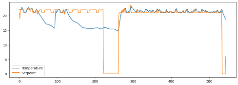

# netatmo-energy


<!-- WARNING: THIS FILE WAS AUTOGENERATED! DO NOT EDIT! -->

``` python
from fasthtml.jupyter import *

from fastcore.utils import *
import fastcore.all as fc, matplotlib.pyplot as plt, collections
from fastcore.xtras import dict2obj

from httpx import get as xget, post as xpost
from fasthtml.common import *
from monsterui.core import *

from dotenv import load_dotenv

from base64 import b64decode
from ipykernel_helper import get_md
from IPython.display import Image, display
```

``` python
load_dotenv()
```

    True

Hi solveit! I am Pol, and I am working with you today! I’m an
experienced Python coder and I enjoy learning new things. When writing
code for me, please follow fast.ai coding style: avoid comments; place
single line if/loop/etc constructs on the same line; use concise
variable names where appropriate. Follow the style you will see in my
messages, as we work on this dialogue together. Are you ready?

##### 🤖Reply🤖<!-- SOLVEIT_SEPARATOR_7f3a9b2c -->

Hi Pol! Yes, I’m absolutely ready to work with you! I’m familiar with
the fast.ai coding style and will follow your preferences for concise,
clear code without unnecessary comments. I see you’ve already set up
some useful imports including fastcore, which I know is central to the
fast.ai approach.

The goal of this notebook is to set up communication with my home
thermostat from the Netatmo brand. I have already created an app on
their website to get API access.

The documentation is here:
https://dev.netatmo.com/apidocumentation/general

The documentation pages are rendered using JS so let’s first set up Zyte
so we can render those pages and access the proper docs.

## Zyte API

``` python
def fetch_page(
    url:str, # URL to fetch,
    browser_html:bool=True, # Use a browser to reunder js page?
    as_md:bool=False, # Convert HTML to markdown?
    screenshot:bool=False, # Also return a screenshot?
    timeout:int=15, # fetch timeout in seconds
):
    "Fetch a page"
    api_key=os.getenv('ZYTE_API_KEY')
    r = xpost("https://api.zyte.com/v1/extract", auth=(api_key, ""), json=dict(url=url, browserHtml=browser_html, screenshot=screenshot), timeout=timeout)
    r.raise_for_status()
    rj = r.json()
    if rj['statusCode'] != 200: raise Exception(f"Status {rj['statusCode']} for {url}")
    html = get_md(rj['browserHtml']) if as_md else rj['browserHtml']
    img = Image(data=b64decode(rj['screenshot'])) if screenshot and 'screenshot' in rj else None
    return (html, img) if screenshot else html
```

``` python
html, img = fetch_page('https://dev.netatmo.com/apidocumentation/energy', screenshot=True)
```

``` python
html[:500]
```

    '<!DOCTYPE html><html><head>\n    <meta data-n-head="ssr" charset="utf-8"><meta data-n-head="ssr" name="viewport" content="width=device-width, initial-scale=1"><meta data-n-head="ssr" data-hid="description" name="description" content="We want to create a smarter home. With Netatmo connect, creative people can imagine solutions to make users\' life easier.\n                Netatmo products are ready to communicate with all Apps and services to fit your vision of what makes a home smarter."><meta data'

``` python
img
```


## Thermostat Class

**Energy API endpoints** for Netatmo thermostat:

<table>
<thead>
<tr>
<th>Method</th>
<th>Endpoint</th>
<th>Description</th>
</tr>
</thead>
<tbody>
<tr>
<td>GET</td>
<td><code>/homesdata</code></td>
<td>Retrieve user’s homes and topology</td>
</tr>
<tr>
<td>GET</td>
<td><code>/homestatus</code></td>
<td>Get current status of home and devices</td>
</tr>
<tr>
<td>GET</td>
<td><code>/getroommeasure</code></td>
<td>Retrieve room data history (for graphs)</td>
</tr>
<tr>
<td>POST</td>
<td><code>/setroomthermpoint</code></td>
<td>Control heating of a room</td>
</tr>
<tr>
<td>POST</td>
<td><code>/setthermmode</code></td>
<td>Control home heating system</td>
</tr>
<tr>
<td>GET</td>
<td><code>/getmeasure</code></td>
<td>Retrieve boiler historical data</td>
</tr>
<tr>
<td>POST</td>
<td><code>/createnewhomeschedule</code></td>
<td>Create thermostat weekly schedule</td>
</tr>
<tr>
<td>POST</td>
<td><code>/synchomeschedule</code></td>
<td>Modify thermostat weekly schedule</td>
</tr>
<tr>
<td>POST</td>
<td><code>/switchhomeschedule</code></td>
<td>Apply a specific schedule</td>
</tr>
</tbody>
</table>

Base domain is `api.netatmo.com` (they’re retiring `api.netatmo.net` on
Sept 8, 2025).

------------------------------------------------------------------------

### Thermostat

>  Thermostat (client_id=None, client_secret=None, access_token=None,
>                  refresh_token=None)

*Initialize self. See help(type(self)) for accurate signature.*

``` python
t = Thermostat()
t.client_id[:10]  # quick check
```

    '6952046932'

``` python
r = t._refresh()
list(r)
```

    ['access_token', 'refresh_token', 'expires_in', 'expire_in', 'scope']

``` python
from dialoghelper.core import *

# tool_info()
```

Tools available from dialoghelper:
&`[curr_dialog, msg_idx, add_html, find_msg_id, find_msgs, read_msg, del_msg, add_msg, update_msg, msg_insert_line, msg_str_replace, msg_strs_replace, msg_replace_lines]`

### Homes data

------------------------------------------------------------------------

### Thermostat.homesdata

>  Thermostat.homesdata ()

``` python
r = t.homesdata()
home_id = r.homes[0].id
home_id
```

    '693572355b98bfc2a009b174'

``` python
r.homes[0].schedules
```

    (#1) [{'timetable': [{'zone_id': 1, 'm_offset': 0}, {'zone_id': 0, 'm_offset': 480}, {'zone_id': 1, 'm_offset': 1440}, {'zone_id': 0, 'm_offset': 1920}, {'zone_id': 1, 'm_offset': 2880}, {'zone_id': 0, 'm_offset': 3360}, {'zone_id': 1, 'm_offset': 4320}, {'zone_id': 0, 'm_offset': 4800}, {'zone_id': 1, 'm_offset': 5760}, {'zone_id': 0, 'm_offset': 6240}, {'zone_id': 1, 'm_offset': 7200}, {'zone_id': 0, 'm_offset': 7740}, {'zone_id': 1, 'm_offset': 8640}, {'zone_id': 0, 'm_offset': 9180}], 'zones': [{'name': 'Night', 'id': 1, 'type': 1, 'rooms_temp': [{'room_id': '3352988001', 'temp': 21}], 'modules': [], 'rooms': [{'id': '3352988001', 'therm_setpoint_temperature': 21}]}, {'name': 'Comfort', 'id': 0, 'type': 0, 'rooms_temp': [{'room_id': '3352988001', 'temp': 21}], 'modules': [], 'rooms': [{'id': '3352988001', 'therm_setpoint_temperature': 21}]}, {'name': 'Comfort +', 'id': 3, 'type': 8, 'rooms_temp': [{'room_id': '3352988001', 'temp': 22}], 'modules': [], 'rooms': [{'id': '3352988001', 'therm_setpoint_temperature': 22}]}, {'name': 'Eco', 'id': 4, 'type': 5, 'rooms_temp': [{'room_id': '3352988001', 'temp': 19}], 'modules': [], 'rooms': [{'id': '3352988001', 'therm_setpoint_temperature': 19}]}], 'name': 'Temperature schedule', 'default': False, 'away_temp': 17, 'hg_temp': 7, 'id': '693572355b98bfc2a009b175', 'type': 'therm', 'selected': True}]

We can see one schedule called “Temperature schedule” with:

**Zones** (temperature presets): - `Night` (id 1): 21°C - `Comfort` (id
0): 21°C  
- `Comfort +` (id 3): 22°C - `Eco` (id 4): 19°C

**Timetable** - `m_offset` is minutes from Monday 00:00: - `0` = Mon
00:00 → zone 1 (Night) - `480` = Mon 08:00 → zone 0 (Comfort) - `1440` =
Tue 00:00 → zone 1 (Night) - etc.

**Special temps:** - `away_temp`: 17°C - `hg_temp`: 7°C (frost guard)

So it switches between Night and Comfort zones each day at midnight and
8am

### Home status

------------------------------------------------------------------------

### Thermostat.homestatus

>  Thermostat.homestatus (home_id)

``` python
st = t.homestatus(home_id=home_id)
room = st.home.rooms[0]
room
```

``` python
{ 'anticipating': False,
  'heating_power_request': 0,
  'id': '3352988001',
  'open_window': False,
  'reachable': True,
  'therm_measured_temperature': 18.6,
  'therm_setpoint_mode': 'off',
  'therm_setpoint_start_time': 1767067816,
  'therm_setpoint_temperature': 0}
```

let’s do them all in order, first only getroommeasuer

##### 🤖Reply🤖<!-- SOLVEIT_SEPARATOR_7f3a9b2c -->

🧠🧠🧠🧠🧠🧠🧠🧠🧠🧠

<details class="tool-usage-details">

``` json
{
  "id": "toolu_01HunczNpfbgMrcgkYhKt9EF",
  "call": {
    "function": "add_msg",
    "arguments": {
      "content": "### Getroommeasure"
    }
  },
  "result": "'_5dcdeea5'"
}
```

</details>

<details class="tool-usage-details">

``` json
{
  "id": "toolu_01Un5xyQRYNUejKCYZCTnrYc",
  "call": {
    "function": "add_msg",
    "arguments": {
      "msg_type": "code",
      "content": "@patch\ndef getroommeasure(self:Thermostat, home_id, room_id, scale='1hour', type='temperature', begin=None, end=None):\n    return self._request('getroommeasure', data=fc.dict_filter(\n        {'home_id': home_id, 'room_id': room_id, 'scale': scale, 'type': type, 'date_begin': begin, 'date_end': end}))"
    }
  },
  "result": "'_3eb95a1f'"
}
```

</details>

<details class="tool-usage-details">

``` json
{
  "id": "toolu_01VuX3fqR4a6YEAmdjv4oDWT",
  "call": {
    "function": "add_msg",
    "arguments": {
      "msg_type": "code",
      "content": "t.getroommeasure(home_id, room.id)"
    }
  },
  "result": "'_50cb2c7a'"
}
```

</details>

Done! I’ve added the `getroommeasure` method. Run those cells and let me
know what you get back — the `type` param can be `'temperature'` or
`'sp_temperature'` (setpoint), and `scale` can be `'30min'`, `'1hour'`,
`'3hours'`, `'1day'`, `'1week'`, `'1month'`.

### Get room measure

------------------------------------------------------------------------

### Thermostat.getroommeasure

>  Thermostat.getroommeasure (home_id:str, room_id:str, scale:str='1hour',
>                                 type:str='temperature', begin:int=None,
>                                 end:int=None)

*Retrieve room temperature history*

<table>
<colgroup>
<col style="width: 6%" />
<col style="width: 25%" />
<col style="width: 34%" />
<col style="width: 34%" />
</colgroup>
<thead>
<tr>
<th></th>
<th><strong>Type</strong></th>
<th><strong>Default</strong></th>
<th><strong>Details</strong></th>
</tr>
</thead>
<tbody>
<tr>
<td>home_id</td>
<td>str</td>
<td></td>
<td>Home ID</td>
</tr>
<tr>
<td>room_id</td>
<td>str</td>
<td></td>
<td>Room ID</td>
</tr>
<tr>
<td>scale</td>
<td>str</td>
<td>1hour</td>
<td>Time scale: 30min, 1hour, 3hours, 1day, 1week, 1month</td>
</tr>
<tr>
<td>type</td>
<td>str</td>
<td>temperature</td>
<td>Data type: temperature or sp_temperature</td>
</tr>
<tr>
<td>begin</td>
<td>int</td>
<td>None</td>
<td>Start timestamp</td>
</tr>
<tr>
<td>end</td>
<td>int</td>
<td>None</td>
<td>End timestamp</td>
</tr>
</tbody>
</table>

``` python
r = t.getroommeasure(home_id, room.id)
list(r)
```

    [{'beg_time': 1765110600,
      'step_time': 3600,
      'value': (#544) [[22.2],[22.2],[22.1],[22],[22.1],[22.3],[22.9],[22.7],[22.3],[22],[22],[21.9],[21.3],[21.1],[21],[21],[21],[21.1],[21.3],[21.7]...]}]

let’s do a super minimal plot of the data

##### 🤖Reply🤖<!-- SOLVEIT_SEPARATOR_7f3a9b2c -->

🧠🧠🧠🧠🧠🧠

``` python
plt.plot(r[0]['value'])
```

``` python
plt.plot([v[0] for v in r[0]['value']])
```


amazing! let’s do the next endpoint

##### 🤖Reply🤖<!-- SOLVEIT_SEPARATOR_7f3a9b2c -->

🧠🧠🧠🧠🧠

<details class="tool-usage-details">

``` json
{
  "id": "toolu_01Rn74vzg44TKw4nVfbhD6hg",
  "call": {
    "function": "add_msg",
    "arguments": {
      "content": "### setroomthermpoint"
    }
  },
  "result": "'_f48d7b2e'"
}
```

</details>

<details class="tool-usage-details">

``` json
{
  "id": "toolu_01SSUKm8ojetBtSx4g3cJXcB",
  "call": {
    "function": "add_msg",
    "arguments": {
      "msg_type": "code",
      "content": "@patch\ndef setroomthermpoint(self:Thermostat,\n    home_id:str,   # Home ID\n    room_id:str,   # Room ID\n    mode:str,      # Mode: manual, home, or schedule\n    temp:float=None,      # Target temperature (for manual mode)\n    endtime:int=None,     # End timestamp (for manual mode)\n):\n    \"Set room temperature setpoint\"\n    d = {'home_id': home_id, 'room_id': room_id, 'mode': mode}\n    if temp: d['temp'] = temp\n    if endtime: d['endtime'] = endtime\n    return self._request('setroomthermpoint', data=d)"
    }
  },
  "result": "'_f2a8da99'"
}
```

</details>

<details class="tool-usage-details">

``` json
{
  "id": "toolu_014hxrqjtoCkPhe39bHg6yr8",
  "call": {
    "function": "add_msg",
    "arguments": {
      "msg_type": "code",
      "content": "# Example: set room to 20\u00b0C for 1 hour\n# t.setroomthermpoint(home_id, room.id, mode='manual', temp=20, endtime=int(time.time())+3600)"
    }
  },
  "result": "'_f1dd2356'"
}
```

</details>

Done! I commented out the example since it would actually change your
thermostat. Run the first cell to add the method, then you can test it
when ready. Next up is `setthermmode`?

maybe let’s first get the therm point so then we can actually set and
unset it to make sure this works

##### 🤖Reply🤖<!-- SOLVEIT_SEPARATOR_7f3a9b2c -->

🧠🧠🧠🧠🧠🧠🧠🧠🧠🧠🧠🧠🧠🧠🧠🧠🧠🧠🧠🧠🧠🧠🧠🧠🧠🧠🧠🧠🧠🧠🧠🧠🧠🧠🧠🧠

You already have the setpoint from `homestatus` — check `room`:

``` python
room.therm_setpoint_temperature, room.therm_setpoint_mode
```

That will show current temp and mode. Then you can set it, call
`homestatus` again, and verify it changed.

### Set room therm point

------------------------------------------------------------------------

### Thermostat.room_temperatures

>  Thermostat.room_temperatures (home_id:str)

*Nicer way to get a list of the temperatures of all room in the home*

------------------------------------------------------------------------

### Thermostat.setroomthermpoint

>  Thermostat.setroomthermpoint (home_id:str, room_id:str, mode:str,
>                                    temp:float=None, endtime:int=None)

*Set room temperature setpoint*

<table>
<thead>
<tr>
<th></th>
<th><strong>Type</strong></th>
<th><strong>Default</strong></th>
<th><strong>Details</strong></th>
</tr>
</thead>
<tbody>
<tr>
<td>home_id</td>
<td>str</td>
<td></td>
<td>Home ID</td>
</tr>
<tr>
<td>room_id</td>
<td>str</td>
<td></td>
<td>Room ID</td>
</tr>
<tr>
<td>mode</td>
<td>str</td>
<td></td>
<td>Mode: manual, home, or schedule</td>
</tr>
<tr>
<td>temp</td>
<td>float</td>
<td>None</td>
<td>Target temperature (for manual mode)</td>
</tr>
<tr>
<td>endtime</td>
<td>int</td>
<td>None</td>
<td>End timestamp (for manual mode)</td>
</tr>
</tbody>
</table>

``` python
# let's check the thermp point before setting it

t.room_temperatures(home_id)
```

    [{'room_id': '3352988001',
      'temperature': 18.6,
      'setpoint': 0,
      'setpoint_mode': 'off'}]

``` python
# Example: set room to 20°C for 1 hour
t.setroomthermpoint(home_id, room.id, mode='manual', temp=20, endtime=int(time())+3600)
```

``` python
{'status': 'ok', 'time_server': 1767067846}
```

``` python
t.room_temperatures(home_id)
```

    [{'room_id': '3352988001',
      'temperature': 18.6,
      'setpoint': 20,
      'setpoint_mode': 'manual'}]

We can see the thermostat was turned on, let’s turn it off again below

``` python
t.setroomthermpoint(home_id, room.id, mode='off')
```

``` python
{'status': 'ok', 'time_server': 1767067847}
```

``` python
t.room_temperatures(home_id)
```

    [{'room_id': '3352988001',
      'temperature': 18.6,
      'setpoint': 0,
      'setpoint_mode': 'off'}]

amazing! let’s do another method

##### 🤖Reply🤖<!-- SOLVEIT_SEPARATOR_7f3a9b2c -->

🧠🧠🧠🧠

<details class="tool-usage-details">

``` json
{
  "id": "toolu_01XDjLFWZHzxkWjqjH6jk2zx",
  "call": {
    "function": "add_msg",
    "arguments": {
      "content": "### setthermmode"
    }
  },
  "result": "'_be102f56'"
}
```

</details>

<details class="tool-usage-details">

``` json
{
  "id": "toolu_017ts9PKjZtrtTrBa548vWcr",
  "call": {
    "function": "add_msg",
    "arguments": {
      "msg_type": "code",
      "content": "@patch\ndef setthermmode(self:Thermostat,\n    home_id:str,   # Home ID\n    mode:str,      # Mode: schedule, away, hg (frost guard)\n    endtime:int=None,  # End timestamp (for away/hg modes)\n):\n    \"Set home thermostat mode\"\n    d = {'home_id': home_id, 'mode': mode}\n    if endtime: d['endtime'] = endtime\n    return self._request('setthermmode', data=d)"
    }
  },
  "result": "'_e51c0227'"
}
```

</details>

<details class="tool-usage-details">

``` json
{
  "id": "toolu_01GemP1TdjJUNwwGxTtBJ22q",
  "call": {
    "function": "add_msg",
    "arguments": {
      "msg_type": "code",
      "content": "# t.setthermmode(home_id, mode='schedule')"
    }
  },
  "result": "'_ce3bf4ca'"
}
```

</details>

Done! Modes are `schedule` (follow weekly schedule), `away` (away mode),
and `hg` (frost guard/minimum temp). Next is `getmeasure` for boiler
history?

### Set therm mode

------------------------------------------------------------------------

### Thermostat.setthermmode

>  Thermostat.setthermmode (home_id:str, mode:str, endtime:int=None)

*Set home thermostat mode*

<table>
<colgroup>
<col style="width: 6%" />
<col style="width: 25%" />
<col style="width: 34%" />
<col style="width: 34%" />
</colgroup>
<thead>
<tr>
<th></th>
<th><strong>Type</strong></th>
<th><strong>Default</strong></th>
<th><strong>Details</strong></th>
</tr>
</thead>
<tbody>
<tr>
<td>home_id</td>
<td>str</td>
<td></td>
<td>Home ID</td>
</tr>
<tr>
<td>mode</td>
<td>str</td>
<td></td>
<td>Mode: schedule (weekly program), away (reduced temp), hg (frost
guard ~7°C)</td>
</tr>
<tr>
<td>endtime</td>
<td>int</td>
<td>None</td>
<td>End timestamp (for away/hg modes)</td>
</tr>
</tbody>
</table>

I think it would be good to document a bit more the schedule modes,
should we add the info after the markdown header? or in the method
docstring or docments? wdyt?

##### 🤖Reply🤖<!-- SOLVEIT_SEPARATOR_7f3a9b2c -->

🧠🧠🧠🧠🧠🧠🧠🧠🧠🧠🧠🧠🧠🧠🧠🧠🧠

I’d suggest in the docments (the parameter comments) since that’s where
you already have the pattern and it keeps info close to the code.
Something like:

``` python
mode:str,      # Mode: schedule (weekly), away (reduced temp), hg (frost guard ~7°C)
```

Or if you want more detail, a short note after the header works too.
What’s your preference?

docments sounds good! do it for me please!

##### 🤖Reply🤖<!-- SOLVEIT_SEPARATOR_7f3a9b2c -->

🧠🧠🧠🧠🧠

<details class="tool-usage-details">

``` json
{
  "id": "toolu_015oE9j2k2QJjddhRMibEcMv",
  "call": {
    "function": "msg_str_replace",
    "arguments": {
      "msgid": "_e51c0227",
      "old_str": "mode:str,      # Mode: schedule, away, hg (frost guard)",
      "new_str": "mode:str,      # Mode: schedule (weekly program), away (reduced temp), hg (frost guard ~7\u00b0C)"
    }
  },
  "result": "{'success': 'Replaced text in message _e51c0227'}"
}
```

</details>

Done! Updated the `mode` docment with more detail.

``` python
# t.setthermmode(home_id, mode='schedule')
```

``` python
t.room_temperatures(home_id)
```

    [{'room_id': '3352988001',
      'temperature': 18.6,
      'setpoint': 0,
      'setpoint_mode': 'off'}]

is this what we expect after setting the mode to schedule?

##### 🤖Reply🤖<!-- SOLVEIT_SEPARATOR_7f3a9b2c -->

🧠🧠🧠🧠🧠🧠🧠🧠🧠🧠🧠🧠🧠🧠🧠🧠🧠🧠🧠🧠🧠🧠🧠🧠🧠🧠🧠🧠🧠🧠🧠🧠🧠🧠🧠🧠🧠🧠🧠🧠🧠🧠🧠🧠🧠🧠🧠🧠🧠🧠🧠

Yes, this looks correct! `setthermmode` sets the *home’s* operating mode
to follow the schedule, but the schedule itself currently has your room
set to “off” at this time of day. So the room’s `setpoint_mode: 'off'`
is what the schedule dictates right now.

If you had heating periods defined in your weekly schedule, the room
would show `setpoint_mode: 'schedule'` with a target temperature during
those times.

can you explain this a bit in a note so users reading my notebook will
get it?

##### 🤖Reply🤖<!-- SOLVEIT_SEPARATOR_7f3a9b2c -->

🧠🧠🧠🧠🧠🧠🧠🧠🧠🧠🧠🧠

<details class="tool-usage-details">

``` json
{
  "id": "toolu_01KyVTw3dm44x9wNpWxtDya4",
  "call": {
    "function": "add_msg",
    "arguments": {
      "content": "**Note:** `setthermmode` controls the *home's* operating mode (schedule/away/hg), not individual room setpoints. When set to `schedule`, each room follows its weekly program\u2014so a room showing `setpoint_mode: 'off'` means the schedule has it off at that time. During scheduled heating periods, it would show `setpoint_mode: 'schedule'` with a target temperature."
    }
  },
  "result": "'_42759b01'"
}
```

</details>

Done! Want to continue with `getmeasure` next?

**Note:** `setthermmode` controls the *home’s* operating mode
(schedule/away/hg), not individual room setpoints. When set to
`schedule`, each room follows its weekly program—so a room showing
`setpoint_mode: 'off'` means the schedule has it off at that time.
During scheduled heating periods, it would show
`setpoint_mode: 'schedule'` with a target temperature.

### Get measure

------------------------------------------------------------------------

### Thermostat.getmeasure

>  Thermostat.getmeasure (device_id:str, module_id:str=None,
>                             scale:str='1hour', type:str='boileron',
>                             begin:int=None, end:int=None)

*Retrieve boiler historical data*

<table>
<colgroup>
<col style="width: 6%" />
<col style="width: 25%" />
<col style="width: 34%" />
<col style="width: 34%" />
</colgroup>
<thead>
<tr>
<th></th>
<th><strong>Type</strong></th>
<th><strong>Default</strong></th>
<th><strong>Details</strong></th>
</tr>
</thead>
<tbody>
<tr>
<td>device_id</td>
<td>str</td>
<td></td>
<td>Device MAC address</td>
</tr>
<tr>
<td>module_id</td>
<td>str</td>
<td>None</td>
<td>Module MAC (if reading from a module)</td>
</tr>
<tr>
<td>scale</td>
<td>str</td>
<td>1hour</td>
<td>Time scale: 30min, 1hour, 3hours, 1day, 1week, 1month</td>
</tr>
<tr>
<td>type</td>
<td>str</td>
<td>boileron</td>
<td>Data type: boileron, boileroff, sum_boiler_on, sum_boiler_off</td>
</tr>
<tr>
<td>begin</td>
<td>int</td>
<td>None</td>
<td>Start timestamp</td>
</tr>
<tr>
<td>end</td>
<td>int</td>
<td>None</td>
<td>End timestamp</td>
</tr>
</tbody>
</table>

``` python
# Get device_id from homesdata
r = t.homesdata()
device_id = r.homes[0].modules[0].id
m = t.getmeasure(device_id)
list(m)
```

    [{'beg_time': 1765110600,
      'step_time': 3600,
      'value': (#544) [[None],[None],[None],[None],[None],[None],[None],[None],[None],[None],[None],[None],[None],[None],[None],[None],[None],[None],[None],[None]...]}]

I don’t have a boiler device so the data is None

I assumed it’s none because I have no boiler, but then I actually have a
device_id, what’s that?

##### 🤖Reply🤖<!-- SOLVEIT_SEPARATOR_7f3a9b2c -->

🧠🧠🧠🧠🧠🧠🧠🧠🧠🧠🧠🧠🧠🧠🧠🧠🧠🧠🧠🧠🧠

Good question! The `device_id` is likely your thermostat or relay
module, not a boiler. Try checking what modules you have:

``` python
[(m.id, m.type, m.get('name', '')) for m in r.homes[0].modules]
```

This will show you what devices are registered. The `getmeasure`
endpoint specifically tracks boiler on/off times, which requires a
compatible boiler controller module to report that data.

``` python
[(m.type, m.get('name', '')) for m in r.homes[0].modules]
```

    [('NAPlug', 'Termostato'), ('NATherm1', 'Thermostat')]

.

##### 🤖Reply🤖<!-- SOLVEIT_SEPARATOR_7f3a9b2c -->

🧠🧠🧠🧠🧠🧠🧠🧠🧠🧠🧠🧠🧠🧠🧠🧠🧠🧠🧠🧠🧠🧠🧠🧠🧠🧠🧠🧠🧠🧠🧠🧠🧠🧠🧠🧠🧠🧠

You have: - **NAPlug** - the relay that controls heating on/off -
**NATherm1** - the thermostat that measures temperature and sends
commands

The `getmeasure` boiler data likely returns `None` because your relay
isn’t logging boiler cycles, or your heating system doesn’t report that
info. This is normal for many setups.

Ready for the next endpoint? We have `createnewhomeschedule`,
`synchomeschedule`, and `switchhomeschedule` left.

### Create new home schedule

------------------------------------------------------------------------

### Thermostat.createnewhomeschedule

>  Thermostat.createnewhomeschedule (home_id:str, name:str, zones:list,
>                                        timetable:list, hg_temp:float=7,
>                                        away_temp:float=17)

*Create a new weekly schedule*

<table>
<colgroup>
<col style="width: 6%" />
<col style="width: 25%" />
<col style="width: 34%" />
<col style="width: 34%" />
</colgroup>
<thead>
<tr>
<th></th>
<th><strong>Type</strong></th>
<th><strong>Default</strong></th>
<th><strong>Details</strong></th>
</tr>
</thead>
<tbody>
<tr>
<td>home_id</td>
<td>str</td>
<td></td>
<td>Home ID</td>
</tr>
<tr>
<td>name</td>
<td>str</td>
<td></td>
<td>New schedule name</td>
</tr>
<tr>
<td>zones</td>
<td>list</td>
<td></td>
<td>List of zone dicts with id, name, type, rooms_temp</td>
</tr>
<tr>
<td>timetable</td>
<td>list</td>
<td></td>
<td>List of timetable entries with zone_id, m_offset</td>
</tr>
<tr>
<td>hg_temp</td>
<td>float</td>
<td>7</td>
<td>Frost guard temp</td>
</tr>
<tr>
<td>away_temp</td>
<td>float</td>
<td>17</td>
<td>Away mode temp</td>
</tr>
</tbody>
</table>

### Switch home schedule

------------------------------------------------------------------------

### Thermostat.switchhomeschedule

>  Thermostat.switchhomeschedule (home_id:str, schedule_id:str)

*Switch to a specific weekly schedule*

<table>
<thead>
<tr>
<th></th>
<th><strong>Type</strong></th>
<th><strong>Details</strong></th>
</tr>
</thead>
<tbody>
<tr>
<td>home_id</td>
<td>str</td>
<td>Home ID</td>
</tr>
<tr>
<td>schedule_id</td>
<td>str</td>
<td>Schedule ID to activate</td>
</tr>
</tbody>
</table>

### Sync home schedule

------------------------------------------------------------------------

### Thermostat.synchomeschedule

>  Thermostat.synchomeschedule (home_id:str, schedule_id:str, zones:list,
>                                   timetable:list, name:str=None,
>                                   hg_temp:float=None, away_temp:float=None)

*Modify an existing weekly schedule*

<table>
<colgroup>
<col style="width: 6%" />
<col style="width: 25%" />
<col style="width: 34%" />
<col style="width: 34%" />
</colgroup>
<thead>
<tr>
<th></th>
<th><strong>Type</strong></th>
<th><strong>Default</strong></th>
<th><strong>Details</strong></th>
</tr>
</thead>
<tbody>
<tr>
<td>home_id</td>
<td>str</td>
<td></td>
<td>Home ID</td>
</tr>
<tr>
<td>schedule_id</td>
<td>str</td>
<td></td>
<td>Schedule ID to modify</td>
</tr>
<tr>
<td>zones</td>
<td>list</td>
<td></td>
<td>List of zone dicts with id, name, type, rooms_temp</td>
</tr>
<tr>
<td>timetable</td>
<td>list</td>
<td></td>
<td>List of timetable entries with zone_id, m_offset</td>
</tr>
<tr>
<td>name</td>
<td>str</td>
<td>None</td>
<td>Schedule name</td>
</tr>
<tr>
<td>hg_temp</td>
<td>float</td>
<td>None</td>
<td>Frost guard temp</td>
</tr>
<tr>
<td>away_temp</td>
<td>float</td>
<td>None</td>
<td>Away mode temp</td>
</tr>
</tbody>
</table>

## Publishing the package to pypi

is our SDK only for thermostats? I’m planning to make it publicly
available and I’m wondering what the github repo name and description
should be to make it easily discoverable

##### 🤖Reply🤖<!-- SOLVEIT_SEPARATOR_7f3a9b2c -->

🧠🧠🧠🧠🧠🧠🧠🧠🧠🧠🧠🧠🧠🧠🧠🧠🧠🧠🧠🧠🧠🧠🧠🧠🧠🧠🧠🧠🧠🧠🧠🧠🧠🧠

Currently yes — we’ve only implemented the Energy API endpoints
(thermostats/heating). Netatmo also has APIs for: - **Weather** -
weather stations, rain gauges - **Security** - cameras, smoke
detectors - **Aircare** - air quality monitors

Naming options: 1. **Thermostat-specific**: `netatmo-thermostat`,
`netatmo-energy-py` — clear but limited scope 2. **Expandable**:
`netatmo-py`, `python-netatmo` — room to grow if you add other products
later

For discoverability, I’d suggest `netatmo-py` or `netatmo-api-python`
with a description like “Python SDK for Netatmo APIs
(Energy/Thermostat)” — accurate now but leaves room to expand.

What’s your preference?

I don’t want to spend too much time on it, but would be great to publish
it and maybe tweet it? It is basically a “reply” to this tweet by Andrej
Karpathy:

    I was inspired by this so I wanted to see if Claude Code can get into my Lutron home automation system.

    - it found my Lutron controllers on the local wifi network
    - checked for open ports, connected, got some metadata and identified the devices and their firmware
    - searched the internet, found the pdf for my system
    - instructed me on what button to press to pair and get the certificates
    - it connected to the system and found all the home devices (lights, shades, HVAC temperature control, motion sensors etc.)
    - it turned on and off my kitchen lights to check that things are working (lol!)

    I am now vibe coding the home automation master command center, the potential is 🔥.And I'm throwing away the crappy, janky, slow Lutron iOS app I've been using so far. Insanely fun :D :D

I then did this:

    I tried this too by asking CC to connect to my netatmo thermostat.

    CC spent a huge amount of tokens scanning ports, using nmap, arp, dsn, web searching for my thermostat's brand MAC prefix, etc...

    It did find my thermostat MAC address, which looked cool. Later, it walked me through the official way of creating an 'App' in the netatmo and getting the keys & tokens.

    At this point the whole message quota almost ran out. 

    Then it hit me that I was just going to use their standard API, so why the MAC and all that stuff. Effectively, all that exploration is pretty useless as CC recognizes, just a token sink.


    It would have been much quicker to have a look at the docs from the beginning and set a quick python script to try it out.

    It feels kind of useless to have wasted this amount of tokens for nothing, on the other hand, it's true that I would never have thought of trying to use my thermostat with an API (I have a perfectly ok app to do so) w/o CC, both because the original tweet was caused by CC and because I could just spin it up on the background while I did other stuff.

    Bittersweet.

So I decided to do it the solveIT way

##### 🤖Reply🤖<!-- SOLVEIT_SEPARATOR_7f3a9b2c -->

🧠🧠🧠🧠🧠🧠🧠🧠🧠🧠🧠🧠🧠🧠🧠🧠🧠🧠🧠🧠🧠🧠🧠🧠🧠🧠🧠🧠🧠🧠🧠🧠🧠🧠🧠🧠🧠🧠🧠🧠🧠

Great story! The contrast is compelling: CC burned tokens on exploratory
scanning while the solveit approach went straight to docs → working SDK
in a focused session.

For sharing, you could:

1.  **Export this notebook** as a GitHub gist or repo with a simple
    README telling the story
2.  **Tweet thread**: Your existing text is already good — just add a
    link to the notebook and maybe a screenshot of the temperature plot

Repo name suggestion: `netatmo-solveit` or `netatmo-the-boring-way` 😄

Want help drafting a README or tweet thread?

yes create a basic README explaining how to use it. Consider that we
will export all the important class methods into a .py file to be used

##### 🤖Reply🤖<!-- SOLVEIT_SEPARATOR_7f3a9b2c -->

🧠🧠🧠🧠

<details class="tool-usage-details">

``` json
{
  "id": "toolu_01T5Z7MdaZ3af1ibUnAVreXH",
  "call": {
    "function": "add_msg",
    "arguments": {
      "content": "# netatmo-energy\n\nA simple Python SDK for the Netatmo Energy API (thermostats).\n\n## Setup\n\n1. Create an app at [dev.netatmo.com](https://dev.netatmo.com) to get your API credentials\n2. Create a `.env` file:\n```\nCLIENT_ID=your_client_id\nCLIENT_SECRET=your_client_secret\nACCESS_TOKEN=your_access_token\nREFRESH_TOKEN=your_refresh_token\n```\n\n## Usage\n\n```python\nfrom netatmo import Thermostat\n\nt = Thermostat()\nhomes = t.homesdata()\nhome_id = homes.homes[0].id\n\n# Get current status\nt.room_temperatures(home_id)\n\n# Set room to 20\u00b0C for 1 hour\nt.setroomthermpoint(home_id, room_id, mode='manual', temp=20,<TRUNCATED>"
    }
  },
  "result": "'_0bcdb02f'"
}
```

</details>

Done! Take a look and let me know if you want any changes — I can adjust
the tone, add more detail to any section, or link to Karpathy’s actual
tweet URL if you have it.

I just cloned the repo into our current working dir, I think the easiest
to publish it is to set it up as an nbdev project, could you help with
that?

##### 🤖Reply🤖<!-- SOLVEIT_SEPARATOR_7f3a9b2c -->

🧠🧠🧠🧠🧠🧠🧠🧠🧠🧠

Sure! Let’s see what’s in the repo first:

<details class="tool-usage-details">

``` json
{
  "id": "toolu_01Mvo1jSv5gsRE7Xr6fh1WKU",
  "call": {
    "function": "view",
    "arguments": {
      "path": "."
    }
  },
  "result": "'Directory contents of /app/data/netatmo-thermostat:\\n/app/data/netatmo-thermostat/thermostat-netatmo.ipynb\\n/app/data/netatmo-thermostat/netatmo-thermostat\\n/app/data/netatmo-thermostat/thermostat_netatmo.py\\n/app/data/netatmo-thermostat/LICENSE'"
}
```

</details>

Got it. To set up nbdev, you’ll need:

1.  `settings.ini` - project config
2.  `nbs/` folder for notebooks (or rename your existing one)
3.  Run `nbdev_new` or create the config manually

Want me to create a minimal `settings.ini` for you, or would you prefer
to run `nbdev_new` and configure interactively?

I already ran `nbdev_new` what next?

##### 🤖Reply🤖<!-- SOLVEIT_SEPARATOR_7f3a9b2c -->

🧠🧠🧠🧠🧠🧠🧠

<details class="tool-usage-details">

``` json
{
  "id": "toolu_01En4683Nf9ArbRVut5Dfzvc",
  "call": {
    "function": "view",
    "arguments": {
      "path": "."
    }
  },
  "result": "'Directory contents of /app/<TRUNCATED>"
}
```

</details>

Good, nbdev scaffolding is there. Next steps:

1.  Move your `Thermostat` code into `nbs/00_core.ipynb` with
    `#| export` directives
2.  Update `nbs/index.ipynb` with your README content
3.  Run `nbdev_export` to generate `netatmo_thermostat/core.py`

Want me to show you what the `#| export` cells should look like, or do
you want to set that up yourself?

I marked the important cells for export already, can you now add at the
top the nbdev header & explanation that usually begins with \#
default_exp …

##### 🤖Reply🤖<!-- SOLVEIT_SEPARATOR_7f3a9b2c -->

🧠🧠🧠🧠🧠🧠🧠🧠🧠🧠🧠🧠

<details class="tool-usage-details">

``` json
{
  "id": "toolu_01L7yd9a4SYQvzkHV9qPNyA2",
  "call": {
    "function": "view",
    "arguments": {
      "path": "nbs/00_core.ipynb",
      "view_range": "[1, 30]"
    }
  },
  "result": "'Error: File not found: /app/data/netatmo-thermostat/nbs/nbs/00_core.ipynb'"
}
```

</details>

<details class="tool-usage-details">

``` json
{
  "id": "toolu_01XTLkEHUyCvsD7ydHk3D8KV",
  "call": {
    "function": "view",
    "arguments": {
      "path": "nbs"
    }
  },
  "result": "'Error: File not found: /app/data/netatmo-thermostat/nbs/nbs'"
}
```

</details>

<details class="tool-usage-details">

``` json
{
  "id": "toolu_01QmyU9icrqTChnZckbbRc9B",
  "call": {
    "function": "view",
    "arguments": {
      "path": "netatmo-thermostat"
    }
  },
  "result": "'Error: File not found: /app/data/netatmo-thermostat/nbs/netatmo-thermostat'"
}
```

</details>

<details class="tool-usage-details">

``` json
{
  "id": "toolu_013GpeNz2ahBHX8kRBdRx47f",
  "call": {
    "function": "view",
    "arguments": {
      "path": "/app/data/netatmo-thermostat"
    }
  },
  "result": "'Directory contents of /app/<TRUNCATED>"
}
```

</details>

<details class="tool-usage-details">

``` json
{
  "id": "toolu_01X1b3h9t6ALwFm44q8o5B3y",
  "call": {
    "function": "view",
    "arguments": {
      "path": "/app/data/netatmo-thermostat/nbs/00_core.ipynb",
      "view_range": "[1, 40]"
    }
  },
  "result": "'{\\n \"cells\": [\\n  {\\n   \"cell_type\": \"code\",\\n   \"execution_count\": null,\\n   \"id\": \"e8cba711\",\\n   \"metadata\": {\\n    \"time_run\": \"2025-12-30T05:25:29.557629+00:00\"\\n   },\\n   \"outputs\": [],\\n   \"source\": [\\n    \"from fastcore.utils import *\\\\n\",\\n    \"import fastcore.all as fc, re, math, itertools, functools, numpy as np, types, typing, dataclasses, matplotlib.pyplot as plt, collections, regex\\\\n\",\\n    \"from fastcore.xtras import dict2obj\\\\n\",\\n    \"from regex import search\\\\n\",\\n    \"from collections import Counter\\\\n\",\\n    \"from collections.abc import Iterable\\\\n\",\\n    \"from httpx impo<TRUNCATED>"
}
```

</details>

I see the notebook already has `#| export` directives. The standard
nbdev header goes at the very top. I’ll add a new first cell with
`#| default_exp core`:

<details class="tool-usage-details">

``` json
{
  "id": "toolu_01NWX5Y6WyQEJmoGzNF46T3o",
  "call": {
    "function": "insert",
    "arguments": {
      "path": "/app/data/netatmo-thermostat/nbs/00_core.ipynb",
      "insert_line": "2",
      "new_str": "{\n   \"cell_type\": \"code\",\n   \"execution_count\": null,\n   \"metadata\": {},\n   \"outputs\": [],\n   \"source\": [\"#| default_exp core\"]\n  },"
    }
  },
  "result": "'Inserted text at line 2 in /app/data/netatmo-thermostat/nbs/00_core.ipynb'"
}
```

</details>

Done! Added `#| default_exp core` as the first cell. Now `nbdev_export`
will know to export marked cells to `netatmo_thermostat/core.py`.

great! I created the reamde with the appropriate content, anything left
before pushing & publishing?

##### 🤖Reply🤖<!-- SOLVEIT_SEPARATOR_7f3a9b2c -->

🧠🧠🧠🧠🧠🧠🧠🧠🧠🧠

Quick checklist:

1.  **Run `nbdev_export`** to generate the `.py` files
2.  **Run `nbdev_clean`** to clean notebook metadata
3.  **Check `settings.ini`** has correct: `lib_name`, `version`,
    `description`, `author`, `keywords`
4.  **Test import**: `from netatmo_thermostat.core import Thermostat`

If those look good, you’re ready to push and `nbdev_pypi`!

can you check the .py file to see if the imports I exported are correct
and sufficient and whether settings.ini needs some package dependencies
added?

##### 🤖Reply🤖<!-- SOLVEIT_SEPARATOR_7f3a9b2c -->

🧠🧠🧠🧠🧠🧠🧠🧠🧠

<details class="tool-usage-details">

``` json
{
  "id": "toolu_018acryaUaLZZEofKtARKtuw",
  "call": {
    "function": "view",
    "arguments": {
      "path": "/app/data/netatmo-thermostat/netatmo_thermostat/core.py"
    }
  },
  "result": "'# AUTOGENERATED! DO NOT EDIT! File to edit: ../nbs/00_core.ipynb.\\n\\n# %% auto 0\\n__all__ = [\\'Thermostat\\']\\n\\n# %% ../nbs/00_core.ipynb 2\\nimport os\\nfrom time import time\\nfrom fastcore.utils import patch\\nfrom fastcore.xtras import dict2obj\\nfrom httpx import get as xget, post as xpost\\n\\n# %% ../nbs/00_core.ipynb 15\\nclass Thermostat:\\n    base = \\'https://api.netatmo.com\\'\\n    \\n    def __init__(self):\\n        self.client_id = os.getenv(\\'CLIENT_ID\\')\\n        self.client_secret = os.getenv(\\'CLIENT_SECRET\\')\\n        self.access_token = os.getenv(\\'ACCESS_TOKEN\\')\\n        self.refre<TRUNCATED>"
}
```

</details>

<details class="tool-usage-details">

``` json
{
  "id": "toolu_013h6SPMxkjmSa1Db4LY8Hjh",
  "call": {
    "function": "view",
    "arguments": {
      "path": "/app/data/netatmo-thermostat/settings.ini"
    }
  },
  "result": "'[DEFAULT]\\n# All sections below are required unless otherwise specified.\\n# See https://github.com/AnswerDotAI/nbdev/blob/main/settings.ini for examples.\\n\\n### Python library ###\\nrepo = netatmo-thermostat\\nlib_name = %(repo)s\\nversion = 0.0.1\\nmin_python = 3.9\\nlicense = apache2\\nblack_formatting = False\\n\\n### nbdev ###\\ndoc_path = _docs\\nlib_path = netatmo_thermostat\\nnbs_path = nbs\\nrecursive = True\\ntst_flags = notest\\nput_version_in_init = True\\nupdate_pyproject = True\\n\\n### Docs ###\\nbranch = main\\ncustom_sidebar = False\\ndoc_host = https://%(user)s.github.io\\ndoc_baseurl = /%(repo)s<TRUNCATED>"
}
```

</details>

Looks good! The imports use: - `fastcore` (for `patch`, `dict2obj`) -
`httpx` (for API calls)

Your `settings.ini` already has `requirements = fastcore httpx` ✅

One thing missing: `getroommeasure` — I don’t see it in the exported
file. Did you mark that cell for export?

what is the `_proc` folder?

##### 🤖Reply🤖<!-- SOLVEIT_SEPARATOR_7f3a9b2c -->

The `_proc` folder is created by nbdev to store processed versions of
your notebooks during builds. It’s used internally by nbdev for things
like:

- Running tests
- Building docs
- Checking for issues

You can safely add it to `.gitignore` — it’s generated automatically and
doesn’t need to be tracked in version control.

## UI

Amazing! now let’s do a very basic FastHTML app that displays a
beautiful historical plot of temperature vs. setpoint. Maybe we can
start with the FastHTML component.

##### 🤖Reply🤖<!-- SOLVEIT_SEPARATOR_7f3a9b2c -->

🧠🧠🧠🧠🧠🧠🧠🧠🧠🧠🧠🧠

For the plot, we could use either: 1. **Matplotlib** - generate a static
image, serve as base64 2. **A JS charting lib** (like Chart.js or
Plotly) - interactive, but more setup

Which approach would you prefer?

check FastHTML / monster.ui docs to see which charts they support and
use one of those

##### 🤖Reply🤖<!-- SOLVEIT_SEPARATOR_7f3a9b2c -->

🧠🧠🧠🧠🧠🧠

<details class="tool-usage-details">

``` json
{
  "id": "toolu_01DzuPzGs954Z8eUJDvjfVm4",
  "call": {
    "function": "read_url",
    "arguments": {
      "url": "https://monsterui.answer.ai/"
    }
  },
  "result": "'* Getting Started\\n    * Getting Started\\n    * Tutorial App\\n  * API Reference\\n    * Accordion | Link\\n    * Button | Link\\n    * Cards\\n    * Charts\\n    * Containers\\n    * Dividers\\n    * Forms\\n    * Html\\n    * Icons | Images\\n    * Layout\\n    * Lightbox\\n    * Lists\\n    * Loading\\n    * Markdown\\n    * Modals\\n    * Navigation\\n    * Notifications\\n    * Sliders\\n    * Steps\\n    * Tables\\n    * Theme | Headers\\n    * Typography\\n  * Guides\\n    * Spacing\\n    * Layout\\n  * Examples\\n    * Task\\n    * Card\\n    * Dashboard\\n    * Form\\n    * Music\\n    * Auth\\n    * Playground\\n    <TRUNCATED>"
}
```

</details>

<details class="tool-usage-details">

``` json
{
  "id": "toolu_01NBSYBGtVGwaHBs2Frqxpvv",
  "call": {
    "function": "read_url",
    "arguments": {
      "url": "https://monsterui.answer.ai/api_ref/charts"
    }
  },
  "result": "\"* Getting Started\\n    * Getting Started\\n    * Tutorial App\\n  * API Reference\\n    * Accordion | Link\\n    * Button | Link\\n    * Cards\\n    * Charts\\n    * Containers\\n    * Dividers\\n    * Forms\\n    * Html\\n    * Icons | Images\\n    * Layout\\n    * Lightbox\\n    * Lists\\n    * Loading\\n    * Markdown\\n    * Modals\\n    * Navigation\\n    * Notifications\\n    * Sliders\\n    * Steps\\n    * Tables\\n    * Theme | Headers\\n    * Typography\\n  * Guides\\n    * Spacing\\n    * Layout\\n  * Examples\\n    * Task\\n    * Card\\n    * Dashboard\\n    * Form\\n    * Music\\n    * Auth\\n    * Playground\\n    <TRUNCATED>"
}
```

</details>

[\*](https://github.com/AnswerDotAI/MonsterUI/blob/main/monsterui/franken.py "MonsterUI/monsterui/franken.py at main · AnswerDotAI/MonsterUI")
MonsterUI includes `ApexChart` for charting, which wraps the ApexCharts
JavaScript library.
[\*](https://monsterui.answer.ai/dashboard/code "FastHTML page - MonsterUI")
The dashboard example uses **Plotly Express** for line charts.

So you have two options: 1. **ApexChart** - built into MonsterUI (via
`ApexChart(opts={...})`)  
2. **Plotly** - used in their dashboard example

Which would you prefer? ApexChart is lighter, Plotly is more
feature-rich.

whatever is easier and more concise

##### 🤖Reply🤖<!-- SOLVEIT_SEPARATOR_7f3a9b2c -->

🧠🧠🧠🧠🧠🧠🧠🧠🧠

ApexChart is simpler. Here’s a basic line chart component:

``` python
from monsterui.core import ApexChart

def temp_chart(temps, setpoints, times):
    return ApexChart(opts={
        'chart': {'type': 'line', 'height': 350},
        'series': [
            {'name': 'Temperature', 'data': temps},
            {'name': 'Setpoint', 'data': setpoints}
        ],
        'xaxis': {'categories': times}
    })
```

Want me to wire this up with your `getroommeasure` data?

``` python
from monsterui.franken import ApexChart
from datetime import datetime
```

``` python
def temp_chart(temps, setpoints, times):
    return ApexChart(opts={
        'chart': {'type': 'line', 'height': 350},
        'series': [
            {'name': 'Temperature', 'data': temps},
            {'name': 'Setpoint', 'data': setpoints}
        ],
        'xaxis': {'categories': times}
    })
```

``` python
# Get temp and setpoint history
temps_raw = t.getroommeasure(home_id, room.id, type='temperature')
sp_raw = t.getroommeasure(home_id, room.id, type='sp_temperature')

beg, step = temps_raw[0]['beg_time'], temps_raw[0]['step_time']
temps = [v[0] for v in temps_raw[0]['value']]
setpoints = [v[0] for v in sp_raw[0]['value']]
times = [datetime.fromtimestamp(beg + i*step).strftime('%m/%d %H:%M') for i in range(len(temps))]
```

``` python
show(temp_chart(temps, setpoints, times))
```

<div class="">
<uk-chart><script type='application/json'>{"chart": {"type": "line", "height": 350}, "series": [{"name": "Temperature", "data": [22.2, 22.2, 22.1, 22, 22.1, 22.3, 22.9, 22.7, 22.3, 22, 22, 21.9, 21.3, 21.1, 21, 21, 21, 21.1, 21.3, 21.7, 22.4, 22.4, 22.3, 22.8, 22.7, 22.6, 22.3, 22, 22.3, 22.3, 22.1, 22.5, 22.3, 22.5, 22.3, 21.9, 21.6, 21.2, 21.1, 21.1, 21, 21.1, 21.2, 21.8, 22, 22.1, 22, 21.6, 21.3, 21.1, 21.1, 20.8, 20.6, 20.3, 20.1, 20, 19.8, 19.6, 19.4, 19.2, 19, 18.8, 18.6, 18.5, 18.2, 18, 17.8, 17.6, 17.5, 17.3, 17.2, 17.1, 17.1, 17.1, 17, 17, 17, 17, 16.9, 16.8, 16.8, 16.7, 16.6, 16.6, 16.5, 16.4, 16.3, 16.2, 16.1, 16, 15.9, 15.8, 15.7, 15.8, 19.5, 21.1, 21.8, 21.1, 21.1, 21.5, 21.8, 22, 22.1, 22, 22, 22.1, 22, 21.8, 21.2, 21.1, 21, 21.1, 21, 21, 21.2, 21.8, 22, 21.8, 21.4, 21, 21, 22, 22.1, 22, 22.1, 21.6, 21.2, 20.9, 20.6, 20.4, 20.1, 19.9, 19.7, 19.5, 19.3, 19.1, 19, 18.8, 18.6, 18.5, 18.4, 18.2, 18.1, 18.1, 18, 17.9, 17.9, 17.8, 17.8, 17.7, 17.6, 17.6, 17.5, 17.4, 17.3, 17.2, 17.1, 17, 16.9, 16.7, 16.6, 16.5, 16.4, 16.2, 16.1, 16, 15.9, 15.9, 15.8, 15.8, 15.8, 15.8, 15.8, 15.8, 15.7, 15.7, 15.7, 15.6, 15.6, 15.6, 15.6, 15.6, 15.6, 15.6, 15.5, 15.5, 15.5, 15.5, 15.5, 15.6, 15.6, 15.6, 15.6, 15.6, 15.6, 15.6, 15.7, 15.7, 15.7, 15.7, 15.8, 15.8, 15.8, 15.8, 15.8, 15.8, 15.8, 15.8, 15.7, 15.7, 15.6, 15.6, 15.5, 15.5, 15.5, 15.4, 15.4, 15.5, 15.5, 15.5, 15.5, 16, 16.1, 15.9, 15.9, 15.9, 15.9, 15.9, 15.8, 15.8, 15.8, 15.7, 15.6, 15.6, 15.5, 15.5, 15.5, 15.4, 15.4, 15.4, 15.4, 15.4, 15.4, 15.4, 15.4, 15.4, 15.4, 15.4, 15.4, 15.4, 15.4, 15.3, 15.3, 15.2, 15.1, 15, 15, 14.9, 14.9, 14.8, 14.7, 14.9, 16.2, 17.1, 17.9, 18.8, 19.7, 20.4, 20.8, 21.1, 21.4, 21.3, 21.4, 22.1, 22, 21.9, 21.9, 22.6, 22.4, 22.6, 22.1, 21.6, 21.2, 20.9, 21.3, 20.9, 21.4, 21.4, 20.9, 21.3, 21.3, 21.3, 22.4, 23.2, 23.3, 22.8, 22.6, 22.6, 22.7, 22.4, 22.2, 22, 22, 21.8, 21.6, 21.4, 21.2, 21.1, 20.9, 21.8, 22.1, 21.6, 21.5, 21.7, 21.6, 21.5, 21.4, 21.9, 21.9, 21.9, 21.7, 21.5, 21.5, 21.5, 21.4, 21.2, 21.1, 21.2, 21.2, 21.3, 21.5, 21.8, 22.3, 21.9, 22.2, 22.1, 21.8, 21.8, 21.6, 21.3, 21.4, 21.6, 21.8, 21.9, 21.8, 21.6, 21.4, 21.3, 21.5, 21.7, 21.6, 21.9, 21.8, 21.6, 21.3, 21, 21.1, 21.3, 21.4, 21.3, 21.2, 21.5, 22.2, 21.9, 22.2, 21.8, 21.7, 21.7, 22.1, 22, 22, 21.5, 21.1, 20.9, 20.9, 21.5, 21.2, 21.1, 21, 20.9, 21.3, 21, 21.1, 21.1, 21.1, 21, 21.6, 22.1, 21.7, 21.4, 21.5, 21.3, 21, 21.2, 21.1, 21, 21.6, 21.6, 21.6, 21.6, 21.2, 21, 21.3, 20.9, 21.2, 20.9, 21.3, 21, 21.3, 21.3, 21.4, 22.2, 21.9, 22.4, 22, 21.7, 21.6, 21.4, 21.1, 21, 21.1, 21.3, 20.9, 21.3, 21, 21.2, 21, 21.2, 21, 21.4, 21.4, 21.8, 21.5, 21.3, 21.1, 20.9, 21.2, 21.2, 21.8, 21.5, 22.1, 22, 22.2, 21.9, 21.6, 21.5, 21.3, 21.2, 21.1, 20.9, 21.2, 21.3, 21, 21.2, 21.5, 21.3, 21, 21.1, 21.3, 22, 22, 21.9, 21.4, 21.7, 22.4, 22.2, 22.1, 21.8, 21.6, 21.5, 21.6, 21.6, 21.3, 21, 21.2, 21.4, 21.1, 21, 21, 21.4, 22.3, 22.3, 22, 21.7, 21.7, 21.8, 21.7, 21.6, 21.5, 21.1, 21.8, 21.6, 21.5, 21.3, 21.4, 21.4, 21.3, 21.3, 21.2, 21, 21.2, 21.1, 21.1, 21, 21.4, 21.3, 21.2, 21.1, 21.1, 21.3, 21.5, 21.4, 21.1, 20.9, 21.3, 21.5, 21.3, 21.2, 21, 21.5, 21.8, 21.5, 21.8, 21.4, 21.2, 20.9, 21.3, 21, 21.2, 21.5, 21, 21.5, 22.1, 22, 21.9, 21.3, 20.8, 20.5, 20.2, 19.9, 19.6, 19.3, 19, 18.8]}, {"name": "Setpoint", "data": [21, 18.8, 22, 22.1, 22, 22.5, 22.1, 22, 22, 22, 22, 21, 21, 21, 21, 21, 21, 21.4, 22, 22, 22, 22, 22.1, 22.5, 22.3, 22, 22, 21.9, 21.5, 21.5, 21.8, 22.5, 22.5, 22.4, 22, 21, 21, 21, 21, 21, 21, 21, 21.5, 22, 22, 22, 21.1, 20.5, 20.5, 21.3, 21.5, 21.5, 21.7, 22, 22, 22, 22, 22, 22, 21, 21, 21, 21, 21, 21, 21, 21.4, 22, 22, 22, 22, 22, 22, 22, 22, 22, 22, 22, 22, 22, 22, 22, 22, 21, 21, 21, 21, 21, 21, 21, 21.5, 22, 22, 22, 22, 22, 22, 22, 22, 22, 22, 22, 22, 22, 22, 22, 22, 21, 21, 21, 21, 21, 21, 21, 21.4, 22, 22, 20.9, 20.5, 20.5, 21.6, 22, 22, 22, 22, 22, 22, 22, 22, 22, 22, 21, 21, 21, 21, 21, 21, 21, 21, 21.5, 22, 22, 22, 22, 22, 22, 22, 22, 22, 22, 22, 22, 22, 22, 22, 21, 21, 21, 21, 21, 21, 21.9, 22, 22, 22, 22, 22, 22, 22, 22, 22, 22, 22, 22, 22, 22, 22, 22, 22, 21.1, 21, 21, 21, 21, 21.9, 22, 22, 22, 22, 22, 22, 22, 22, 22, 22, 22, 22, 22, 22, 22, 22, 22, 22, 21, 21, 21, 21, 21, 21.9, 22, 22, 22, 22, 22, 22, 22, 22, 22, 22, 22, 22, 4.9, 0, 0, 0, 0, 0, 0, 0, 0, 0, 0, 0, 0, 0, 0, 0, 0, 0, 0, 0, 0, 0, 0, 0, 0, 0, 0, 0, 0, 0, 0, 0, 0, 0, 0, 0, 0, 0, 0, 0, 18, 21, 21, 21, 21, 21, 21, 21, 21.7, 21.5, 21.1, 22, 22, 21.9, 21, 21.8, 22.5, 22.5, 21.9, 21, 21, 21, 21, 21, 21.2, 21.3, 21, 21, 21, 21, 22.6, 23.5, 23.5, 21.2, 21, 21, 21, 21, 21, 21, 21, 21, 21, 21, 21, 21, 21, 21.7, 22, 21.3, 21, 21, 21, 21, 21, 21.2, 21.5, 21.5, 21.3, 21, 21, 21, 21, 21, 21, 21, 21, 21, 21, 21, 21.9, 22, 22, 21.2, 21, 21, 21, 21, 21, 21, 21, 21, 21, 21, 21, 21, 21, 21.5, 21.5, 21.5, 21.1, 21, 21, 21, 21, 21, 21, 21, 21, 21, 22, 22, 22, 21.1, 21, 21, 21.5, 22, 22, 21.6, 21, 21, 21, 21, 21, 21, 21, 21, 21, 21, 21, 21, 21, 21, 21.3, 22, 21.3, 21, 21, 21, 21, 21, 21, 21, 21, 21.5, 21.5, 21.5, 21.1, 21, 21, 21, 21, 21, 21, 21, 21, 21, 21, 21.8, 22, 22, 21.3, 21, 21, 21, 21, 21, 21, 21, 21, 21, 21, 21, 21, 21, 21, 21, 21.4, 21.5, 21.5, 21.1, 21, 21, 21, 21, 21.2, 21.5, 21.7, 22, 22, 21.7, 21, 21, 21, 21, 21, 21, 21, 21, 21, 21, 21, 21, 21, 21, 21, 21.5, 22, 22, 21.6, 21, 21, 21, 21, 21, 21, 21, 21, 21, 21, 21, 21, 21, 21, 21, 21, 21.1, 22, 22, 22, 21.1, 21, 21, 21, 21, 21, 21, 21.2, 21.5, 21.5, 21.3, 21, 21, 21, 21, 21, 21, 21, 21, 21, 21, 21, 21, 21, 21, 21, 21, 21, 21, 21, 21, 21, 21, 21, 21, 21, 21.1, 21.5, 21.5, 21.5, 21.1, 21, 21, 21, 21, 21, 21, 21, 21.1, 22, 22, 14.7, 0, 0, 0, 0, 0, 0, 0, 0, 0, 5.9]}], "xaxis": {"categories": ["12/07 12:30", "12/07 13:30", "12/07 14:30", "12/07 15:30", "12/07 16:30", "12/07 17:30", "12/07 18:30", "12/07 19:30", "12/07 20:30", "12/07 21:30", "12/07 22:30", "12/07 23:30", "12/08 00:30", "12/08 01:30", "12/08 02:30", "12/08 03:30", "12/08 04:30", "12/08 05:30", "12/08 06:30", "12/08 07:30", "12/08 08:30", "12/08 09:30", "12/08 10:30", "12/08 11:30", "12/08 12:30", "12/08 13:30", "12/08 14:30", "12/08 15:30", "12/08 16:30", "12/08 17:30", "12/08 18:30", "12/08 19:30", "12/08 20:30", "12/08 21:30", "12/08 22:30", "12/08 23:30", "12/09 00:30", "12/09 01:30", "12/09 02:30", "12/09 03:30", "12/09 04:30", "12/09 05:30", "12/09 06:30", "12/09 07:30", "12/09 08:30", "12/09 09:30", "12/09 10:30", "12/09 11:30", "12/09 12:30", "12/09 13:30", "12/09 14:30", "12/09 15:30", "12/09 16:30", "12/09 17:30", "12/09 18:30", "12/09 19:30", "12/09 20:30", "12/09 21:30", "12/09 22:30", "12/09 23:30", "12/10 00:30", "12/10 01:30", "12/10 02:30", "12/10 03:30", "12/10 04:30", "12/10 05:30", "12/10 06:30", "12/10 07:30", "12/10 08:30", "12/10 09:30", "12/10 10:30", "12/10 11:30", "12/10 12:30", "12/10 13:30", "12/10 14:30", "12/10 15:30", "12/10 16:30", "12/10 17:30", "12/10 18:30", "12/10 19:30", "12/10 20:30", "12/10 21:30", "12/10 22:30", "12/10 23:30", "12/11 00:30", "12/11 01:30", "12/11 02:30", "12/11 03:30", "12/11 04:30", "12/11 05:30", "12/11 06:30", "12/11 07:30", "12/11 08:30", "12/11 09:30", "12/11 10:30", "12/11 11:30", "12/11 12:30", "12/11 13:30", "12/11 14:30", "12/11 15:30", "12/11 16:30", "12/11 17:30", "12/11 18:30", "12/11 19:30", "12/11 20:30", "12/11 21:30", "12/11 22:30", "12/11 23:30", "12/12 00:30", "12/12 01:30", "12/12 02:30", "12/12 03:30", "12/12 04:30", "12/12 05:30", "12/12 06:30", "12/12 07:30", "12/12 08:30", "12/12 09:30", "12/12 10:30", "12/12 11:30", "12/12 12:30", "12/12 13:30", "12/12 14:30", "12/12 15:30", "12/12 16:30", "12/12 17:30", "12/12 18:30", "12/12 19:30", "12/12 20:30", "12/12 21:30", "12/12 22:30", "12/12 23:30", "12/13 00:30", "12/13 01:30", "12/13 02:30", "12/13 03:30", "12/13 04:30", "12/13 05:30", "12/13 06:30", "12/13 07:30", "12/13 08:30", "12/13 09:30", "12/13 10:30", "12/13 11:30", "12/13 12:30", "12/13 13:30", "12/13 14:30", "12/13 15:30", "12/13 16:30", "12/13 17:30", "12/13 18:30", "12/13 19:30", "12/13 20:30", "12/13 21:30", "12/13 22:30", "12/13 23:30", "12/14 00:30", "12/14 01:30", "12/14 02:30", "12/14 03:30", "12/14 04:30", "12/14 05:30", "12/14 06:30", "12/14 07:30", "12/14 08:30", "12/14 09:30", "12/14 10:30", "12/14 11:30", "12/14 12:30", "12/14 13:30", "12/14 14:30", "12/14 15:30", "12/14 16:30", "12/14 17:30", "12/14 18:30", "12/14 19:30", "12/14 20:30", "12/14 21:30", "12/14 22:30", "12/14 23:30", "12/15 00:30", "12/15 01:30", "12/15 02:30", "12/15 03:30", "12/15 04:30", "12/15 05:30", "12/15 06:30", "12/15 07:30", "12/15 08:30", "12/15 09:30", "12/15 10:30", "12/15 11:30", "12/15 12:30", "12/15 13:30", "12/15 14:30", "12/15 15:30", "12/15 16:30", "12/15 17:30", "12/15 18:30", "12/15 19:30", "12/15 20:30", "12/15 21:30", "12/15 22:30", "12/15 23:30", "12/16 00:30", "12/16 01:30", "12/16 02:30", "12/16 03:30", "12/16 04:30", "12/16 05:30", "12/16 06:30", "12/16 07:30", "12/16 08:30", "12/16 09:30", "12/16 10:30", "12/16 11:30", "12/16 12:30", "12/16 13:30", "12/16 14:30", "12/16 15:30", "12/16 16:30", "12/16 17:30", "12/16 18:30", "12/16 19:30", "12/16 20:30", "12/16 21:30", "12/16 22:30", "12/16 23:30", "12/17 00:30", "12/17 01:30", "12/17 02:30", "12/17 03:30", "12/17 04:30", "12/17 05:30", "12/17 06:30", "12/17 07:30", "12/17 08:30", "12/17 09:30", "12/17 10:30", "12/17 11:30", "12/17 12:30", "12/17 13:30", "12/17 14:30", "12/17 15:30", "12/17 16:30", "12/17 17:30", "12/17 18:30", "12/17 19:30", "12/17 20:30", "12/17 21:30", "12/17 22:30", "12/17 23:30", "12/18 00:30", "12/18 01:30", "12/18 02:30", "12/18 03:30", "12/18 04:30", "12/18 05:30", "12/18 06:30", "12/18 07:30", "12/18 08:30", "12/18 09:30", "12/18 10:30", "12/18 11:30", "12/18 12:30", "12/18 13:30", "12/18 14:30", "12/18 15:30", "12/18 16:30", "12/18 17:30", "12/18 18:30", "12/18 19:30", "12/18 20:30", "12/18 21:30", "12/18 22:30", "12/18 23:30", "12/19 00:30", "12/19 01:30", "12/19 02:30", "12/19 03:30", "12/19 04:30", "12/19 05:30", "12/19 06:30", "12/19 07:30", "12/19 08:30", "12/19 09:30", "12/19 10:30", "12/19 11:30", "12/19 12:30", "12/19 13:30", "12/19 14:30", "12/19 15:30", "12/19 16:30", "12/19 17:30", "12/19 18:30", "12/19 19:30", "12/19 20:30", "12/19 21:30", "12/19 22:30", "12/19 23:30", "12/20 00:30", "12/20 01:30", "12/20 02:30", "12/20 03:30", "12/20 04:30", "12/20 05:30", "12/20 06:30", "12/20 07:30", "12/20 08:30", "12/20 09:30", "12/20 10:30", "12/20 11:30", "12/20 12:30", "12/20 13:30", "12/20 14:30", "12/20 15:30", "12/20 16:30", "12/20 17:30", "12/20 18:30", "12/20 19:30", "12/20 20:30", "12/20 21:30", "12/20 22:30", "12/20 23:30", "12/21 00:30", "12/21 01:30", "12/21 02:30", "12/21 03:30", "12/21 04:30", "12/21 05:30", "12/21 06:30", "12/21 07:30", "12/21 08:30", "12/21 09:30", "12/21 10:30", "12/21 11:30", "12/21 12:30", "12/21 13:30", "12/21 14:30", "12/21 15:30", "12/21 16:30", "12/21 17:30", "12/21 18:30", "12/21 19:30", "12/21 20:30", "12/21 21:30", "12/21 22:30", "12/21 23:30", "12/22 00:30", "12/22 01:30", "12/22 02:30", "12/22 03:30", "12/22 04:30", "12/22 05:30", "12/22 06:30", "12/22 07:30", "12/22 08:30", "12/22 09:30", "12/22 10:30", "12/22 11:30", "12/22 12:30", "12/22 13:30", "12/22 14:30", "12/22 15:30", "12/22 16:30", "12/22 17:30", "12/22 18:30", "12/22 19:30", "12/22 20:30", "12/22 21:30", "12/22 22:30", "12/22 23:30", "12/23 00:30", "12/23 01:30", "12/23 02:30", "12/23 03:30", "12/23 04:30", "12/23 05:30", "12/23 06:30", "12/23 07:30", "12/23 08:30", "12/23 09:30", "12/23 10:30", "12/23 11:30", "12/23 12:30", "12/23 13:30", "12/23 14:30", "12/23 15:30", "12/23 16:30", "12/23 17:30", "12/23 18:30", "12/23 19:30", "12/23 20:30", "12/23 21:30", "12/23 22:30", "12/23 23:30", "12/24 00:30", "12/24 01:30", "12/24 02:30", "12/24 03:30", "12/24 04:30", "12/24 05:30", "12/24 06:30", "12/24 07:30", "12/24 08:30", "12/24 09:30", "12/24 10:30", "12/24 11:30", "12/24 12:30", "12/24 13:30", "12/24 14:30", "12/24 15:30", "12/24 16:30", "12/24 17:30", "12/24 18:30", "12/24 19:30", "12/24 20:30", "12/24 21:30", "12/24 22:30", "12/24 23:30", "12/25 00:30", "12/25 01:30", "12/25 02:30", "12/25 03:30", "12/25 04:30", "12/25 05:30", "12/25 06:30", "12/25 07:30", "12/25 08:30", "12/25 09:30", "12/25 10:30", "12/25 11:30", "12/25 12:30", "12/25 13:30", "12/25 14:30", "12/25 15:30", "12/25 16:30", "12/25 17:30", "12/25 18:30", "12/25 19:30", "12/25 20:30", "12/25 21:30", "12/25 22:30", "12/25 23:30", "12/26 00:30", "12/26 01:30", "12/26 02:30", "12/26 03:30", "12/26 04:30", "12/26 05:30", "12/26 06:30", "12/26 07:30", "12/26 08:30", "12/26 09:30", "12/26 10:30", "12/26 11:30", "12/26 12:30", "12/26 13:30", "12/26 14:30", "12/26 15:30", "12/26 16:30", "12/26 17:30", "12/26 18:30", "12/26 19:30", "12/26 20:30", "12/26 21:30", "12/26 22:30", "12/26 23:30", "12/27 00:30", "12/27 01:30", "12/27 02:30", "12/27 03:30", "12/27 04:30", "12/27 05:30", "12/27 06:30", "12/27 07:30", "12/27 08:30", "12/27 09:30", "12/27 10:30", "12/27 11:30", "12/27 12:30", "12/27 13:30", "12/27 14:30", "12/27 15:30", "12/27 16:30", "12/27 17:30", "12/27 18:30", "12/27 19:30", "12/27 20:30", "12/27 21:30", "12/27 22:30", "12/27 23:30", "12/28 00:30", "12/28 01:30", "12/28 02:30", "12/28 03:30", "12/28 04:30", "12/28 05:30", "12/28 06:30", "12/28 07:30", "12/28 08:30", "12/28 09:30", "12/28 10:30", "12/28 11:30", "12/28 12:30", "12/28 13:30", "12/28 14:30", "12/28 15:30", "12/28 16:30", "12/28 17:30", "12/28 18:30", "12/28 19:30", "12/28 20:30", "12/28 21:30", "12/28 22:30", "12/28 23:30", "12/29 00:30", "12/29 01:30", "12/29 02:30", "12/29 03:30", "12/29 04:30", "12/29 05:30", "12/29 06:30", "12/29 07:30", "12/29 08:30", "12/29 09:30", "12/29 10:30", "12/29 11:30", "12/29 12:30", "12/29 13:30", "12/29 14:30", "12/29 15:30", "12/29 16:30", "12/29 17:30", "12/29 18:30", "12/29 19:30", "12/29 20:30", "12/29 21:30", "12/29 22:30", "12/29 23:30", "12/30 00:30", "12/30 01:30", "12/30 02:30", "12/30 03:30"]}}</script></uk-chart></div>

I can’t see the component, how to render it in notebook? I though
fasthtml was auto-displayed, maybe it’s the apex chart thing?

##### 🤖Reply🤖<!-- SOLVEIT_SEPARATOR_7f3a9b2c -->

🧠🧠🧠🧠🧠🧠🧠🧠🧠🧠🧠🧠🧠🧠🧠🧠🧠🧠🧠🧠🧠🧠🧠🧠🧠🧠🧠🧠🧠🧠🧠🧠🧠🧠🧠🧠🧠🧠🧠🧠🧠🧠🧠

ApexChart needs JavaScript to render, which doesn’t work in notebook
outputs. It’s designed for FastHTML web apps.

For notebooks, stick with matplotlib:

``` python
plt.figure(figsize=(12,4))
plt.plot(temps, label='Temperature')
plt.plot(setpoints, label='Setpoint')
plt.legend()
```

The ApexChart component will work once we build the actual FastHTML app.
Want to set that up now?

``` python
plt.figure(figsize=(12,4))
plt.plot(temps, label='Temperature')
plt.plot(setpoints, label='Setpoint')
plt.legend()
```



yes let’s create the app now and run it from the notebook, you can see
an example in:
https://share.solve.it.com/d/60acda488c7dca4c931d4a4cd1a6481b

##### 🤖Reply🤖<!-- SOLVEIT_SEPARATOR_7f3a9b2c -->

🧠🧠🧠🧠🧠🧠🧠🧠🧠

<details class="tool-usage-details">

``` json
{
  "id": "toolu_01LVzsGQZM8U4bH6DpgcxXK1",
  "call": {
    "function": "read_url",
    "arguments": {
      "url": "https://share.solve.it.com/d/60acda488c7dca4c931d4a4cd1a6481b"
    }
  },
  "result": "'Try an interactive version of this dialog: Sign up at [solve.it.com](https://solve.it.com), click Upload, and pass this URL. \\n\\nCode: 225 ()\\n\\n[](/show_card_?msgid=_e8cba711&with_input=1&dlg_name=chinese%2Flookup)\\n```\\nfrom fastcore.utils import *\\nimport fastcore.all as fc, re, math, itertools, functools, numpy as np, types, typing, dataclasses, matplotlib.pyplot as plt, collections, regex\\nfrom fastcore.xtras import dict2obj\\nfrom regex import search\\nfrom collections import Counter\\nfrom collections.abc import Iterable\\nfrom httpx import get as xget, post as xpost\\nimport json\\n\\nfrom f<TRUNCATED>"
}
```

</details>

Got it. Here’s the basic FastHTML app structure with your thermostat
chart:

``` python
from fasthtml.jupyter import *

app, rt = fast_app(hdrs=Theme.blue.headers())

@rt
def index():
    temps_raw = t.getroommeasure(home_id, room.id, type='temperature')
    sp_raw = t.getroommeasure(home_id, room.id, type='sp_temperature')
    beg, step = temps_raw[0]['beg_time'], temps_raw[0]['step_time']
    temps = [v[0] for v in temps_raw[0]['value']]
    setpoints = [v[0] for v in sp_raw[0]['value']]
    times = [datetime.fromtimestamp(beg + i*step).strftime('%m/%d %H:%M') for i in range(len(temps))]
    return Container(
        H1("Thermostat"),
        temp_chart(temps, setpoints, times)
    )

server = JupyUvi(app)
```

Run that, then `server.start()` to launch and `server.stop()` to stop.
Does this look right to start with?

``` python
app, rt = fast_app(hdrs=Theme.blue.headers())
if 'srv' in globals(): srv.stop()
```

``` python
JupyUvi?
```

    Init signature:
    JupyUvi(
        app,
        log_level='error',
        host='0.0.0.0',
        port=8000,
        start=True,
        **kwargs,
    )
    Docstring:      Start and stop a Jupyter compatible uvicorn server with ASGI `app` on `port` with `log_level`
    File:           /usr/local/lib/python3.12/site-packages/fasthtml/jupyter.py
    Type:           type
    Subclasses:     JupyUviAsync

``` python
srv = JupyUvi(app, port=8083)
# srv.stop()
```

``` python
@rt('/thermostat')
def index():
    temps_raw = t.getroommeasure(home_id, room.id, type='temperature')
    sp_raw = t.getroommeasure(home_id, room.id, type='sp_temperature')
    beg, step = temps_raw[0]['beg_time'], temps_raw[0]['step_time']
    temps = [v[0] for v in temps_raw[0]['value']]
    setpoints = [v[0] for v in sp_raw[0]['value']]
    times = [datetime.fromtimestamp(beg + i*step).strftime('%m/%d %H:%M') for i in range(len(temps))]
    return Container(
        H1("Thermostat"),
        temp_chart(temps, setpoints, times)
    )
```

``` python
def get_preview(app): return partial(HTMX, app=app, host=None, port=None)
preview = get_preview(app)
```

``` python
preview('/thermostat')
```

<iframe src="/thermostat" style="width: 100%; height: auto; border: none;" onload="{
        let frame = this;
        window.addEventListener('message', function(e) {
            if (e.source !== frame.contentWindow) return; // Only proceed if the message is from this iframe
            if (e.data.height) frame.style.height = (e.data.height+1) + 'px';
        }, false);
    }" allow="accelerometer; autoplay; camera; clipboard-read; clipboard-write; display-capture; encrypted-media; fullscreen; gamepad; geolocation; gyroscope; hid; identity-credentials-get; idle-detection; magnetometer; microphone; midi; payment; picture-in-picture; publickey-credentials-get; screen-wake-lock; serial; usb; web-share; xr-spatial-tracking"></iframe> 

why not found?

##### 🤖Reply🤖<!-- SOLVEIT_SEPARATOR_7f3a9b2c -->

🧠🧠🧠🧠🧠🧠🧠🧠🧠🧠🧠🧠🧠🧠🧠🧠🧠🧠🧠🧠🧠🧠🧠🧠🧠🧠🧠🧠🧠🧠🧠🧠🧠🧠🧠🧠🧠🧠🧠🧠🧠🧠🧠🧠🧠🧠🧠🧠🧠🧠🧠🧠🧠🧠🧠🧠🧠🧠🧠🧠🧠🧠🧠🧠🧠🧠🧠🧠🧠🧠🧠🧠🧠🧠🧠🧠🧠🧠🧠🧠🧠🧠🧠🧠🧠🧠🧠🧠🧠🧠🧠🧠🧠🧠🧠🧠🧠🧠🧠🧠🧠🧠🧠🧠🧠🧠🧠🧠🧠🧠🧠🧠🧠🧠🧠🧠🧠🧠🧠🧠🧠🧠🧠🧠🧠🧠🧠🧠🧠🧠🧠🧠🧠🧠🧠🧠🧠🧠

The route was defined after the server started but before the app was
registered with that route. Try running the route cell again, or check
if it’s registered:

``` python
app.routes
```

If `/thermostat` isn’t listed, re-run the route definition cell and then
refresh the preview.

I think it’s because I already have something running on port 8080 so
8083 is not listened to

##### 🤖Reply🤖<!-- SOLVEIT_SEPARATOR_7f3a9b2c -->

🧠🧠🧠🧠🧠🧠🧠🧠🧠🧠🧠🧠🧠🧠🧠🧠🧠🧠🧠🧠🧠🧠🧠🧠🧠🧠🧠🧠🧠🧠🧠🧠🧠🧠🧠🧠🧠🧠🧠🧠🧠🧠🧠🧠

Ah, solveit’s preview probably proxies to port 8080 specifically. Try:

``` python
srv.stop()
srv = JupyUvi(app, port=8080)
```

Then refresh the preview.

what do you suggest? I just want the docs rendered for the thermostat
class

##### 🤖Reply🤖<!-- SOLVEIT_SEPARATOR_7f3a9b2c -->

🧠🧠🧠🧠🧠🧠🧠🧠🧠🧠🧠🧠🧠🧠🧠🧠🧠🧠🧠

Add `#| exec: false` to that big import cell - it’ll still show in docs
but won’t run during build. The exported `core.py` has its own clean
imports so the docs will work fine.

what is the command to run locally to emulate the docs build?

##### 🤖Reply🤖<!-- SOLVEIT_SEPARATOR_7f3a9b2c -->

🧠🧠🧠🧠🧠

``` bash
nbdev_docs
```

Or to preview live:

``` bash
nbdev_preview
```

then can I add the docs folder directly instead of having the GH actions
do it for me?
